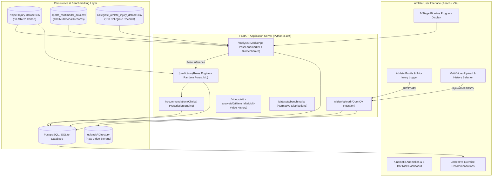
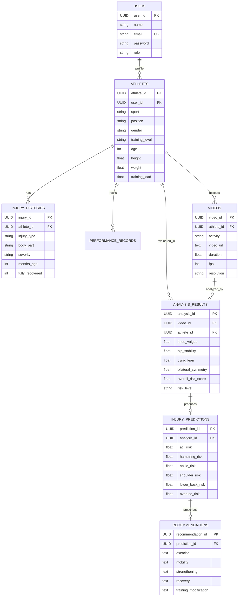

# SportShield — Sports Injury Risk Detection from Video

> **⚠️ Non-Medical Disclaimer**: SportShield is an academic research prototype for biomechanical movement analysis and injury-risk estimation. All risk scores are rule-based indicators derived from kinematic deviation thresholds — they are NOT clinical diagnoses. Always consult qualified sports medicine professionals for injury assessment and treatment decisions.

**SportShield** is an advanced full-stack AI/ML sports biomechanics platform. It processes real-life athlete movement videos frame-by-frame, performs 3D/2D pose estimation, extracts joint kinematics and biomechanical parameters, dynamically detects activities (Running, Walking, Squatting), detects motion deviations from reference ranges, evaluates **6 rule-based injury risk scores**, and delivers actionable, non-medical safety and performance recommendations.

---

## 📌 Project Overview & Problem Statement

### The Problem
Non-contact musculoskeletal injuries—such as ACL ruptures, hamstring strains, ankle sprains, and lumbar stress fractures—are leading causes of missed competitive time in collegiate and amateur sports. The vast majority of these injuries stem from faulty biomechanics (e.g., knee valgus collapse during landing, pelvic instability, lateral trunk lean, and bilateral load asymmetry) compounded by prior injury history and acute training fatigue.

Traditional biomechanical motion capture laboratories (e.g., optical Vicon or Qualisys systems) rely on multi-camera arrays and reflective markers costing tens of thousands of dollars. As a result, individual athletes, club players, and school teams cannot access movement screening tools.

### The Solution: SportShield
**SportShield** is a computer vision and sports biomechanics platform tailored specifically for the individual **Athlete**. Using ordinary smartphone or camera-recorded training videos (MP4/MOV), SportShield:
1. Performs 3D human pose estimation (tracking 33 skeletal landmarks via Google MediaPipe PoseLandmarker).
2. Calculates real-time kinematic angles, bilateral symmetry, range of motion, and dynamic stability.
3. Quantifies kinematic deviations against normative athletic distributions derived from empirical datasets.
4. Cross-references the athlete's prior injury history and playing position.
5. Computes transparent, deterministic injury risk percentages across 6 anatomical categories with prominent risk level indicators (**Low <30%**, **Moderate 30%–59%**, **High ≥60%**).
6. Generates targeted, non-medical corrective and preventative exercise prescriptions.
7. Persists multi-video analysis histories with seamless session restoration across page refreshes.

---

## 🏗️ System Architecture



---

## 🔬 AI/ML Architecture: Active Vision ML vs. Rule-Based Scoring

SportShield maintains complete scientific and academic honesty regarding where machine learning is employed and where deterministic biomechanical rules govern decisions:

```
┌─────────────────────────────────────────────────────────────────────────────┐
│                           SPORTSHIELD AI STACK                              │
├──────────────────────────┬──────────────────────┬───────────────────────────┤
│ Component                │ Implementation       │ Technical Details         │
├──────────────────────────┼──────────────────────┼───────────────────────────┤
│ 1. Skeletal Pose Tracking│ ACTIVE VISION ML     │ MediaPipe PoseLandmarker  │
│                          │ Deep Learning CNN    │ 33 3D body keypoints      │
├──────────────────────────┼──────────────────────┼───────────────────────────┤
│ 2. Feature Extraction    │ MATHEMATICAL         │ 3D vector geometry, dot   │
│                          │ Biomechanics Engine  │ products, plane angles    │
├──────────────────────────┼──────────────────────┼───────────────────────────┤
│ 3. Anomaly Benchmarking  │ STATISTICAL          │ Empirical Z-scores from   │
│                          │ Cohort Distribution  │ Project-Injury-Dataset.csv│
├──────────────────────────┼──────────────────────┼───────────────────────────┤
│ 4. 6-Category Risk Engine│ DETERMINISTIC RULES  │ Transparent physiological │
│                          │ Clinical Biomechanics│ equations (0% - 100%)     │
├──────────────────────────┼──────────────────────┼───────────────────────────┤
│ 5. Tabular ML Classifier │ SUPERVISED ML        │ Scikit-learn Random Forest│
│                          │ Baseline Comparison  │ Trained on 50-sample set  │
└──────────────────────────┴──────────────────────┴───────────────────────────┘
```

> **Why Deterministic Rule-Based Scoring for Anatomical Risk?**  
> In sports medicine and physical therapy, black-box neural networks cannot be trusted for risk attribution without auditability. If an athlete has an elevated ACL risk, the system must explain the exact biomechanical mechanism: *"Knee valgus of 16.4° exceeds normal (<12°), bilateral symmetry is 74% (<85%), and athlete reported a prior right knee sprain."* The supervised Random Forest classifier runs in parallel to output overall statistical risk probability.

---

## 📁 Datasets Used in SportShield

SportShield is grounded in 3 specific datasets located in the `datasets/` directory:

| Dataset | Records | Features | Target Column(s) | Primary Purpose & Usage in SportShield |
| :--- | :--- | :--- | :--- | :--- |
| **`Project-Injury-Dataset.csv`** | 50 competitive athlete trials across 5 sports | 16 features: angles, symmetry, ROM, smoothness, fatigue, prior injuries | `injury_occurred` (0/1), `injury_risk_level` (Low/Mod/High) | **Primary Population Baseline**: Powers `dataset_loader.py` and `GET /datasets/benchmarks`. Provides empirical means and standard deviations for Z-score anomaly calculations. Also trains the baseline Random Forest classifier. |
| **`sports_multimodal_data.csv`** | 100 training sessions across 5 sports | 12 features: duration, heart rate, player load, valgus, shear proxy, RPE | `injury_risk_flag` (0/1), `injury_type_recorded` | **Multimodal Workload Reference**: Used to calibrate acute-to-chronic training load thresholds, fatigue multipliers, and lumbar shear stress heuristics for the Overuse and Lower Back rules. |
| **`collegiate_athlete_injury_dataset.csv`** | 100 collegiate athlete longitudinal records | 14 features: sport discipline, gender, years competing, prior injury count, rehab status | `subsequent_injury_occurred` (0/1), `days_missed` | **Prior Injury Multiplier Calibration**: Calibrates historical injury recurrence weights (+25% risk if fully recovered, +40% if residual symptoms exist) and sport-specific exposure rates. |

---

## ⚡ The 7-Stage End-to-End Processing Pipeline

When the athlete uploads a movement video and clicks **Analyze Video**, the system executes 7 distinct processing stages:

```
[1. Upload Video] ──► [2. Detecting Movement] ──► [3. Extracting Features]
         │
         ▼
[4. Anomaly Detection] ──► [5. Applying Previous Injury Information] ──► [6. Calculating Risk Score]
         │
         ▼
[7. Generating Recommendations] ──► [Results Dashboard]
```

1. **Upload Video**: The video is transmitted via multipart upload to `/video/upload`, stored securely in `backend/uploads/`, and metadata (resolution, frame count, fps) is saved in the `videos` database table.
2. **Detecting Movement (Vision ML)**: OpenCV reads sampled video frames and feeds them through Google MediaPipe PoseLandmarker to detect 33 3D spatial keypoints per frame.
3. **Extracting Features**: Joint angles (knee valgus, hip tilt, trunk lean), range of motion (ROM), bilateral symmetry, and movement smoothness are computed across all frames.
4. **Anomaly Detection**: Extracted metrics are statistically evaluated against normative cohort distributions (`Project-Injury-Dataset.csv`) to calculate Z-scores and identify kinematic deviations.
5. **Applying Previous Injury Information**: The athlete's database profile is queried for recorded prior injuries (`injury_histories` table). Recovered injuries apply a 1.25x weighting factor to corresponding joints; incomplete recoveries apply a 1.40x factor. Note: Previous injury history is provided/recorded by the athlete, NOT detected from the video.
6. **Calculating Risk Score**: The deterministic 6-category risk engine calculates individual risk percentages for ACL, Hamstring, Ankle, Shoulder, Lower Back, and Overuse, applying playing-position multipliers alongside supervised ML inference.
7. **Generating Recommendations**: Based on dominant risk categories and identified movement flaws, the recommendation engine generates 5 structured corrective prescriptions (corrective exercises, mobility drills, strengthening routines, recovery protocols, and training modifications).

---

## 🛡️ Risk Categories & Visual Risk Label Thresholds

All risk bars on the frontend display both numeric percentages and prominent risk tier badges:

| Risk Percentage | Risk Label | Badge Color | Meaning & Clinical Action |
| :--- | :--- | :--- | :--- |
| **< 30%** | **LOW** | Green (`#10b981`) | Safe biomechanics. Continue current training regimen. |
| **30% – 59%** | **MODERATE** | Yellow / Amber (`#f59e0b`) | Noticeable kinematic compensation or prior vulnerability. Targeted prehab recommended. |
| **≥ 60%** | **HIGH** | Red (`#ef4444`) | Severe mechanical flaw or high recurrence risk. Immediate corrective modification required. |

### 6 Injury Evaluation Formulations

1. **ACL / Knee Ligament Risk**:
   $$\text{Risk}_{ACL} = \text{clamp}\Big( 3.8 \times \max(0, \text{KneeValgus} - 7) + 0.45 \times (100 - \text{Symmetry}) + 0.36 \times (100 - \text{Balance}), 5, 95 \Big) \times \text{PositionFactor} \times \text{PriorFactor}$$
2. **Hamstring Strain Risk**:
   $$\text{Risk}_{Hamstring} = \text{clamp}\Big( 0.88 \times (100 - \text{Flexibility}) + 0.54 \times \max(0, 75 - \text{ROM}) + 0.6 \times \text{Fatigue}, 5, 95 \Big) \times \text{PositionFactor} \times \text{PriorFactor}$$
3. **Ankle Sprain Risk**:
   $$\text{Risk}_{Ankle} = \text{clamp}\Big( 1.0 \times (100 - \text{Balance}) + 2.0 \times \max(0, \text{KneeValgus} - 9) + 0.36 \times (100 - \text{Symmetry}), 5, 95 \Big) \times \text{PositionFactor} \times \text{PriorFactor}$$
4. **Shoulder Impingement Risk**:
   $$\text{Risk}_{Shoulder} = \text{clamp}\Big( 0.8 \times (100 - \text{Symmetry}) + 0.54 \times (100 - \text{Strength}) + 1.5 \times \max(0, \text{TrunkLean} - 10), 5, 95 \Big) \times \text{PositionFactor} \times \text{PriorFactor}$$
5. **Lower Back Strain Risk**:
   $$\text{Risk}_{LowerBack} = \text{clamp}\Big( 3.5 \times \max(0, \text{TrunkLean} - 8) + 0.7 \times (100 - \text{HipStability}) + 0.36 \times (100 - \text{Flexibility}), 5, 95 \Big) \times \text{PositionFactor} \times \text{PriorFactor}$$
6. **Overuse Syndrome Risk**:
   $$\text{Risk}_{Overuse} = \text{clamp}\Big( 0.4 \times \text{TrainingLoad} + 0.4 \times \text{Fatigue} + 0.2 \times (100 - \text{MovementQuality}), 5, 95 \Big) \times \text{PositionFactor} \times \text{PriorFactor}$$

---

## 🔄 Multi-Video Analysis & Session Refresh Persistence

SportShield supports full multi-session athletic tracking:
- **Multiple Video Ingestion**: Athletes can upload any number of training videos over weeks or months. Each upload creates an independent video record and distinct analysis row.
- **Upload History Selector**: The **Upload History** sidebar displays every analyzed video with date, time, activity type, and overall risk badge. Clicking any past video re-loads its full kinematics, anomaly benchmarks, and recommendations.
- **Refresh Persistence**: The frontend stores `active_video_id` in `localStorage`. When the user refreshes the browser or returns later:
  1. The athlete session and token are retrieved.
  2. The full video history is fetched from `GET /videos/with-analysis/{athlete_id}`.
  3. The active video's kinematic profile, risk bars, and recommendations are instantly restored.

---

## 🗄️ Database Schema & Entity Relationships

The platform runs on **PostgreSQL** with SQLAlchemy ORM (and SQLite support for lightweight testing):



---

## 🌐 API Endpoint Reference

| Method | Endpoint | Description |
| :--- | :--- | :--- |
| `POST` | `/register` | Register an athlete user account |
| `POST` | `/login` | Authenticate and obtain user/athlete profile |
| `POST` | `/athlete` | Create or update athlete profile metrics |
| `GET` | `/athlete/{user_id}` | Retrieve athlete profile by user ID |
| `POST` | `/athlete/{athlete_id}/injuries` | Log prior injury record |
| `POST` | `/athlete/injury-history` | Log prior injury record (legacy compatibility) |
| `GET` | `/athlete/{athlete_id}/injuries` | List all prior injuries for an athlete |
| `POST` | `/video/upload` | Upload MP4/MOV video, extract duration/fps/resolution |
| `POST` | `/analysis` | Execute MediaPipe pose tracking & feature extraction |
| `POST` | `/prediction` | Run 6-category risk scoring & Random Forest probability |
| `POST` | `/recommendation` | Generate 5 clinical corrective prescriptions |
| `GET` | `/videos/with-analysis/{athlete_id}` | Retrieve all uploaded videos with joined analysis & prediction records |
| `GET` | `/datasets/benchmarks` | Get normative population distributions from `Project-Injury-Dataset.csv` |
| `GET` | `/datasets/summary` | Summary of all 3 mentor datasets |
| `GET` | `/ml/status` | Current AI/ML status & framework audit |

---

## 🚀 Step-by-Step Local Setup & Run Guide

### System Requirements
- Python 3.10+
- Node.js 18+ and npm
- PostgreSQL 14+ (or default fallback to SQLite)

### 1. Backend Setup
```bash
# Navigate to backend directory
cd backend

# Create and activate virtual environment
python -m venv venv
# Windows:
.\venv\Scripts\activate
# Mac/Linux:
# source venv/bin/activate

# Install dependencies
pip install -r requirements.txt

# Start the FastAPI server
uvicorn main:app --reload --host 0.0.0.0 --port 8000
```
Backend API will be accessible at `http://localhost:8000`.  
Interactive Swagger API documentation is available at `http://localhost:8000/docs`.

### 2. Frontend Setup
```bash
# In a new terminal, navigate to frontend directory
cd backend/frontend

# Install npm dependencies
npm install

# Start the Vite development server
npm run dev
```
Frontend web application will open at `http://localhost:5173`.

### 3. Automated Verification Tests
Run the comprehensive diagnostic test suite to verify all endpoints, database tables, and the video analysis pipeline:
```bash
cd backend
.\venv\Scripts\python.exe verify_platform.py
```

---

## 🔮 Known Limitations & Future Work

1. **Camera Angle Sensitivity**: Single-camera 2D/3D estimation with MediaPipe Pose works best in sagittal or frontal views. Multi-view synchronized camera fusion is planned for future iterations.
2. **Dynamic Lighting & Occlusion**: Fast athletic movements in poor lighting can cause intermittent landmark jitter. Temporal Kalman filtering and physics-based skeleton constraints are planned.
3. **Clinical Validation**: SportShield provides academic biomechanical risk estimation and is not a medical diagnostic device. Ongoing research aims to validate risk predictions against longitudinal MRI and clinical injury records.

---

## ⚠️ Academic & Non-Medical Disclaimer
SportShield is an academic research platform developed for biomechanical analysis and risk estimation. All risk scores and exercise suggestions are calculated from kinematic deviation rules and do not constitute clinical or medical diagnosis. Athletes must consult licensed sports medicine professionals for clinical care.