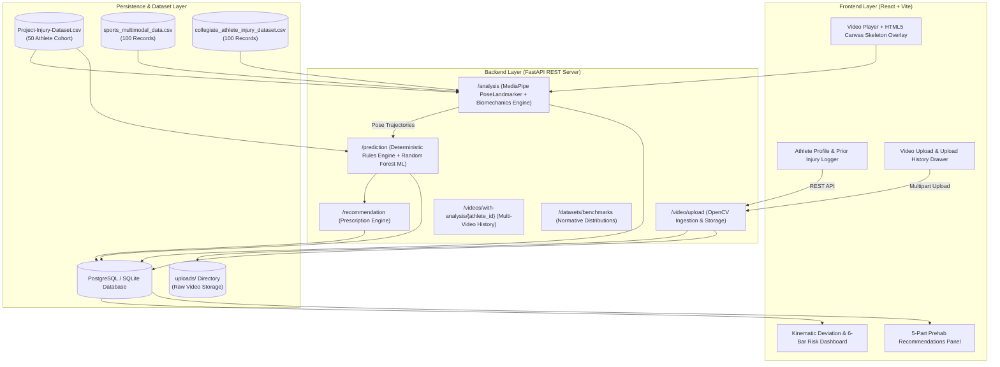

# SportShield — AI-Powered Sports Injury Risk Detection from Video

> ⚠️ **Non-Medical Academic Disclaimer**: **SportShield** is an academic research prototype developed for biomechanical motion analysis and injury risk screening. All risk scores, anomaly metrics, and exercise suggestions are rule-based and statistical indicators derived from kinematic deviation thresholds — they are **NOT** clinical diagnoses or medical advice. Always consult certified sports medicine professionals, physical therapists, or physicians for injury diagnosis and rehabilitation decisions.

---

## 📖 Table of Contents
1. [Project Overview](#1-project-overview)
2. [Problem Statement](#2-problem-statement)
3. [Objectives](#3-objectives)
4. [Key Features](#4-key-features)
5. [System Workflow & Architecture](#5-system-workflow--architecture)
6. [Technologies & Tools Used](#6-technologies--tools-used)
7. [AI & ML Components](#7-ai--ml-components)
8. [MediaPipe Pose Landmarker & 33 Body Keypoints](#8-mediapipe-pose-landmarker--33-body-keypoints)
9. [Video Analysis Process](#9-video-analysis-process)
10. [Kinematic Parameters Calculated](#10-kinematic-parameters-calculated)
11. [Injury Risk Detection & Assessment Process](#11-injury-risk-detection--assessment-process)
12. [Frontend & Backend Architecture](#12-frontend--backend-architecture)
13. [Database & API Details](#13-database--api-details)
14. [Project Folder Structure](#14-project-folder-structure)
15. [Installation & Setup](#15-installation--setup)
16. [How to Run the Project](#16-how-to-run-the-project)
17. [How to Upload & Analyze a Video](#17-how-to-upload--analyze-a-video)
18. [Sample Output & Results](#18-sample-output--results)
19. [Screenshots](#19-screenshots)
20. [Limitations](#20-limitations)
21. [Future Enhancements](#21-future-enhancements)
22. [Team Members](#22-team-members)
23. [Conclusion](#23-conclusion)

---

## 1. Project Overview

**SportShield** is an end-to-end AI and biomechanics screening platform designed for individual athletes and sports practitioners. By analyzing standard 2D video recordings (such as smartphone or camera footage in MP4/MOV formats) frame by frame, SportShield tracks 33 3D skeletal landmarks, computes joint kinematic angles, compares movement patterns against empirical athletic population distributions, and evaluates non-contact injury risks across six major anatomical categories (ACL, Hamstring, Ankle, Shoulder, Lower Back, and Overuse).

---

## 2. Problem Statement

Musculoskeletal non-contact injuries—such as anterior cruciate ligament (ACL) tears, hamstring strains, ankle sprains, and lumbar stress injuries—are major causes of missed competition time and long-term joint degradation across competitive and amateur sports. 

Key challenges in sports injury prevention include:
- **Cost & Inaccessibility**: Gold-standard optical motion capture laboratories (e.g., Vicon, Qualisys) require expensive multi-camera arrays, reflective markers, and specialized laboratory environments costing tens of thousands of dollars.
- **Biomechanical Compensation**: Subtle movement flaws—such as dynamic knee valgus collapse, lateral trunk lean, and inter-limb asymmetry—are difficult to detect with the naked eye during fast athletic movements.
- **Lack of Objective Screening**: Club, school, and collegiate athletes frequently lack continuous access to biomechanical screening tools to identify movement vulnerability before injuries occur.

---

## 3. Objectives

- **Markerless Motion Tracking**: Leverage computer vision deep learning to capture skeletal joint trajectories from single-camera video recordings without physical body markers.
- **Kinematic Feature Extraction**: Quantify critical biomechanical parameters, including dynamic knee valgus angles, hip stability, spinal trunk lean, range of motion (ROM), and bilateral symmetry.
- **Empirical Benchmarking**: Statistically compare an individual athlete's kinematics against normative population distributions using Z-scores to flag mechanical deviations.
- **Transparent Risk Scoring**: Compute auditable risk percentage scores across 6 anatomical areas by combining physical athlete profiles, position demands, prior injury history, and movement kinematics.
- **Corrective Prehab Prescriptions**: Generate automated, structured 5-part exercise, mobility, strengthening, and workload management recommendations.

---

## 4. Key Features

- 📹 **Multi-Format Video Ingestion**: Supports standard video formats (`.mp4`, `.mov`, `.webm`, `.mkv`) up to 50 MB with automatic duration, resolution, and FPS extraction.
- 🦴 **Real-Time 33-Point Skeleton Overlay**: Interactive HTML5 Canvas renders detected skeletal joints and limb connections synchronized with video playback.
- 🏃 **Dynamic Activity Detection**: Kinematic temporal model infers whether the movement performed is **Running**, **Squatting**, or **Walking**.
- 📊 **6-Category Risk Dashboard**: Visual risk progress bars and badges with distinct risk tier thresholds:
  - 🟢 **LOW (< 30%)**: Normal biomechanics; maintain current training.
  - 🟡 **MODERATE (30% – 59%)**: Noticeable kinematic deviation or prior vulnerability; prehab recommended.
  - 🔴 **HIGH (≥ 60%)**: Severe mechanical deviation or high recurrence risk; corrective adjustment required.
- 🤖 **Supervised ML Classification**: Supervised `RandomForestClassifier` trained on empirical data predicting overall risk probability and category.
- 📋 **Prior Injury History Weighting**: Factors in athlete-recorded past injuries (+25% multiplier for recovered, +40% for active/residual). *(Note: Prior injuries are entered in the athlete profile, not detected visually).*
- 📁 **Multi-Video Session History**: Persists all historical video analyses in the database with instant click-to-view restoration across page refreshes.
- 🏋️ **5-Part Corrective Prescriptions**: Delivers targeted exercises, mobility drills, strengthening routines, recovery protocols, and training modifications.

---

## 5. System Workflow & Architecture



---

## 6. Technologies and Tools Used

### Backend & Core Logic
- **Python 3.10+**: Core programming language.
- **FastAPI**: Asynchronous web framework for high-speed RESTful API endpoints.
- **Uvicorn**: ASGI web server implementation.
- **OpenCV (`opencv-python-headless`)**: Video file decoding, frame sampling, and dimensional metadata extraction.
- **Google MediaPipe (`mediapipe`)**: Deep learning PoseLandmarker task engine for 33 3D spatial keypoint tracking.
- **Scikit-learn**: Supervised `RandomForestClassifier` and `StandardScaler` for tabular risk classification.
- **NumPy & Pandas**: Vector geometry, trigonometric joint angles, and dataset manipulation.
- **SQLAlchemy ORM**: Database abstraction and entity mapping.
- **PostgreSQL / SQLite**: Relational database storage.
- **Pydantic**: Request/response data validation and serialization.

### Frontend Client
- **React 18**: Component-based UI library.
- **Vite**: Modern frontend tooling and rapid development server.
- **HTML5 Canvas API**: Rendering 33-point skeletal landmark coordinates over video frames.
- **Vanilla CSS**: Custom responsive styling, glassmorphism, and dark-theme aesthetics.
- **Fetch API**: Client-server asynchronous communication.

---

## 7. AI & ML Components

SportShield maintains complete scientific transparency regarding where machine learning is employed versus where deterministic biomechanical rules govern evaluation:

| Component | Implementation Type | Description & Role |
| :--- | :--- | :--- |
| **1. Skeletal Pose Tracking** | **Active Vision ML** | Google MediaPipe PoseLandmarker (deep convolutional neural network) detects 33 3D skeletal landmark coordinates per frame. |
| **2. Kinematic Feature Extraction** | **Mathematical Vector Trigonometry** | Computes 3D dot-product joint angles, 2D frontal plane valgus projections, ROM, and bilateral symmetry. |
| **3. Normative Benchmarking** | **Statistical Z-Score Analysis** | Compares extracted metrics against empirical means and standard deviations from `Project-Injury-Dataset.csv`. |
| **4. Tabular Risk Classifier** | **Supervised ML (Random Forest)** | Scikit-learn `RandomForestClassifier(n_estimators=100, max_depth=5)` trained on 50 athlete trials to predict overall risk category and continuous probability. |
| **5. 6-Category Risk Engine** | **Deterministic Rules Engine** | Transparent physiological equations evaluating specific vulnerabilities (ACL, Hamstring, Ankle, Shoulder, Back, Overuse) incorporating position and prior injury history. |

---

## 8. MediaPipe Pose Landmarker & 33 Body Keypoints

Google MediaPipe PoseLandmarker tracks 33 standard skeletal landmarks:

```
                  0 - Nose
            1 - Left Eye Inner       4 - Right Eye Inner
            2 - Left Eye             5 - Right Eye
            3 - Left Eye Outer       6 - Right Eye Outer
            7 - Left Ear             8 - Right Ear
                  9 - Mouth Left    10 - Mouth Right
                        \          /
              11 - Left Shoulder───12 - Right Shoulder
                     |                   |
               13 - Left Elbow     14 - Right Elbow
                     |                   |
               15 - Left Wrist     16 - Right Wrist
               /   |   \               /   |   \
             17   19   21             18   20   22
             (L Hand Keypoints)       (R Hand Keypoints)
                     |                   |
                  23 - Left Hip──────24 - Right Hip
                         \           /
                       25 - Left Knee──────26 - Right Knee
                             |                   |
                       27 - Left Ankle─────28 - Right Ankle
                          /     \             /     \
                    29 - Heel  31 - Toe   30 - Heel  32 - Toe
```

### Landmark Categorization Table

| Group | Landmark IDs | Keypoints Included |
| :--- | :--- | :--- |
| **Head & Face** | `0`–`10` | Nose, Eyes (Inner, Center, Outer), Ears, Mouth |
| **Upper Extremity (Left)** | `11`, `13`, `15`, `17`, `19`, `21` | Left Shoulder, Elbow, Wrist, Pinky, Index, Thumb |
| **Upper Extremity (Right)** | `12`, `14`, `16`, `18`, `20`, `22` | Right Shoulder, Elbow, Wrist, Pinky, Index, Thumb |
| **Pelvis & Torso** | `23`, `24` | Left Hip, Right Hip (ASIS Pelvic proxy) |
| **Lower Extremity (Left)** | `25`, `27`, `29`, `31` | Left Knee, Left Ankle, Left Heel, Left Foot Index (Toe) |
| **Lower Extremity (Right)** | `26`, `28`, `30`, `32` | Right Knee, Right Ankle, Right Heel, Right Foot Index (Toe) |

Each landmark contains normalized coordinates $(x, y, z)$ and a $\text{visibility}$ confidence score.

---

## 9. Video Analysis Process

When a video is analyzed, the system executes the following steps:

1. **Video Ingestion & Validation**: The file is received via `POST /video/upload`, validated for extension and size (max 50 MB), saved to `backend/uploads/`, and registered in the database.
2. **OpenCV Frame Sampling**: OpenCV opens the video and samples up to 240 representative frames evenly spaced across the full duration.
3. **RGB Conversion & MediaPipe Inference**: Sampled frames are converted from BGR to RGB and passed to `vision.PoseLandmarker.detect()`.
4. **Trajectory Time-Series Construction**: 33 landmark coordinates are compiled into a temporal trajectory array with frame indices and timestamps.
5. **Biomechanical Aggregation**: `backend/biomechanics.py` processes keypoint trajectories across all frames to calculate mean, peak, and range metrics.
6. **Activity Detection**: Horizontal hip/ankle translation, vertical foot travel, and knee flexion synchrony determine whether the activity is **Running**, **Squatting**, or **Walking**.

---

## 10. Kinematic Parameters Calculated

| Parameter | Unit | Formula / Method | Normal Range | Biomechanical Significance |
| :--- | :--- | :--- | :--- | :--- |
| **Knee Valgus Angle** | Degrees (°) | 2D frontal plane angle of knee joint relative to hip-ankle mechanical axis | $< 10.0^\circ$ | Inward collapse during deceleration; values $> 12^\circ$ increase ACL strain. |
| **Trunk Lateral Lean** | Degrees (°) | Coronal plane deviation of the shoulder-hip spinal axis from vertical | $< 10.0^\circ$ | Torso compensation for hip abductor weakness; stresses lumbar spine. |
| **Range of Motion (ROM)** | Degrees (°) | Difference between maximum extension and minimum flexion knee angle | $\ge 60.0^\circ$ | Restricted ROM tightens hamstrings; excessive ROM strains patellar tendon. |
| **Bilateral Symmetry** | Percentage (%) | Inter-limb percentage match between left and right knee kinematic curves | $\ge 80.0\%$ | Asymmetry indicates compensatory loading on dominant limb. |
| **Hip Stability** | Percentage (%) | Inverse vertical center-of-mass standard deviation across stride frames | $\ge 75.0\%$ | Measures pelvic stability and gluteus medius control. |
| **Movement Quality** | Percentage (%) | Weighted composite of symmetry (35%), alignment (35%), and trunk lean (30%) | $\ge 75.0\%$ | Overall indicator of neuromuscular smoothness and coordination. |
| **Fatigue Score** | Percentage (%) | Kinematic variance change between first-half and second-half frame segments | $10.0\% - 35.0\%$ | Form degradation and movement variability over time. |
| **Joint Angles (3D)** | Degrees (°) | Vector dot-product 3D angles for Knee (Hip-Knee-Ankle), Hip, and Ankle | Sport-specific | Quantifies limb flexion throughout movement phases. |

---

## 11. Injury Risk Detection & Assessment Process

Risk assessment combines deterministic biomechanical equations, playing position adjustments, and prior injury history:

### 6 Injury Risk Formulations (`backend/risk_rules.py`)

1. **ACL / Knee Ligament Risk**:
   $$\text{Risk}_{ACL} = \Big[ 3.8 \times \max(0, \text{Valgus} - 7.0) + 0.45 \times (100 - \text{Symmetry}) + 0.36 \times (100 - \text{Balance}) \Big] \times F_{pos}$$
2. **Hamstring Strain Risk**:
   $$\text{Risk}_{Hamstring} = \Big[ 0.88 \times (100 - \text{Flexibility}) + 0.54 \times \max(0, 75.0 - \text{ROM}) + 0.6 \times \text{Fatigue} \Big] \times F_{pos}$$
3. **Ankle Sprain Risk**:
   $$\text{Risk}_{Ankle} = \Big[ 1.0 \times (100 - \text{Balance}) + 2.0 \times \max(0, \text{Valgus} - 9.0) + 0.36 \times (100 - \text{Symmetry}) \Big] \times F_{pos}$$
4. **Shoulder Impingement Risk**:
   $$\text{Risk}_{Shoulder} = \Big[ 0.8 \times (100 - \text{Symmetry}) + 0.54 \times (100 - \text{Strength}) + 1.5 \times \max(0, \text{TrunkLean} - 10.0) \Big] \times F_{pos}$$
5. **Lower Back Strain Risk**:
   $$\text{Risk}_{LowerBack} = \Big[ 3.5 \times \max(0, \text{TrunkLean} - 8.0) + 0.7 \times (100 - \text{HipStability}) + 0.36 \times (100 - \text{Flexibility}) \Big] \times F_{pos}$$
6. **Overuse Syndrome Risk**:
   $$\text{Risk}_{Overuse} = \Big[ 0.4 \times \text{TrainingLoad} + 0.4 \times \text{Fatigue} + 0.2 \times (100 - \text{MovementQuality}) \Big] \times F_{pos}$$

### Playing Position Multipliers ($F_{pos}$)
- **Pivoting / Cutting** (Striker, Forward, Winger, Point Guard, Defender): $+20\%$ ACL, $+15\%$ Ankle.
- **Overhead / Throwing** (Pitcher, Quarterback, Bowler, Setter, Goalkeeper): $+30\%$ Shoulder, $+15\%$ Lower Back.
- **Endurance / Locomotion** (Runner, Midfielder, Sprinter): $+25\%$ Overuse, $+20\%$ Hamstring.

### Prior Injury History Multiplier
- **Recovered Prior Injury**: Applies a $+25\%$ ($1.25\times$) risk weighting to corresponding anatomical joints.
- **Residual / Incomplete Recovery**: Applies a $+40\%$ ($1.40\times$) risk weighting.
*(Note: Prior injuries are entered via the athlete profile interface, not detected from video).*

---

## 12. Frontend and Backend Architecture

### Backend Architecture
- **FastAPI Framework**: Provides high-concurrency asynchronous endpoints.
- **Modular Pipeline**: Separate specialized modules for video ingestion (`main.py`), pose extraction (`pose_engine.py`), biomechanics (`biomechanics.py`), ML pipeline (`ml_pipeline.py`), risk rules (`risk_rules.py`), feature engineering (`feature_engineering.py`), and prescriptions (`recommendation_engine.py`).
- **Database Engine**: SQLAlchemy with automatic fallback between PostgreSQL and SQLite.

### Frontend Architecture
- **React SPA**: Stateful single-page application with responsive tab navigation (Dashboard, Video Analysis, Prehab Recommendations, Performance Records).
- **HTML5 Canvas Pose Overlay**: Renders the 33 skeletal keypoints and color-coded limb connections dynamically over the video element.
- **State & Refresh Persistence**: Stores `athlete_id` and `active_video_id` in `localStorage` to seamlessly restore analysis results upon page refresh.

---

## 13. Database & API Details

### Relational Database Schema (SQLAlchemy)

| Table Name | Primary Key | Key Columns | Purpose |
| :--- | :--- | :--- | :--- |
| `users` | `user_id` (UUID) | `name`, `email` (Unique), `password`, `role`, `phone` | Authentication and user accounts. |
| `athletes` | `athlete_id` (UUID) | `user_id` (FK), `sport`, `position`, `age`, `height`, `weight`, `training_load`, `flexibility`, `strength`, `balance` | Athlete physical metrics and baseline attributes. |
| `injury_histories`| `injury_id` (UUID) | `athlete_id` (FK), `injury_type`, `body_part`, `severity`, `months_ago`, `fully_recovered` | Self-reported historical injuries for risk weighting. |
| `videos` | `video_id` (UUID) | `athlete_id` (FK), `activity`, `video_url`, `duration`, `fps`, `resolution`, `processing_status` | Uploaded video file records and metadata. |
| `analysis_results`| `analysis_id` (UUID)| `video_id` (FK), `athlete_id` (FK), `knee_valgus`, `hip_stability`, `trunk_lean`, `symmetry_score`, `overall_risk_score`, `risk_level`, `pose_frames` | Kinematic features and pose keypoints. |
| `injury_predictions`| `prediction_id` (UUID)| `analysis_id` (FK), `acl_risk`, `hamstring_risk`, `ankle_risk`, `shoulder_risk`, `lower_back_risk`, `overuse_risk` | 6-category individual risk percentage scores. |
| `recommendations`| `recommendation_id` (UUID)| `prediction_id` (FK), `exercise`, `mobility`, `strengthening`, `recovery`, `training_modification` | 5-part prehab and corrective exercise prescriptions. |
| `performance_records`| `record_id` (UUID)| `athlete_id` (FK), `activity`, `score`, `remarks`, `recorded_at` | Historical athletic test scores. |

### REST API Endpoints

| Method | Endpoint | Description |
| :--- | :--- | :--- |
| `POST` | `/register` | Create a new user account |
| `POST` | `/login` | Authenticate and obtain user/athlete profile |
| `POST` | `/athlete` | Create or update athlete physical metrics |
| `GET` | `/athlete/{identifier}` | Retrieve athlete profile by athlete ID or user ID |
| `POST` | `/athlete/{athlete_id}/injuries` | Log a prior injury history entry |
| `GET` | `/athlete/{athlete_id}/injuries` | List all prior injuries for an athlete |
| `DELETE` | `/athlete/{athlete_id}/injuries/{injury_id}` | Remove a recorded injury |
| `POST` | `/video/upload` | Upload MP4/MOV video file and extract metadata |
| `POST` | `/analysis` | Execute MediaPipe pose tracking & feature calculations |
| `POST` | `/prediction` | Run 6-category risk scoring & Random Forest probability |
| `POST` | `/recommendation` | Generate 5 clinical corrective prescriptions |
| `GET` | `/videos/with-analysis/{athlete_id}` | Retrieve all uploaded videos joined with analysis results |
| `GET` | `/analysis/detail/{analysis_id}` | Fetch a single analysis with prediction & recommendations |
| `GET` | `/datasets/benchmarks` | Get normative population distributions from empirical dataset |
| `GET` | `/datasets/summary` | Summary of all 3 empirical datasets |
| `GET` | `/ml/status` | Current AI/ML status and model audit |

---

## 14. Project Folder Structure

```
sports-injury-risk-detection/
├── backend/                             # FastAPI application server
│   ├── models/                          # Persisted ML model artifacts
│   │   ├── injury_rf_model.pkl          # Trained Random Forest model
│   │   └── scaler.pkl                   # Fitted StandardScaler
│   ├── uploads/                         # Storage directory for uploaded videos
│   ├── biomechanics.py                  # Kinematic calculations & activity inference
│   ├── database.py                      # SQLAlchemy engine & session setup
│   ├── dataset_loader.py                # Dataset ingestion & benchmark calculations
│   ├── feature_engineering.py           # Anomaly Z-score detection against norms
│   ├── init_db.py                       # Database table initialization script
│   ├── main.py                          # FastAPI routing & API endpoints
│   ├── ml_pipeline.py                   # Random Forest training & inference pipeline
│   ├── models.py                        # SQLAlchemy ORM table models
│   ├── pose_engine.py                   # OpenCV & MediaPipe PoseLandmarker engine
│   ├── pose_landmarker.task             # MediaPipe deep learning model asset
│   ├── recommendation_engine.py         # 5-part prehab prescription generator
│   ├── requirements.txt                 # Backend Python package dependencies
│   ├── risk_rules.py                    # 6-category deterministic risk calculations
│   ├── schemas.py                       # Pydantic schemas for data validation
│   ├── verify_platform.py               # Automated system verification test suite
│   └── frontend/                        # Active React 18 + Vite frontend
│       ├── src/
│       │   ├── config/api.js            # API base URL configuration
│       │   ├── utils/validation.js      # Input validation utilities
│       │   ├── App.jsx                  # Main application container & auth
│       │   ├── Dashboard.jsx            # Athlete dashboard & metric cards
│       │   ├── Performance.jsx          # Performance records tracking
│       │   ├── Recommendations.jsx      # Corrective prescriptions panel
│       │   ├── VideoAnalysis.jsx        # Video player & Canvas skeletal overlay
│       │   └── index.css                # Base stylesheet
│       ├── package.json                 # Node.js package manifest
│       └── vite.config.js               # Vite build configuration
├── datasets/                            # Ground-truth datasets for benchmarks & ML
│   ├── Project-Injury-Dataset.csv       # 50 athlete trials with CV kinematics & outcomes
│   ├── sports_multimodal_data.csv       # 100 records with ACWR workloads & fatigue
│   └── collegiate_athlete_injury_dataset.csv # 100 collegiate athlete longitudinal records
├── docs/                                # Technical & architectural documentation
│   ├── README.md                        # Documentation hub index
│   ├── architecture.md                  # Comprehensive system architecture guide
│   ├── technical-details.md             # Mathematical formulas & keypoint mappings
│   ├── setup.md                         # Step-by-step installation guide
│   └── SYSTEM_DOCUMENTATION.md          # Reference system documentation
├── README.md                            # Master repository README
└── docker-compose.yml                   # Docker container configuration
```

---

## 15. Installation & Setup

### Prerequisites
- **Python 3.10+** (64-bit)
- **Node.js 18+** and **npm**
- **Git**
- *Optional*: PostgreSQL 14+ (SQLite is used by default if PostgreSQL is not configured)

### 1. Clone Repository
```bash
git clone https://github.com/your-username/sports-injury-risk-detection.git
cd sports-injury-risk-detection
```

### 2. Backend Setup
```bash
cd backend

# Create virtual environment
python -m venv venv

# Activate virtual environment
# On Windows:
.\venv\Scripts\activate
# On macOS / Linux:
# source venv/bin/activate

# Install Python dependencies
pip install --upgrade pip
pip install -r requirements.txt

# Initialize database tables and ML model
python init_db.py
```

### 3. Frontend Setup
```bash
# In a new terminal window:
cd backend/frontend

# Install npm dependencies
npm install
```

---

## 16. How to Run the Project

### 1. Start Backend API Server
```bash
cd backend
# Make sure virtualenv is activated
uvicorn main:app --reload --host 0.0.0.0 --port 8000
```
- API is accessible at: `http://localhost:8000`
- Interactive Swagger API docs: `http://localhost:8000/docs`

### 2. Start Frontend Development Server
```bash
cd backend/frontend
npm run dev
```
- Frontend application is accessible at: `http://localhost:5173`

### 3. Run Automated System Verification
```bash
cd backend
python verify_platform.py
```

---

## 17. How to Upload and Analyze a Video

1. **Sign Up / Login**: Open `http://localhost:5173` and create an athlete account or log in with existing credentials.
2. **Complete Athlete Profile**: Enter sport discipline, playing position, age, height, weight, training load, and baseline fitness metrics (flexibility, strength, balance).
3. **Log Prior Injuries** *(Optional)*: Add any past musculoskeletal injuries in your profile to calibrate recurrence multipliers.
4. **Navigate to Video Analysis**: Click on the **Video Analysis** tab in the top navigation bar.
5. **Select Video**: Click **Choose Video** and upload an MP4 or MOV recording of an athletic movement (e.g., running stride, squatting, cutting drill).
6. **Click Analyze Video**: The system will execute the 7-stage processing pipeline (uploading, MediaPipe 33-point tracking, kinematic calculation, anomaly benchmarking, ML risk classification, and prescription generation).
7. **View Results**:
   - Play the video with the real-time **33-point skeletal overlay**.
   - Review kinematic metrics (Knee Valgus, Trunk Lean, Symmetry, Hip Stability, ROM).
   - Check the **6-Bar Risk Distribution** for individual anatomical risk percentages and badges.
8. **Review Prehab Recommendations**: Navigate to the **Recommendations** tab to view tailored exercises, mobility drills, strengthening exercises, and workload modifications.
9. **Upload History**: Access past uploaded video sessions anytime using the **Upload History** drawer.

---

## 18. Sample Output & Results

### Sample Kinematic Metrics (`POST /analysis`)
```json
{
  "detected_activity": "Running",
  "overall_risk_score": 42,
  "risk_level": "Moderate",
  "knee_valgus": 11.4,
  "hip_stability": 78.5,
  "trunk_lean": 7.2,
  "symmetry_score": 82.0,
  "fatigue_score": 24.0,
  "movement_quality": 81.3,
  "range_of_motion_deg": 68.5,
  "knee_angle": 134.2,
  "sampled_frames_count": 240,
  "anomalies": [
    {
      "feature": "Knee Valgus",
      "value": 11.4,
      "benchmark_mean": 9.2,
      "z_score": 1.15,
      "status": "Deviated",
      "risk_implication": "Mild medial knee collapse"
    }
  ]
}
```

### Sample Risk Prediction (`POST /prediction`)
```json
{
  "acl_risk": 44.5,
  "hamstring_risk": 28.0,
  "ankle_risk": 34.2,
  "shoulder_risk": 18.0,
  "lower_back_risk": 22.5,
  "overuse_risk": 38.0,
  "overall_risk_score": 42,
  "risk_level": "Moderate",
  "position_applied_msg": "Cutting/Pivoting position 'Forward' applied +20% ACL & +15% Ankle risk weighting.",
  "ml_prediction": {
    "predicted_risk_score": 42.0,
    "risk_level": "MODERATE",
    "class_probabilities": {
      "LOW": 0.28,
      "MODERATE": 0.62,
      "HIGH": 0.10
    }
  }
}
```

---

## 19. Screenshots

> *Replace the placeholder paths below with actual screenshots of your running application.*

### Athlete Dashboard & Overview

*Figure 1: Main athlete dashboard displaying physical parameters, risk overview, and recent activity.*

### Video Analysis & 33-Point Skeletal Pose Overlay

*Figure 2: Real-time 33-landmark skeletal pose overlay on HTML5 Canvas synchronized with video playback.*

### 6-Category Anatomical Injury Risk Breakdown

*Figure 3: Detailed breakdown of 6 anatomical risk indicators (ACL, Hamstring, Ankle, Shoulder, Back, Overuse) with risk tier badges.*

### Tailored Prehab & Corrective Exercise Prescriptions

*Figure 4: Automated 5-part corrective exercise, mobility, strengthening, and workload management prescriptions.*

---

## 20. Limitations

1. **Single-Camera 2D/3D Perspective**: Estimating 3D kinematics from a single 2D camera view is subject to perspective foreshortening. Results are most accurate when recorded in clear frontal or sagittal views.
2. **Motion Blur & Fast Occlusion**: Explosive athletic movements (e.g., high-velocity sprint cuts) in low-frame-rate video (<30 fps) can cause temporary keypoint jitter.
3. **Non-Medical Research Prototype**: The system calculates rule-based and statistical kinematic deviations. It does not replace clinical physical examinations, X-rays, or MRIs.
4. **Lighting Sensitivity**: Pose detection accuracy depends on adequate scene illumination and high contrast between the athlete and background.

---

## 21. Future Enhancements

- 📡 **Multi-Camera 3D Triangulation**: Synchronize multiple camera streams to build true 3D volumetric joint reconstructions.
- ⌚ **Wearable IMU Sensor Fusion**: Combine computer vision landmarks with wearable accelerometers and gyroscopes (IMUs) for ground reaction force estimation.
- 📈 **Longitudinal Trend Analytics**: Track kinematic recovery progression and fatigue trends across an entire competitive season.
- 📱 **Mobile Native Application**: Develop iOS/Android mobile apps for on-field video recording and instant sideline movement screening.
- 🧠 **Temporal Deep Learning Models**: Implement spatio-temporal graph convolutional networks (ST-GCN) or LSTM architectures for continuous action risk classification.

---

## 22. Team Members

| Name | Role | Project Contributions | Profile / Links |
| :--- | :--- | :--- | :--- |
| **[Team Member 1]** | Lead Developer / AI Engineer | MediaPipe pose pipeline, Kinematics engine, Risk scoring algorithms | [GitHub / LinkedIn](#) |
| **[Team Member 2]** | Full-Stack Developer | Frontend React UI, HTML5 Canvas pose overlay, API integration | [GitHub / LinkedIn](#) |
| **[Team Member 3]** | Backend & Database Specialist | FastAPI server, SQLAlchemy schema, Multi-video persistence | [GitHub / LinkedIn](#) |
| **[Team Member 4]** | ML & Biomechanics Research | Dataset curation, Random Forest training, Prehab recommendations | [GitHub / LinkedIn](#) |

---

## 23. Conclusion

**SportShield** demonstrates the feasibility of combining modern computer vision (Google MediaPipe), mathematical biomechanics, and transparent machine learning to provide accessible, non-invasive sports injury risk screening. By translating complex joint movement kinematics into clear risk indicators and actionable prehab exercises, SportShield empowers athletes and coaches to identify movement flaws early and make informed training adjustments.

---

## 📄 License
This project is licensed under the terms of the [MIT License](LICENSE).