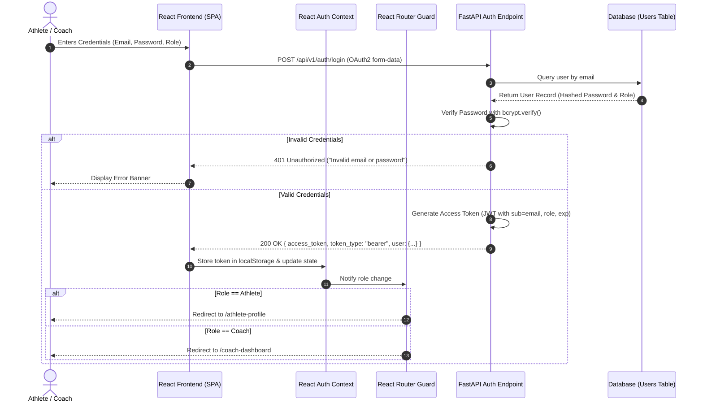

# 🔐 Module 1: User Authentication & Role-Based Access Control (RBAC)

## 1. Overview & Objectives
The **User Authentication & RBAC Module** establishes a secure identity perimeter for the KineticAI platform. It ensures that data privacy, video uploads, clinical screening reports, and squad-level analytics are strictly partitioned based on the verified role of the authenticated entity.

### Primary Objectives:
1. **Stateless JWT Authentication:** Implement secure JSON Web Token generation, signature validation, and payload decoding using industry-standard HMAC-SHA256 (`HS256`).
2. **Cryptographic Credential Security:** Salt and hash user passwords using the `bcrypt` key-derivation function (`passlib`).
3. **Role-Based Access Control (RBAC):** Restrict system views and API endpoints based on user roles (`Athlete`, `Coach`).
4. **Client-Side Navigation Guards:** Implement declarative React Router layout wrappers to prevent unauthorized cross-portal navigation.

---

## 2. Authentication & Authorization Flowchart



---

## 3. Role-Based Access Matrix

| Feature / Page | Endpoint / Route | Athlete Role | Coach Role | Unauthenticated |
| :--- | :--- | :---: | :---: | :---: |
| **Landing & Login** | `/`, `/login`, `/register` | ✅ Viewable | ✅ Viewable | ✅ Allowed |
| **Athlete Profile & Vitals** | `/athlete-profile`, `/api/v1/athletes/profile` | ✅ Full Access | ❌ Restricted | ❌ 401 Redirect |
| **Video Motion Capture** | `/upload`, `/api/v1/videos/upload` | ✅ Full Access | ✅ Full Access | ❌ 401 Redirect |
| **Biomechanical Report** | `/analysis-report`, `/api/v1/videos/analysis/*`| ✅ Own Reports | ✅ Full Access | ❌ 401 Redirect |
| **Coach Squad Roster** | `/coach-dashboard`, `/api/v1/athletes/squad` | ❌ Restricted | ✅ Full Access | ❌ 401 Redirect |

---

## 4. Data Models & Schemas

### User Database Entity (`app/models/user.py`)
```python
class User(Base):
    __tablename__ = "users"

    id = Column(Integer, primary_key=True, index=True)
    email = Column(String(255), unique=True, index=True, nullable=False)
    name = Column(String(100), nullable=False)
    hashed_password = Column(String(255), nullable=False)
    role = Column(String(50), nullable=False, default="athlete")  # "athlete" or "coach"
    is_active = Column(Boolean, default=True)
    created_at = Column(DateTime, default=datetime.utcnow)
```

### JWT Payload Structure
```json
{
  "sub": "aadrika@example.com",
  "role": "athlete",
  "exp": 1789620000
}
```

---

## 5. API Endpoint Specifications

### 1. Register User
- **URL:** `POST /api/v1/auth/register`
- **Request Body:**
  ```json
  {
    "email": "athlete@example.com",
    "password": "SecurePassword123!",
    "name": "Aadrika Singh",
    "role": "athlete"
  }
  ```
- **Response:** `201 Created`
  ```json
  {
    "id": 1,
    "email": "athlete@example.com",
    "name": "Aadrika Singh",
    "role": "athlete",
    "is_active": true
  }
  ```

### 2. Login & Token Generation
- **URL:** `POST /api/v1/auth/login`
- **Request Format:** `application/x-www-form-urlencoded` (`username`, `password`)
- **Response:** `200 OK`
  ```json
  {
    "access_token": "eyJhbGciOiJIUzI1NiIsIn...",
    "token_type": "bearer",
    "user": {
      "id": 1,
      "email": "athlete@example.com",
      "name": "Aadrika Singh",
      "role": "athlete"
    }
  }
  ```

---

## 6. Verification & Test Scenarios

1. **Password Hashing Test:** Verify that plain-text passwords are never written to database logs or table records.
2. **Expired Token Rejection:** Tokens past their expiration timestamp immediately yield `401 Token Expired`.
3. **Role Spoofing Prevention:** Athletes attempting to navigate directly to `/coach-dashboard` are intercepted by `RoleProtectedLayout` and automatically redirected to their athlete portal.
