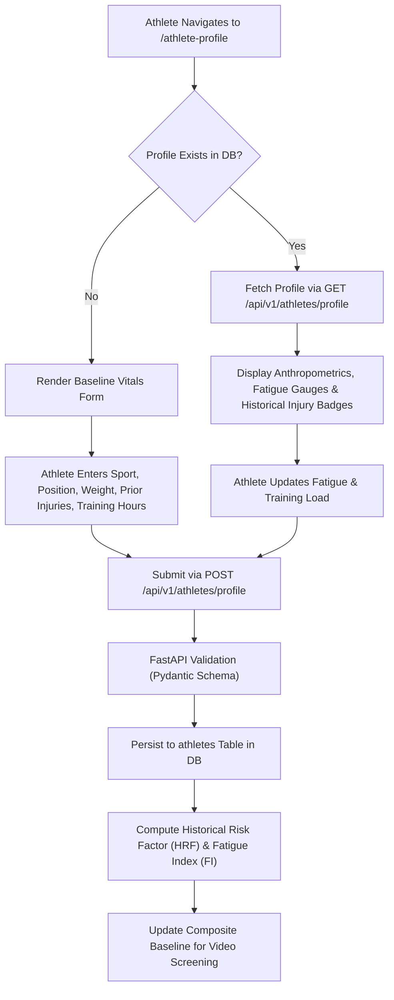

# 👤 Module 2: Athlete Profile & Physiological Vitals Management

## 1. Overview & Objectives
The **Athlete Profile Management Module** maintains the longitudinal physical, anthropometric, and training profile for every screened athlete. These vitals form the baseline normalization inputs for the 5-factor composite risk scoring algorithm.

### Primary Objectives:
1. **Anthropometric Record Keeping:** Manage athlete height, body weight, age, primary sport, and position.
2. **Injury History Tracking:** Record prior sprains, ligament tears, and surgeries to compute historical risk vulnerabilities.
3. **Dynamic Training Load Monitoring:** Track weekly training hours and self-reported fatigue to adjust joint impact tolerance dynamically.
4. **Physical Capacity Assessment:** Measure baseline flexibility index (%) and core/quad strength index (%) for individualized injury thresholds.

---

## 2. Profile Management & Baseline Ingestion Workflow



---

## 3. Anthropometric & Vitals Data Schema

### Athlete Database Entity (`app/models/athlete.py`)
```python
class Athlete(Base):
    __tablename__ = "athletes"

    id = Column(Integer, primary_key=True, index=True)
    user_id = Column(Integer, ForeignKey("users.id"), nullable=False, unique=True)
    sport = Column(String(100), default="Basketball")
    position = Column(String(100), default="Point Guard")
    age = Column(Integer, default=21)
    height_cm = Column(Float, default=178.0)
    weight_kg = Column(Float, default=72.0)
    injury_history = Column(String(500), default="None")
    previous_acl_injury = Column(Boolean, default=False)
    training_load_hours_per_week = Column(Float, default=12.0)
    fatigue_level = Column(Integer, default=3)  # Scale 1 (Fresh) - 10 (Exhausted)
    flexibility_index = Column(Float, default=80.0)  # Percentage score (0 - 100%)
    strength_index = Column(Float, default=85.0)     # Percentage score (0 - 100%)
    updated_at = Column(DateTime, default=datetime.utcnow, onupdate=datetime.utcnow)
```

---

## 4. Vitals & Benchmark Field Reference

| Metric Field | Unit / Type | Standard Athletic Range | Influence on Composite Risk Score |
| :--- | :--- | :--- | :--- |
| **Sport & Position** | String | Basketball, Soccer, Sprinting | Sets joint shock thresholds and landing velocity models. |
| **Height & Weight** | $\text{cm}$, $\text{kg}$ | $150\text{--}210\text{ cm}$, $45\text{--}120\text{ kg}$ | Determines Ground Reaction Force ($\text{GRF}$) multipliers upon impact. |
| **Previous ACL Tear** | Boolean | `true` / `false` | Injects an automatic $+20\%$ multiplier to the historical vulnerability index. |
| **Training Load** | $\text{Hours/Week}$ | $8\text{--}25\text{ hrs/week}$ | Modulates the $15\%$ Training Load component of composite risk. |
| **Fatigue Index** | Scale $1\text{--}10$ | $1\text{--}4$ (Optimal), $\ge 7$ (Critical) | Accounts for the $10\%$ Fatigue component; impairs neuromuscular reaction time. |
| **Flexibility Index** | Percentage ($\%$) | $75\%\text{--}95\%$ | Modulates Hamstring Strain Risk and Achilles tension metrics. |

---

## 5. API Endpoint Reference

### 1. Get Current Athlete Profile
- **URL:** `GET /api/v1/athletes/profile`
- **Headers:** `Authorization: Bearer <JWT_TOKEN>`
- **Response:** `200 OK`
  ```json
  {
    "sport": "Basketball",
    "position": "Point Guard",
    "age": 21,
    "height_cm": 178.0,
    "weight_kg": 72.0,
    "injury_history": "Mild left ankle sprain (2024)",
    "previous_acl_injury": false,
    "training_load_hours_per_week": 14.5,
    "fatigue_level": 4,
    "flexibility_index": 82.0,
    "strength_index": 88.0,
    "riskScore": 54.2,
    "riskStatus": "High Risk"
  }
  ```

### 2. Update Athlete Profile
- **URL:** `POST /api/v1/athletes/profile`
- **Request Body:** Partial or complete JSON payload containing updated metrics.
- **Response:** `200 OK` with updated profile.
