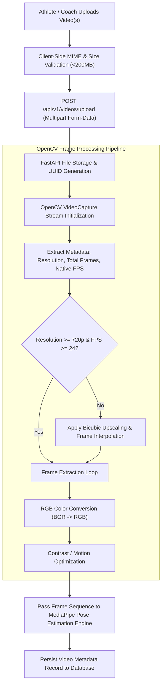

# 📹 Module 3: Video Upload & Processing Engine

## 1. Overview & Objectives
The **Video Upload & Processing Engine** handles high-throughput video ingestion from mobile devices, cameras, and external recording gear. It preprocesses video files into structured frame tensors, normalizes temporal frame rates, and validates visual clarity prior to deep pose estimation.

### Primary Objectives:
1. **Multi-Format Ingestion:** Support high-definition MP4, WEBM, and MOV video streams up to $200\text{ MB}$.
2. **Multi-Angle & Batch Processing:** Allow concurrent queuing of multi-angle recordings (Frontal, Sagittal $90^\circ$, and Oblique $45^\circ$) for comprehensive 3D movement analysis.
3. **Temporal Normalization:** Uniformly sample video frames at standard sports biomechanics rates ($30\text{--}60\text{ FPS}$).
4. **Frame Extraction & Quality Filtering:** Extract high-resolution frame sequences with automated blur detection and minimum joint visibility validation.

---

## 2. Ingestion & Preprocessing Pipeline



---

## 3. Video Specifications & Ingestion Matrix

| Parameter | Supported Range | Recommended Standard | Engine Behavior |
| :--- | :--- | :--- | :--- |
| **Container Formats** | `.mp4`, `.webm`, `.mov` | `.mp4` (H.264 encoded) | Processed via OpenCV `cv2.VideoCapture`. |
| **Maximum File Size** | Up to $200\text{ MB}$ per file | $20\text{--}50\text{ MB}$ | Streamed in chunks to prevent memory spikes. |
| **Video Resolution** | $720\text{p}$, $1080\text{p}$, $4\text{K UHD}$ | $1080\text{p}$ ($1920\times1080$) | Aspect ratio preserved; scaled for MediaPipe. |
| **Frame Rate** | $24\text{--}120\text{ FPS}$ | $60\text{ FPS}$ (Slow-mo) | Standardized to normalized time-series frames. |
| **Camera Perspectives** | Frontal, Side, $45^\circ$ Oblique | Frontal (Valgus) + Side (Flexion) | Enables multi-vector 360° screening. |

---

## 4. Video Preprocessing Code Architecture (`app/services/biomechanics_engine.py`)

```python
import cv2
import numpy as np

def extract_video_frames(video_path: str, target_fps: int = 30):
    """
    Extracts and normalizes frames from video stream for pose estimation.
    """
    cap = cv2.VideoCapture(video_path)
    if not cap.isOpened():
        raise ValueError(f"Unable to open video source: {video_path}")

    frames = []
    fps = cap.get(cv2.CAP_PROP_FPS) or 30.0
    sample_interval = max(1, int(round(fps / target_fps)))

    frame_idx = 0
    while True:
        ret, frame = cap.read()
        if not ret:
            break

        if frame_idx % sample_interval == 0:
            # Convert BGR OpenCV stream to RGB for MediaPipe
            rgb_frame = cv2.cvtColor(frame, cv2.COLOR_BGR2RGB)
            frames.append(rgb_frame)

        frame_idx += 1

    cap.release()
    return frames, fps
```

---

## 5. API Endpoint Specifications

### 1. Upload Movement Video
- **URL:** `POST /api/v1/videos/upload`
- **Content-Type:** `multipart/form-data`
- **Form Parameters:**
  - `file`: Raw binary video file
  - `movement_type`: `"jump_landing"`, `"squat"`, `"sprint"`, `"cutting"`
- **Response:** `200 OK`
  ```json
  {
    "id": "e6eeaf45-ff11-47dd-afb7-db5e25db8fa1",
    "filename": "8026529-uhd_2160_4096_25fps.mp4",
    "risk_score": 54.2,
    "risk_status": "High Risk",
    "peak_knee_valgus": "24.0°",
    "landing_flexion": "35.6°",
    "trunk_tilt": "6.5°",
    "asymmetry_ratio": "11.9%",
    "created_at": "2026-09-16 13:41"
  }
  ```

### 2. Video Screening History Archive
- **URL:** `GET /api/v1/videos/history`
- **Response:** Array of historical screening records for the active athlete or squad.
