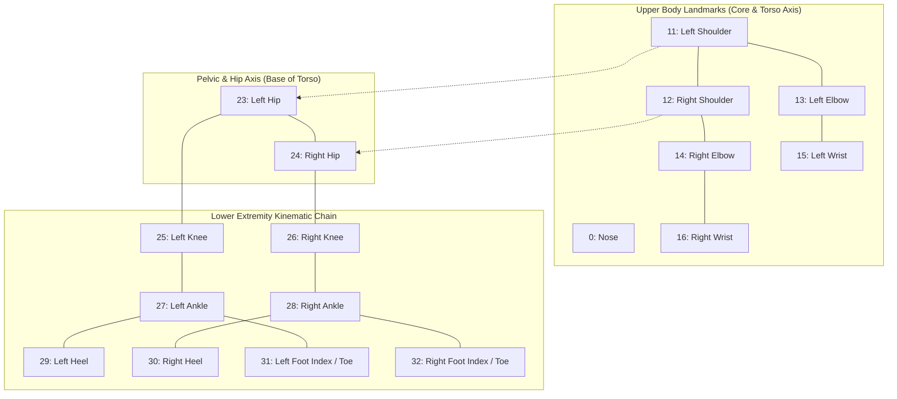
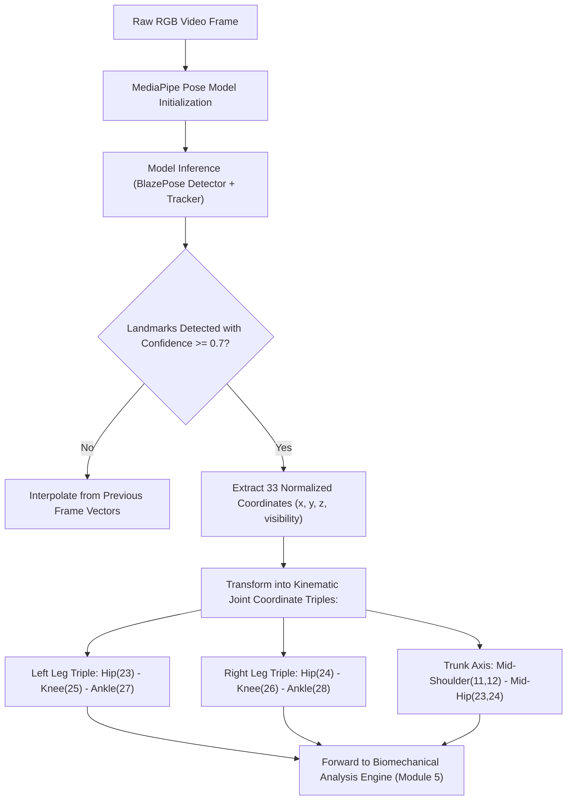

# 🏃 Module 4: 3D Pose Estimation & Keypoint Extraction Engine

## 1. Overview & Objectives
The **Pose Estimation Engine** uses Google's deep learning MediaPipe Pose architecture (BlazePose) to track 33 3D anatomical keypoints on every extracted video frame in real time. It converts raw 2D pixel coordinates into continuous 3D spatial coordinate vectors $(x, y, z)$ to analyze joint kinematics without physical mocap markers.

### Primary Objectives:
1. **33 3D Full-Body Landmark Tracking:** Localize shoulders, elbows, wrists, hips, knees, ankles, heels, and toes across full motion sequences.
2. **Depth & Spatial Extrapolation:** Estimate normalized 3D coordinates $(x, y, z)$, where $z$ represents relative depth from the camera plane.
3. **High-Speed Execution:** Process high-resolution frames with low inference latency using lightweight convolutional backbone networks.
4. **Visibility & Occlusion Filtering:** Filter low-confidence landmarks (visibility score $< 0.65$) to eliminate tracking noise during fast dynamic movements.

---

## 2. MediaPipe 33-Keypoint Anatomical Landmark Topology

---

## 3. Critical Keypoint Index Reference Table

| Landmark Index | Anatomical Landmark Name | Primary Biomechanical Role |
| :---: | :--- | :--- |
| **11, 12** | Left & Right Shoulder | Upper body center-of-mass and **Trunk Lateral Tilt** reference. |
| **23, 24** | Left & Right Hip (ASIS) | Pelvic drop, hip adduction, and **Landing Flexion** baseline. |
| **25, 26** | Left & Right Knee (Patella/Joint) | **Peak Knee Valgus (θ)** and knee flexion angle calculation. |
| **27, 28** | Left & Right Ankle (Lateral Malleolus) | Foot-ankle strike axis and **Bilateral Asymmetry** determination. |
| **29, 30** | Left & Right Heel (Calcaneus) | Ground contact moment ($T_{\text{contact}}$) detection. |
| **31, 32** | Left & Right Foot Index (Toes) | Dynamic foot progression angle and sagittal plane alignment. |

---

## 4. Pose Extraction Engine Workflow

---

## 5. Landmark Vector Formulation

For each frame $t$, every anatomical joint $J_i$ is represented as a 4-dimensional spatial vector:

$$\mathbf{p}_i(t) = \begin{bmatrix} x_i(t) \\ y_i(t) \\ z_i(t) \\ v_i(t) \end{bmatrix}$$

Where:
- $x_i(t) \in [0, 1]$: Horizontal normalized image coordinate.
- $y_i(t) \in [0, 1]$: Vertical normalized image coordinate.
- $z_i(t)$: Normalized depth coordinate relative to the midpoint of the hips.
- $v_i(t) \in [0, 1]$: Landmark visibility probability score.
