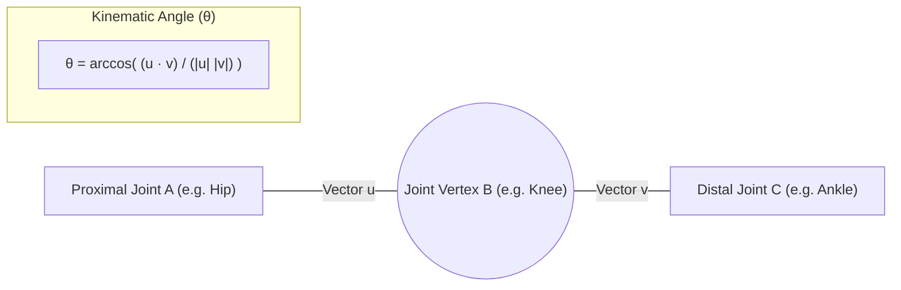

# 📐 Module 5: Biomechanical Analysis Engine (Core 4 Kinematics)

## 1. Overview & Objectives
The **Biomechanical Analysis Engine** translates 3D spatial landmark coordinates into clinical joint kinematics. It extracts the **four primary non-contact injury indicators** validated by sports medicine and biomechanics research:

1. **Peak Knee Valgus ($\theta_{\text{valgus}}$):** Inward collapse of the knee joint in the frontal plane.
2. **Landing Flexion ($\theta_{\text{flexion}}$):** Degree of sagittal knee bend upon ground contact (shock absorption).
3. **Trunk Lateral Tilt ($\theta_{\text{trunk}}$):** Deviation of the upper torso center-of-mass from the vertical gravity vector.
4. **Bilateral Asymmetry Ratio ($\Delta_{\text{asym}}$):** Kinetic and kinematic imbalance between left and right lower limbs.

---

## 2. Mathematical Formulations & Vector Geometry

### A. 3D Joint Angle Formulation
The angle $\theta$ between three consecutive anatomical landmarks $\mathbf{A}$, $\mathbf{B}$ (joint vertex), and $\mathbf{C}$ is calculated using the vector dot product:

$$\mathbf{u} = \mathbf{A} - \mathbf{B}, \quad \mathbf{v} = \mathbf{C} - \mathbf{B}$$

$$\theta = \arccos\left( \frac{\mathbf{u} \cdot \mathbf{v}}{\|\mathbf{u}\| \|\mathbf{v}\|} \right) \times \frac{180^\circ}{\pi}$$

---

### B. The 4 Core Kinematic Equations

#### 1. Peak Knee Valgus ($\theta_{\text{valgus}}$)
Calculated in the frontal plane ($x, y$) as the medial deviation of the knee joint relative to the hip-ankle mechanical axis:

$$\theta_{\text{valgus}}(t) = \left| 180^\circ - \text{Angle}\Big(\mathbf{Hip}(t), \mathbf{Knee}(t), \mathbf{Ankle}(t)\Big) \right|$$

$$\text{Peak Valgus} = \max_{t \in [T_{\text{contact}}, T_{\text{stabilize}}]} \Big(\max\big(\theta_{\text{valgus, Left}}(t), \theta_{\text{valgus, Right}}(t)\big)\Big)$$

---

#### 2. Landing Flexion ($\theta_{\text{flexion}}$)
Measures the minimum angle of knee bend (sagittal flexion) during the peak deceleration phase:

$$\theta_{\text{flexion}}(t) = \text{Angle}\Big(\mathbf{Hip}(t), \mathbf{Knee}(t), \mathbf{Ankle}(t)\Big)$$

$$\text{Min Landing Flexion} = \min_{t \in [T_{\text{contact}}, T_{\text{stabilize}}]} \Big(\theta_{\text{flexion, Left}}(t), \theta_{\text{flexion, Right}}(t)\Big)$$

---

#### 3. Trunk Lateral Tilt ($\theta_{\text{trunk}}$)
Measures the angular deviation of the torso vector (mid-hip to mid-shoulder) from the vertical axis ($\mathbf{\hat{y}} = [0, 1, 0]^T$):

$$\mathbf{M}_{\text{shoulder}} = \frac{\mathbf{Shoulder}_L + \mathbf{Shoulder}_R}{2}, \quad \mathbf{M}_{\text{hip}} = \frac{\mathbf{Hip}_L + \mathbf{Hip}_R}{2}$$

$$\mathbf{T}_{\text{spine}} = \mathbf{M}_{\text{shoulder}} - \mathbf{M}_{\text{hip}}$$

$$\theta_{\text{trunk}}(t) = \left| \arctan2\left( T_{\text{spine}, x}, T_{\text{spine}, y} \right) \times \frac{180^\circ}{\pi} \right|$$

---

#### 4. Bilateral Asymmetry Ratio ($\Delta_{\text{asym}}$)
Calculates percentage limb loading and angular discrepancy between the left and right legs:

$$\Delta_{\text{asym}} = \frac{\left| \theta_{\text{flexion, Left}}^{\text{min}} - \theta_{\text{flexion, Right}}^{\text{min}} \right|}{\max\left(\theta_{\text{flexion, Left}}^{\text{min}}, \theta_{\text{flexion, Right}}^{\text{min}}\right)} \times 100\%$$

---

## 3. Clinical Benchmarks & Safety Threshold Matrix

| Feature Name | Clinical Target | Borderline Range | High-Risk Flag | Primary Risk Mechanism |
| :--- | :---: | :---: | :---: | :--- |
| **Peak Knee Valgus** | $< 12^\circ$ | $12^\circ\text{--}15^\circ$ | $> 15^\circ$ | **Medial Knee Collapse:** Excessive dynamic valgus places severe tensile load on the ACL. |
| **Landing Flexion** | $> 45^\circ$ | $35^\circ\text{--}45^\circ$ | $< 35^\circ$ | **Stiff Leg Impact Shock:** Insufficient knee bend transmits ground impact directly to cartilage and joints. |
| **Trunk Lateral Tilt** | $< 5^\circ$ | $5^\circ\text{--}8^\circ$ | $> 8^\circ$ | **Spinal Shear Deviation:** Upper body tilt shifts whole-body center of gravity onto a single knee joint. |
| **Bilateral Asymmetry** | $< 8\%$ | $8\%\text{--}10\%$ | $> 10\%$ | **Unilateral Overload:** Uneven force distribution causes sudden hamstring or ankle tendon strains. |

---

## 4. Ground Reaction Force ($\text{GRF}$) Estimation Model

Estimated based on deceleration velocity ($\frac{\Delta v}{\Delta t}$) and knee flexion damping depth:

$$\text{GRF}_{\text{multiplier}} = 1.0 + \left(\frac{v_{\text{impact}}^2}{2 \cdot g \cdot d_{\text{flexion}}}\right) \times \left(1.0 + \frac{\theta_{\text{valgus}}}{30^\circ}\right)$$

Where:
- $v_{\text{impact}}$ is the descent velocity prior to foot strike.
- $d_{\text{flexion}}$ is vertical hip displacement during knee flexion.
- $g = 9.81\text{ m/s}^2$ is gravitational acceleration.
- Normal athletic landings range from $2.2\times\text{--}3.8\times\text{ BW}$ (Body Weight). Values $> 4.5\times\text{ BW}$ trigger excessive joint impact warnings.
