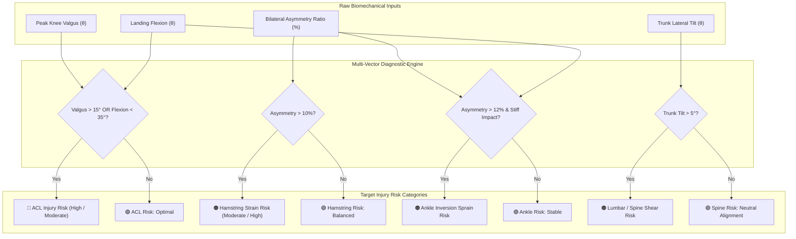

# 🏥 Module 6: Multi-Vector Injury Risk Prediction Engine

## 1. Overview & Objectives
The **Injury Risk Prediction Engine** translates quantitative kinematic metrics into specific, actionable clinical injury categories. Rather than providing a generic risk percentage, it pinpoints the exact anatomical structure at risk based on the athlete's movement pattern.

### Primary Objectives:
1. **Multi-Vector Injury Mapping:** Correlate kinematic deviations to the 4 most common athletic non-contact injuries (ACL, Hamstrings, Ankle, Lumbar Spine).
2. **Biomechanical Root Cause Tracing:** Identify the primary kinematic trigger causing each vulnerability.
3. **Compound Risk Detection:** Detect co-occurring risk factors (e.g., dynamic valgus + stiff landing = exponential ACL rupture risk).
4. **Risk Categorization:** Assign discrete severity tiers (**High**, **Moderate**, **Low**) with physiological rationale.

---

## 2. Multi-Vector Injury Prediction Logic



---

## 3. Injury Risk Mapping & Trigger Matrix

| Injury Category | Primary Kinematic Triggers | Physiological Risk Mechanism | Threshold Rules |
| :--- | :--- | :--- | :--- |
| **1. ACL Injury Risk** | • Knee Valgus ($\theta_{\text{valgus}} > 15^\circ$)<br>• Landing Flexion ($\theta_{\text{flexion}} < 35^\circ$) | Dynamic medial collapse causes extreme multi-planar tibiofemoral rotation, stressing the Anterior Cruciate Ligament beyond physiological yield strength. | • **High:** Valgus $> 18^\circ$ or (Valgus $> 15^\circ$ + Flexion $< 35^\circ$)<br>• **Moderate:** Valgus $12^\circ\text{--}18^\circ$<br>• **Low:** Valgus $< 12^\circ$ & Flexion $> 45^\circ$ |
| **2. Hamstring Strain Risk** | • Asymmetry ($\Delta_{\text{asym}} > 10\%$)<br>• Flexibility Index $< 75\%$ | Unequal eccentric loading during landing or deceleration causes rapid over-stretching of the biceps femoris muscle-tendon unit on the dominant limb. | • **High:** Asymmetry $> 15\%$ + Flexibility $< 70\%$<br>• **Moderate:** Asymmetry $10\%\text{--}15\%$<br>• **Low:** Asymmetry $< 8\%$ |
| **3. Ankle Inversion Sprain Risk** | • Asymmetry ($\Delta_{\text{asym}} > 12\%$)<br>• Ground Impact $> 4.0\times\text{ BW}$ | Stiff foot strike with lateral center-of-mass shift causes rapid ankle inversion and plantarflexion, straining the anterior talofibular ligament (ATFL). | • **High:** High GRF + Asymmetry $> 15\%$<br>• **Moderate:** Asymmetry $10\%\text{--}15\%$<br>• **Low:** Asymmetry $< 8\%$ & GRF $< 3.5\times$ |
| **4. Lumbar / Spine Shear Risk** | • Trunk Lateral Tilt ($\theta_{\text{trunk}} > 5^\circ$) | Lateral torso sway upon ground contact creates asymmetric spinal compression and rotational shear forces on the L4-L5 and L5-S1 lumbar vertebrae. | • **High:** Trunk Tilt $> 8^\circ$<br>• **Moderate:** Trunk Tilt $5^\circ\text{--}8^\circ$<br>• **Low:** Trunk Tilt $< 5^\circ$ |

---

## 4. Assessment Implementation (`app/services/biomechanics_engine.py`)

```python
def _assess_injury_categories(self, peak_valgus, landing_flexion, trunk_tilt, asymmetry, flexibility):
    categories = []

    # 1. ACL Injury Risk Assessment
    if peak_valgus > 18.0 or (peak_valgus > 15.0 and landing_flexion < 35.0):
        acl_level = "High"
    elif peak_valgus > 12.0 or landing_flexion < 40.0:
        acl_level = "Moderate"
    else:
        acl_level = "Low"
    categories.append({
        "category": "ACL Injury Risk",
        "risk_level": acl_level,
        "factor": f"Dynamic knee valgus ({peak_valgus:.1f}°) & landing flexion ({landing_flexion:.1f}°)"
    })

    # 2. Hamstring Strain Assessment
    ham_level = "High" if asymmetry > 15.0 and flexibility < 70.0 else ("Moderate" if asymmetry > 10.0 else "Low")
    categories.append({
        "category": "Hamstring Strain Risk",
        "risk_level": ham_level,
        "factor": f"Eccentric loading asymmetry ({asymmetry:.1f}%) & flexibility index ({flexibility:.0f}%)"
    })

    # 3. Ankle Sprain Assessment
    ankle_level = "Moderate" if asymmetry > 12.0 else "Low"
    categories.append({
        "category": "Ankle Inversion Sprain Risk",
        "risk_level": ankle_level,
        "factor": f"Ground impact stabilization asymmetry ({asymmetry:.1f}%)"
    })

    # 4. Lumbar / Spine Shear Assessment
    spine_level = "High" if trunk_tilt > 8.0 else ("Moderate" if trunk_tilt > 5.0 else "Low")
    categories.append({
        "category": "Lumbar / Spine Shear Risk",
        "risk_level": spine_level,
        "factor": f"Lateral trunk tilt deviation ({trunk_tilt:.1f}°)"
    })

    return categories
```
