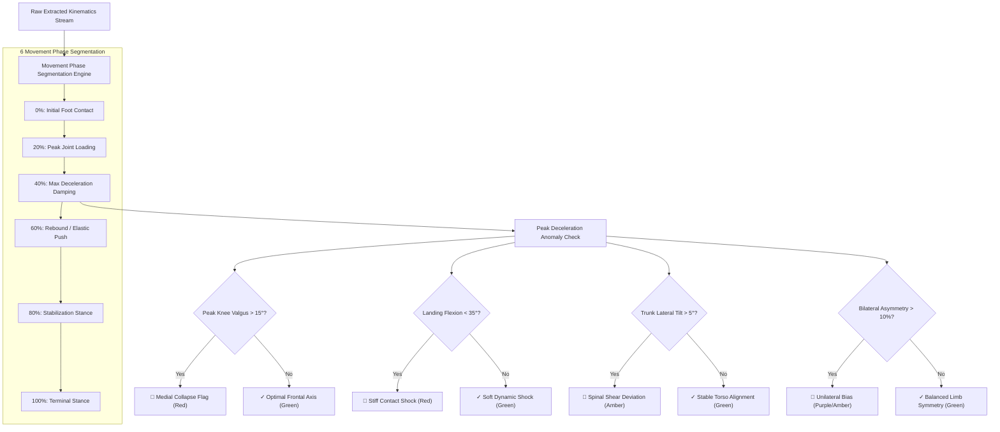

# ⚠️ Module 7: Movement Anomaly & Deviation Detection Engine

## 1. Overview & Objectives
The **Movement Anomaly Detection Engine** performs frame-by-frame deviation analysis to flag abnormal movement artifacts, compensatory motion habits, and neuromuscular fatigue patterns before clinical injury occurs.

### Primary Objectives:
1. **Instant Movement Flagging:** Evaluate every jump-landing and squat against healthy biomechanical corridors.
2. **Compensatory Movement Isolation:** Detect when an athlete unconsciously shifts weight away from a previously injured or fatigued limb.
3. **Automated Visual Feedback:** Generate intuitive UI status flags (e.g., `⚠ Medial Collapse Flag`, `⚠ Stiff Contact Shock`) with contextual progress bars.
4. **Technique Quality Scoring:** Calculate a normalized Movement Quality Score ($0\text{--}100\%$) indicating mechanical efficiency.

---

## 2. Movement Anomaly Evaluation Workflow

---

## 3. Anomaly Criteria & Status Flag Specification Matrix

| Metric Area | Healthy Baseline | Anomaly Trigger Threshold | Generated UI Status Flag | Clinical Interpretation |
| :--- | :---: | :---: | :--- | :--- |
| **Knee Frontal Alignment** | $\theta_{\text{valgus}} \le 12^\circ$ | $\theta_{\text{valgus}} > 15^\circ$ | `⚠ Medial Collapse Flag` | Knee buckles toward midline; high risk of ACL/MCL strain. |
| **Sagittal Damping Depth** | $\theta_{\text{flexion}} \ge 45^\circ$ | $\theta_{\text{flexion}} < 35^\circ$ | `⚠ Stiff Contact Shock` | Stiff-legged landing; quadriceps fail to dissipate ground impact. |
| **Upper Torso Stability** | $\theta_{\text{trunk}} \le 5^\circ$ | $\theta_{\text{trunk}} > 5^\circ$ | `⚠ Spinal Shear Deviation` | Torso sways laterally; indicates core or abductor fatigue. |
| **Limb Loading Balance** | $\Delta_{\text{asym}} \le 8\%$ | $\Delta_{\text{asym}} > 10\%$ | `⚠ Unilateral Bias` | Athlete heavily favors one leg, overworking the dominant tendon. |

---

## 4. Anomaly Severity Scoring Formulation

The continuous **Biomechanical Deviation Score** ($S_{\text{biomech}}$) is calculated by summing normalized penalty vectors:

$$P_{\text{valgus}} = \min\left(1.0, \frac{\max(0, \theta_{\text{valgus}} - 10^\circ)}{20^\circ}\right)$$

$$P_{\text{flexion}} = \min\left(1.0, \frac{\max(0, 50^\circ - \theta_{\text{flexion}})}{25^\circ}\right)$$

$$P_{\text{trunk}} = \min\left(1.0, \frac{\max(0, \theta_{\text{trunk}} - 3^\circ)}{12^\circ}\right)$$

$$S_{\text{biomech}} = \left( 0.40 \cdot P_{\text{valgus}} + 0.35 \cdot P_{\text{flexion}} + 0.25 \cdot P_{\text{trunk}} \right) \times 100$$
