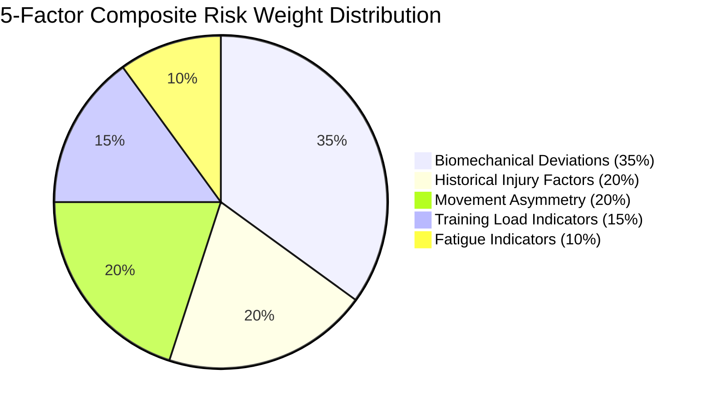

# 📊 Module 8: Risk Scoring & 5-Factor Weighted Mathematical Model

## 1. Overview & Objectives
The **Risk Scoring Engine** combines dynamic computer vision kinematic telemetry with the athlete's historical vitals, training load, and fatigue to generate a single, authoritative **Composite Injury Vulnerability Score ($0\text{--}100\%$)**.

### Primary Objectives:
1. **Multi-Modal Synthesis:** Fuse video kinematics ($55\%$) with athlete physiological vitals ($45\%$).
2. **Deterministic Mathematical Formulation:** Use an explainable, weighted linear regression equation rather than an unexplainable black-box prediction.
3. **Threshold Harmonization:** Maintain strict alignment between backend predictions, visual gauge meters, and historical screening cards.
4. **Calibrated Risk Tiers:** Map composite scores into standard clinical tiers (**Low**, **Moderate**, **High**, **Critical**).

---

## 2. The 5-Factor Weighted Mathematical Model

$$\boxed{\text{Composite Injury Risk Score} = 0.35 \cdot S_{\text{biomech}} + 0.20 \cdot S_{\text{history}} + 0.20 \cdot S_{\text{asymmetry}} + 0.15 \cdot S_{\text{load}} + 0.10 \cdot S_{\text{fatigue}}}$$

---

## 3. Mathematical Breakdown of the 5 Sub-Scores

### 1. Biomechanical Deviation Sub-Score ($S_{\text{biomech}} \in [0, 100]$, Weight: $35\%$)
Measures instantaneous joint misalignment across Valgus, Flexion, and Trunk Tilt during peak landing deceleration:

$$S_{\text{biomech}} = \min\left(100, \left[ 0.40 \cdot \left(\frac{\max(0, \theta_{\text{valgus}} - 10)}{20}\right) + 0.35 \cdot \left(\frac{\max(0, 50 - \theta_{\text{flexion}})}{25}\right) + 0.25 \cdot \left(\frac{\max(0, \theta_{\text{trunk}} - 3)}{12}\right) \right] \times 100\right)$$

---

### 2. Historical Injury Sub-Score ($S_{\text{history}} \in [0, 100]$, Weight: $20\%$)
Accounts for prior anatomical vulnerabilities and surgical re-injury probabilities:

$$S_{\text{history}} = \begin{cases} 
85.0 & \text{if Previous ACL Tear == True} \\
50.0 & \text{if Prior Ligament / Muscle Sprain Reported} \\
15.0 & \text{if Clean Health History}
\end{cases}$$

---

### 3. Movement Asymmetry Sub-Score ($S_{\text{asymmetry}} \in [0, 100]$, Weight: $20\%$)
Quantifies dynamic limb force and angle divergence between left and right legs:

$$S_{\text{asymmetry}} = \min\left(100.0, \frac{\Delta_{\text{asym}}}{20.0\%} \times 100\right)$$

---

### 4. Training Load Sub-Score ($S_{\text{load}} \in [0, 100]$, Weight: $15\%$)
Measures cumulative weekly volume against the acute:chronic workload ratio (ACWR):

$$S_{\text{load}} = \min\left(100.0, \frac{\text{Training Hours/Week}}{25.0\text{ hrs}} \times 100\right)$$

---

### 5. Fatigue Sub-Score ($S_{\text{fatigue}} \in [0, 100]$, Weight: $10\%$)
Measures subjective and physiological central nervous system fatigue on a $1\text{--}10$ scale:

$$S_{\text{fatigue}} = \frac{\text{Fatigue Level (1-10)}}{10} \times 100$$

---

## 4. Standard Risk Classification Tiers

| Score Range | Risk Classification | Color Indicator | Clinical Action & Training Protocol |
| :---: | :---: | :---: | :--- |
| **$0.0\%\text{--}24.9\%$** | **Low Risk** | 🟢 Green (`#10b981`) | Optimal mechanics. Cleared for full competition and high-intensity training. |
| **$25.0\%\text{--}49.9\%$** | **Moderate Risk** | 🟡 Amber (`#f59e0b`) | Mild compensatory movement or asymmetry noted. Implement corrective warm-up drills. |
| **$50.0\%\text{--}74.9\%$** | **High Risk** | 🔴 Rose/Red (`#f43f5e`) | Significant joint stress detected. Restrict high-impact plyometrics; prioritize targeted rehabilitation. |
| **$75.0\%\text{--}100.0\%$** | **Critical Risk** | 🟣 Crimson (`#e11d48`) | Severe mechanical failure risk. Immediate physical therapy evaluation required. |

---

## 5. Sample Calculation Walkthrough

### Athlete Profile:
- **Peak Knee Valgus:** $24.0^\circ$ ($S_{\text{valgus}} = 70.0$)
- **Landing Flexion:** $35.6^\circ$ ($S_{\text{flexion}} = 57.6$)
- **Trunk Tilt:** $6.5^\circ$ ($S_{\text{trunk}} = 29.2$)
- $\implies S_{\text{biomech}} = (0.40 \times 70.0) + (0.35 \times 57.6) + (0.25 \times 29.2) = \mathbf{55.46}$
- **History:** No prior ACL, mild ankle history $\implies S_{\text{history}} = \mathbf{50.0}$
- **Asymmetry:** $11.9\% \implies S_{\text{asymmetry}} = (11.9 / 20) \times 100 = \mathbf{59.5}$
- **Training Load:** $14.5\text{ hrs/week} \implies S_{\text{load}} = (14.5 / 25) \times 100 = \mathbf{58.0}$
- **Fatigue Level:** $4 / 10 \implies S_{\text{fatigue}} = \mathbf{40.0}$

### Final Weighted Composite:
$$\text{Final Score} = (0.35 \times 55.46) + (0.20 \times 50.0) + (0.20 \times 59.5) + (0.15 \times 58.0) + (0.10 \times 40.0)$$
$$\text{Final Score} = 19.41 + 10.00 + 11.90 + 8.70 + 4.00 = \mathbf{54.01\%} \implies \mathbf{54.0\% \text{ (High Risk)}}$$
