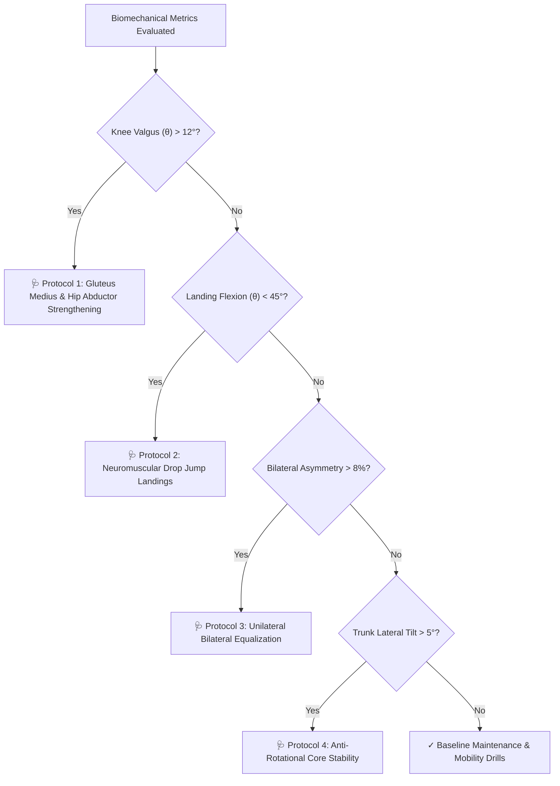

# 🏋️ Module 9: Corrective Rehabilitation & Recommendation Engine

## 1. Overview & Objectives
The **Corrective Recommendation Engine** bridges diagnostic assessment and clinical physical therapy. When an athlete exhibits biomechanical anomalies, the engine prescribes targeted neuromuscular drills, strengthening protocols, and landing mechanics retraining.

### Primary Objectives:
1. **Root-Cause Targeting:** Match specific joint deviations to clinically validated corrective exercises.
2. **Actionable Dosage & Cues:** Provide clear sets, repetitions, and technical focus cues for athletes and strength coaches.
3. **Adaptive Prescription:** Automatically generate customized protocol lists based on the specific failing metrics of each screening session.

---

## 2. Corrective Prescription Decision Tree



---

## 3. Corrective Protocols Master Specification Table

| Protocol Title | Triggering Biomechanical Metric | Prescribed Exercises & Dosage | Biomechanical Target / Clinical Focus |
| :--- | :--- | :--- | :--- |
| **1. Gluteus Medius & Hip Abductor Strengthening** | Peak Knee Valgus $> 12^\circ$ | **Banded Monster Walks & Clamshells**<br>• $3\text{ sets} \times 15\text{ reps}$<br>• Frequency: $4\times/\text{week}$ | Strengthens the hip external rotators to prevent inward femoral adduction and medial knee collapse upon landing. |
| **2. Neuromuscular Drop Jump Landings** | Landing Flexion $< 45^\circ$ | **30cm Box Drop Landing with 45° Knee Flexion Cue**<br>• $4\text{ sets} \times 6\text{ reps}$<br>• Frequency: $3\times/\text{week}$ | Retrains the quadriceps and gluteals to eccentrically absorb ground impact shock with knees tracking over the second toe. |
| **3. Unilateral Bilateral Equalization** | Bilateral Asymmetry $> 8\%$ | **Single-Leg Romanian Deadlifts & Bulgarian Split Squats**<br>• $3\text{ sets} \times 8\text{ reps/leg}$<br>• Frequency: $3\times/\text{week}$ | Eliminates limb loading disparities and balances ground reaction force absorption between dominant and non-dominant legs. |
| **4. Anti-Rotational Core Stability** | Trunk Lateral Tilt $> 5^\circ$ | **Pallof Press & Side Planks with Leg Lift**<br>• $3\text{ sets} \times 30\text{s each side}$<br>• Frequency: $4\times/\text{week}$ | Builds deep lateral core endurance (quadratus lumborum and obliques) to eliminate trunk sway during ground contact. |

---

## 4. Implementation Code (`app/services/biomechanics_engine.py`)

```python
def _generate_corrective_recommendations(
    self, peak_valgus, min_landing_flexion, peak_trunk_tilt, asymmetry_ratio, flexibility, strength
):
    recommendations = []

    # 1. Valgus Trigger -> Hip Abductors
    if peak_valgus > 12.0:
        recommendations.append({
            "title": "Gluteus Medius & Hip Abductor Strengthening",
            "exercise": "Banded Monster Walks & Clamshells (3 sets x 15 reps)",
            "focus": "Strengthen abductors to prevent inward frontal knee collapse on landing.",
            "priority": "High"
        })

    # 2. Stiff Flexion Trigger -> Drop Landings
    if min_landing_flexion < 45.0:
        recommendations.append({
            "title": "Neuromuscular Drop Jump Landings",
            "exercise": "30cm Box Drop Landing with 45° Knee Flexion Cue (4 sets x 6 reps)",
            "focus": "Train athlete to absorb shock dynamically with knees aligned over second toes.",
            "priority": "High"
        })

    # 3. Asymmetry Trigger -> Single-leg Drills
    if asymmetry_ratio > 8.0:
        recommendations.append({
            "title": "Unilateral Bilateral Equalization",
            "exercise": "Single-Leg Romanian Deadlifts & Bulgarian Split Squats (3 sets x 8 reps/leg)",
            "focus": "Equalize ground reaction force and limb load distribution.",
            "priority": "Moderate"
        })

    # 4. Trunk Tilt Trigger -> Anti-rotation
    if peak_trunk_tilt > 5.0:
        recommendations.append({
            "title": "Anti-Rotational Core Stability",
            "exercise": "Pallof Press & Side Planks with Leg Lift (3 sets x 30s each side)",
            "focus": "Eliminate lateral trunk sway during ground contact deceleration.",
            "priority": "Moderate"
        })

    return recommendations
```
