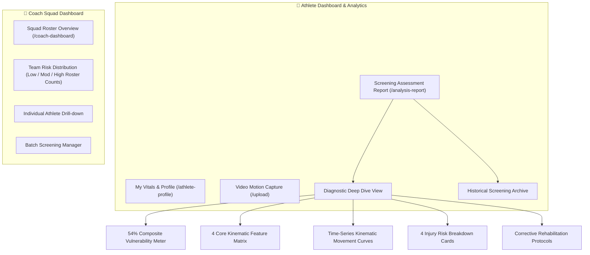
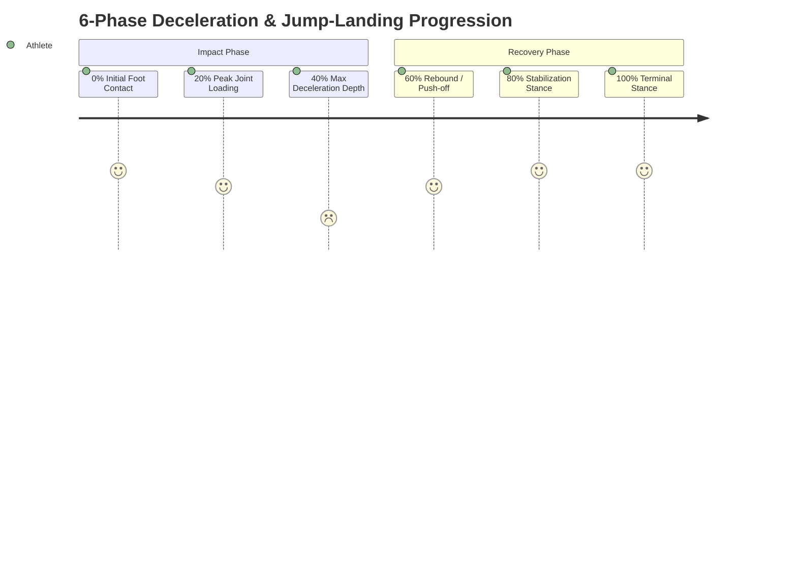

# 📈 Module 10: Dashboards, Squad Analytics & Time-Series Movement Curves

## 1. Overview & Objectives
The **Dashboards & Analytics Module** provides tailored visual interfaces for athletes, strength coaches, and sports scientists. It visualizes high-dimensional kinematic telemetry through responsive gauges, status cards, and interactive time-series curves.

### Primary Objectives:
1. **Athlete Self-Monitoring:** Provide individual athletes with intuitive vulnerability scores, historical screening sessions, and prescribed corrective protocols.
2. **Coach Squad Management:** Aggregate squad-level risk distributions, flagging high-risk roster members for training modifications.
3. **Time-Series Deceleration Analytics:** Plot joint angle curves across the 6 phases of dynamic ground impact.
4. **Historical Screening Archive:** Allow instant comparison across past video assessments.

---

## 2. Dashboard Architecture & User Navigation

---

## 3. Time-Series Movement Phase Analytics

KineticAI segments dynamic video movements into **6 standardized biomechanical phases** to pinpoint the exact millisecond of peak joint stress:

### Time-Series Kinematic Curve Dataset

| Phase (%) | Movement Phase Name | Knee Flexion ($\theta_{\text{flex}}$) | Knee Valgus ($\theta_{\text{valg}}$) | Trunk Lateral Tilt ($\theta_{\text{trunk}}$) | Biomechanical Significance |
| :---: | :--- | :---: | :---: | :---: | :--- |
| **0%** | Initial Contact | $9.0^\circ$ | $8.0^\circ$ | $1.0^\circ$ | First ground strike; heel/toe touchdown. |
| **20%** | Peak Joint Loading | $22.0^\circ$ | $23.0^\circ$ | $4.5^\circ$ | Shock transmission through lower kinetic chain. |
| **40%** | **Max Deceleration** | $\mathbf{35.6^\circ}$ | $\mathbf{24.0^\circ}$ | $\mathbf{6.5^\circ}$ | **Critical Hazard Zone:** Maximum valgus collapse and peak ground force. |
| **60%** | Rebound Push | $24.0^\circ$ | $12.0^\circ$ | $3.0^\circ$ | Muscle recruitment for upward momentum or stabilization. |
| **80%** | Stabilization | $16.0^\circ$ | $6.0^\circ$ | $1.5^\circ$ | Center of gravity stabilizes over base of support. |
| **100%** | Terminal Stance | $8.0^\circ$ | $4.0^\circ$ | $0.8^\circ$ | Neutral athletic standing position restored. |

---

## 4. Coach Squad Roster Management

The **Coach Dashboard** (`frontend/src/pages/CoachDashboard.jsx`) aggregates all team members into a synchronized risk roster:

- **Squad Summary Metrics:** Total Athletes Active, High-Risk Flags count, Average Squad Knee Valgus, Average Asymmetry.
- **Roster Table:** Athlete Name, Position, Recent Screening Date, Vulnerability Score ($0\text{--}100\%$), Action button to review detailed diagnostic reports.
- **Filter & Search:** Real-time athlete name search and risk category sorting.
