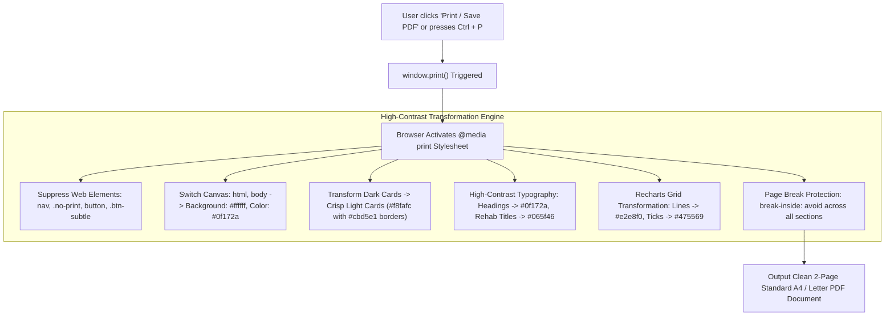

# 📄 Modules 11 & 12: Alerts, History Archive & PDF Export Engine

## 1. Overview & Objectives
The **Alerts, History Archive & Reports Export System** enables historical performance tracking, visual hazard notifications, and formal physical assessment documentation. It transforms on-screen interactive telemetry into publication-grade clinical reports for coaches, medical teams, and orthopedic specialists.

### Primary Objectives:
1. **Real-Time Visual Alerts:** Highlight dangerous joint angles with high-contrast colored alert badges (`High Risk`, `Medial Collapse Flag`).
2. **Recorded Screening History Archive:** Maintain a historical session switcher and comparative table for past video assessments.
3. **Publication-Grade PDF Export:** Transform dark web UI into a clean, high-contrast, black-and-white compatible document upon clicking **"Print / Save PDF"**.
4. **Clean Print Architecture:** Automatically suppress web navigation bars, buttons, and interactive widgets during print rendering.

---

## 2. PDF & Print Transformation Architecture

---

## 3. Print Stylesheet Master Specification (`frontend/src/index.css`)

| Component | Web Display Style | Print / PDF Export Override | Rationale |
| :--- | :--- | :--- | :--- |
| **Page Canvas** | `#070b14` (Dark Cyber) | `#ffffff` (Clean White) | Eliminates ink saturation and ensures clean physical printing. |
| **Top Navigation Bar** | Fixed Sticky Glass Bar | `display: none !important` | Web navigation has no place in an official clinical report. |
| **Report Main Title** | White `#ffffff` text | Bold Charcoal `#0f172a` | Guarantees high-contrast readability against white paper. |
| **Brand Text ("KINETIC")** | White `#ffffff` text | Dark Slate `#0f172a` | Prevents brand text from vanishing into white paper. |
| **Athlete Profile Card** | Dark Navy `rgba(15, 23, 42, 0.8)` | Light Slate `#f8fafc` + `#cbd5e1` | Professional medical document appearance. |
| **Composite Risk Gauge** | Translucent Arc Track | Light Gray `#e2e8f0` Arc Track | Keeps the speedometer visible and crisp on paper. |
| **Rehab Protocol Titles** | White `#ffffff` text | Forest Green `#065f46` | Highlights corrective exercise names clearly. |
| **Section Breaks** | Fluid scroll | `break-inside: avoid !important` | Prevents charts or cards from being sliced across page boundaries. |

---

## 4. Screening History Management & Deletion Engine

The **Screening History Archive** provides full CRUD management for athlete assessments:

- **Switch Active Assessment:** Clicking any past card in the top horizontal gallery immediately reloads the 3D curves, scores, and recommendations for that session.
- **Searchable Archive Table:** Filter past runs by filename, date, or risk classification.
- **Safe Deletion Workflow:** Custom modal confirmation ensures accidental clicks cannot delete assessment records from the database.
