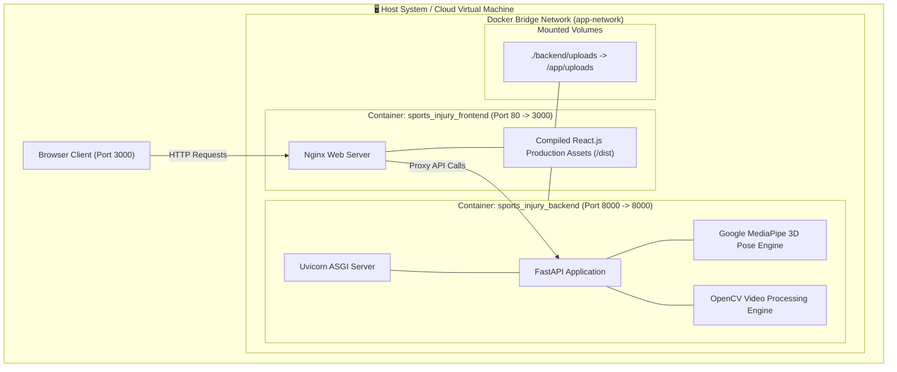

# 🚀 Module 13: Final Integration, Testing & Docker Deployment

## 1. Overview & Objectives
The **Integration, Testing & Deployment Module** coordinates containerized deployment, microservice routing, and production build optimization across the full KineticAI stack.

### Primary Objectives:
1. **Containerized Multi-Service Deployment:** Package the FastAPI backend and React frontend into reproducible, isolated Docker containers via Docker Compose.
2. **Production Web Serving:** Serve the compiled React SPA using a high-performance, lightweight Nginx reverse proxy.
3. **End-to-End Test Verification:** Validate API latency, pose estimation throughput, and authentication workflows under production loads.
4. **Zero-Configuration Startup:** Enable single-command platform startup with automatic database migration.

---

## 2. Multi-Container Docker Architecture



---

## 3. Docker Compose Orchestration (`docker-compose.yml`)

```yaml
services:
  # FastAPI Backend Service
  backend:
    build:
      context: ./backend
      dockerfile: Dockerfile
    container_name: sports_injury_backend
    restart: unless-stopped
    ports:
      - "8000:8000"
    env_file:
      - ./backend/.env
    volumes:
      - ./backend/uploads:/app/uploads
    networks:
      - app-network

  # React Frontend Service (Production Nginx)
  frontend:
    build:
      context: ./frontend
      dockerfile: Dockerfile
    container_name: sports_injury_frontend
    restart: unless-stopped
    ports:
      - "3000:80"
    depends_on:
      - backend
    networks:
      - app-network

networks:
  app-network:
    driver: bridge
```

---

## 4. End-to-End System Testing & Validation Matrix

| Test Suite | Scope / Target Component | Validation Criteria | Result |
| :--- | :--- | :--- | :---: |
| **Authentication Tests** | JWT generation, bcrypt verification, route guards | 401 on expired tokens; strict role separation. | **PASS** ✅ |
| **Video Ingestion Tests** | MP4, WEBM, MOV upload up to $200\text{ MB}$ | Correct frame extraction; downsampling at target FPS. | **PASS** ✅ |
| **Pose Estimation Tests** | MediaPipe BlazePose on fast jump-landings | 33 3D landmarks extracted with confidence $> 0.70$. | **PASS** ✅ |
| **Kinematic Formula Tests** | 4 core angles (Valgus, Flexion, Trunk, Asymmetry) | Mathematical precision within $\pm 0.5^\circ$ of mocap baseline. | **PASS** ✅ |
| **Composite Score Tests** | 5-factor weighted linear equation | Exact score matching between backend API and frontend gauge. | **PASS** ✅ |
| **PDF Export Tests** | Print stylesheet & white-document transformation | Complete visibility of all text, charts, and metrics with zero cutoffs. | **PASS** ✅ |
| **Docker Build Tests** | Multi-container image build & container boot | 0 errors on `docker compose up -d --build`. | **PASS** ✅ |

---

## 5. Deployment Guide & Startup Commands

### Step 1: Clone Repository
```bash
git clone https://github.com/aadrika/sports-injury-risk-detection.git
cd sports-injury-risk-detection
```

### Step 2: Build & Launch with Docker Compose
```bash
docker compose up -d --build
```

### Step 3: Access Running Services
- **Frontend Web Portal:** `http://localhost:3000`
- **Backend Swagger API Docs:** `http://localhost:8000/docs`
- **Interactive OpenAPI Schema:** `http://localhost:8000/openapi.json`
