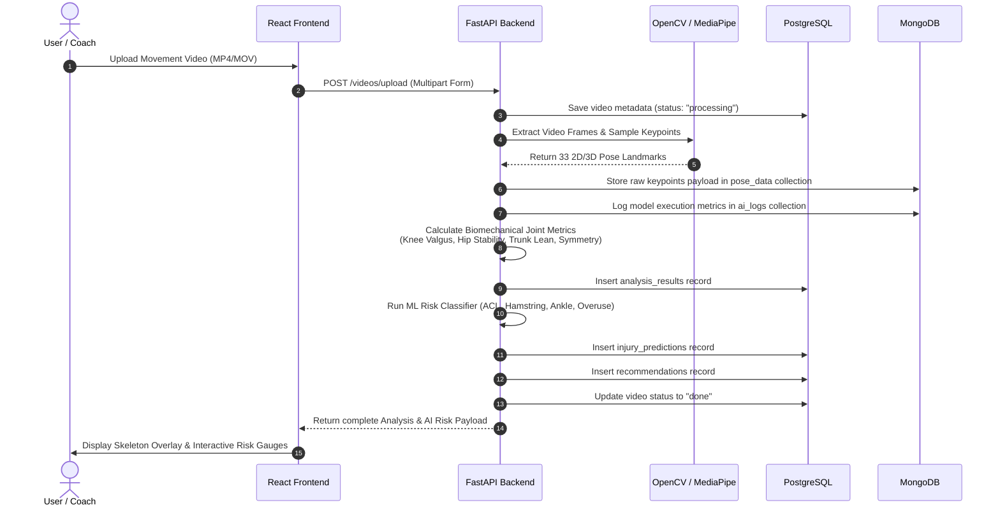

# System Architecture & Design Document

This document outlines the software architecture, design principles, data pipelines, and component relationships of the **Sports Injury Risk Detection System**.

---

## 🏛️ System Overview

The application follows a modern, decoupled microservices-ready architecture:

```
+-------------------------------------------------------------------+
|                        Client Web Browser                         |
|        (React 19 + Vite SPA, Tailwind CSS, Chart.js, Canvas)      |
+-------------------------------------------------------------------+
                                 |  HTTPS / REST API
                                 v
+-------------------------------------------------------------------+
|                       Nginx Reverse Proxy                         |
|             (Static Asset Serving + API Proxy Pass)               |
+-------------------------------------------------------------------+
                                 |  Proxy Pass (Port 8000)
                                 v
+-------------------------------------------------------------------+
|                      FastAPI Application Server                   |
|  - Auth Router (JWT Authentication)                               |
|  - Athlete Router (Profile & Physical Assessment Management)      |
|  - Video Router (Async Upload, CV Processing, AI Pipeline)        |
+-------------------------------------------------------------------+
           |                                         |
           v                                         v
+-----------------------+                 +-----------------------+
|  PostgreSQL Database  |                 |   MongoDB Database    |
| (Relational Entities) |                 | (Pose Data & AI Logs) |
+-----------------------+                 +-----------------------+
```

---

## 🔬 AI Biomechanical Analysis Pipeline

When a user uploads a video clip, the backend processes it through a multi-stage computer vision and risk classification pipeline:



### Biomechanical Metrics Calculations
1. **Dynamic Knee Valgus**: Computes the 3D interior angle between Hip-Knee-Ankle keypoints. An inward collapse angle exceeding 12° triggers high ACL strain alerts.
2. **Hip Stability Index**: Evaluates pelvic tilt variation across landing frames (0–100 stability score).
3. **Lateral Trunk Lean**: Measures degrees of coronal plane trunk deviation relative to vertical axis during cutting maneuvers.
4. **Bilateral Symmetry**: Compares peak ground reaction loading and joint displacement between Left and Right limbs (0.0 to 1.0 ratio).

---

## 🔐 Authentication & Role-Based Access Control (RBAC)

Authentication uses stateless **JSON Web Tokens (JWT)** with HTTP Bearer authentication headers.

### System Roles & Permissions
- **Athlete**: Can view their own profile, uploaded videos, injury predictions, and prescribed AI recommendations.
- **Coach**: Full access to assign training modifications, view team-wide risk distributions, log injury histories, and generate squad comparison reports.
- **Admin**: System-wide administrative permissions, access to raw MongoDB `ai_logs`, user account management, and schema overrides.
- **Viewer**: Read-only guest access to public metrics and sample demonstration videos.

---

## 📦 Database Selection Rationale

| Requirement | Selected Database | Rationale |
|---|---|---|
| Core User Profiles, Athletes, Injury Histories, Reports | **PostgreSQL 16** | Strict relational integrity, foreign key CASCADE deletes, ACID transactions, and structured indexing. |
| Frame-by-Frame Keypoint Landmarks (30–120 FPS) | **MongoDB 7.0** | High-throughput, schema-flexible document storage designed for large JSON arrays. |
| AI Inference Latency & Debug Logs | **MongoDB 7.0** | Unstructured log storage with TTL expiration indexes to clean logs older than 90 days. |
