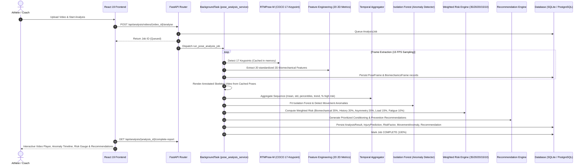

# AthleteGuard - System Architecture & Design Document

**AthleteGuard: AI Sports Biomechanics & Injury Prevention**

> **IMPORTANT MEDICAL & REGULATORY DISCLAIMER**  
> *AthleteGuard provides AI-assisted video biomechanical screening and injury-risk estimation. It is strictly an informational and athletic performance screening tool, NOT a medical device or clinical diagnostic system. No clinical diagnosis or medical prescription is provided.*

---

## 🏛️ System Overview

AthleteGuard uses a modular, high-throughput microservices-ready architecture:

```
+-------------------------------------------------------------------+
|                        Client Web Browser                         |
|    (React 19 + Vite SPA, Tailwind CSS, Lucide Icons, Canvas)      |
+-------------------------------------------------------------------+
                                 |  HTTPS / REST API
                                 v
+-------------------------------------------------------------------+
|                       Nginx Reverse Proxy                         |
|             (Static Asset Serving + API Proxy Pass)               |
+-------------------------------------------------------------------+
                                 |  Proxy Pass (Port 8000)
                                 v
+-------------------------------------------------------------------+
|                      FastAPI Application Server                   |
|  - Auth Router (JWT, RBAC: Athlete, Coach, Physio, Scientist, Admin)|
|  - Athlete Router (Profile & Physical Assessment Management)      |
|  - Video Router (Upload, Security Checks, Metadata Extraction)    |
|  - Analysis Router (Risk, Anomalies, Biomechanics, Reports)       |
+-------------------------------------------------------------------+
           |                     |                      |
           v                     v                      v
+--------------------+ +--------------------+ +--------------------+
| SQLite / Postgres  | |     Pose Cache     | |   Video Storage    |
| (Relational Data)  | |  (Zero Re-infer)   | |  (Local / S3 Stub) |
+--------------------+ +--------------------+ +--------------------+
```

---

## 🔬 End-to-End ML & Biomechanical Screening Pipeline



---

## 📐 20 Reliable 2D Biomechanical Features (Phase 1)

All calculations operate strictly in 2D image coordinates and plane projections:

1. **Knee Valgus Angle**: 2D frontal plane medial collapse angle deviation (degrees).
2. **Left Knee Angle**: 3-point interior angle (hip-knee-ankle, degrees).
3. **Right Knee Angle**: 3-point interior angle (hip-knee-ankle, degrees).
4. **Left Hip Angle**: 3-point interior angle (shoulder-hip-knee, degrees).
5. **Right Hip Angle**: 3-point interior angle (shoulder-hip-knee, degrees).
6. **Left Ankle Angle**: 3-point ankle dorsiflexion angle (knee-ankle-foot, degrees).
7. **Right Ankle Angle**: 3-point ankle dorsiflexion angle (knee-ankle-foot, degrees).
8. **Trunk Lean**: Angle of torso segment relative to true vertical axis (degrees).
9. **Hip Stability**: Pelvic tilt angle relative to horizontal axis (degrees).
10. **Bilateral Knee Asymmetry**: Absolute difference between left and right knee flexion (degrees).
11. **Bilateral Hip Asymmetry**: Absolute difference between left and right hip flexion (degrees).
12. **Bilateral Ankle Asymmetry**: Absolute difference between left and right ankle angles (degrees).
13. **Shoulder Asymmetry**: Alignment tilt of shoulder line relative to horizontal (degrees).
14. **Range of Motion**: Dynamic envelope of joint angular displacement over sequence (degrees).
15. **Joint-Angle Velocity**: Angular rate of change frame-to-frame (deg/sec).
16. **Joint-Angle Acceleration**: Angular acceleration frame-to-frame (deg/sec²).
17. **Movement Variability**: Windowed standard deviation of lower-limb kinematics (degrees_std).
18. **Postural Stability**: Center-of-mass sway and trunk oscillation stability score (0–100).
19. **Landing/Deceleration Indicator**: High-speed flexion deceleration spike indicator (binary/index).
20. **Keypoint Confidence & Movement Quality**: Mean detector confidence and combined composite score (0–100).

---

## 📊 Temporal Feature Aggregation (Phase 2)

Features are aggregated across the full video sequence:
- **Central Tendency**: Mean, Median
- **Dispersion**: Standard Deviation, Minimum, Maximum, Percentiles (P5, P25, P75, P95)
- **Kinematic Trends**: Linear regression slope across temporal timeline
- **Variability**: Coefficient of variation (CV)
- **Threshold Excursions**: Percentage of frames exceeding clinical risk thresholds (e.g. knee valgus > 12°, trunk lean > 10°, knee asymmetry > 15°)

---

## 🚨 Movement Anomaly Detection (Phase 3)

Implemented with an unsupervised **Isolation Forest** paired with statistical z-score and biomechanical threshold attribution:
- Detects outlier frames across sequence
- Outputs structured events: `{frame, timestamp, type, score, severity, body_region, explanation}`
- Categorized as: `knee_valgus`, `excessive_trunk_lean`, `bilateral_asymmetry`, `abnormal_hip_movement`, `abnormal_ankle_movement`, `excessive_movement_variability`, `low_movement_confidence`

---

## ⚖️ Weighted Risk Scoring Engine (Phase 5)

Replaces simplistic heuristics with an explainable multi-component formula:

| Component | Weight | Key Drivers |
|---|---|---|
| **Biomechanical Deviations** | **35%** | Knee valgus excursions, excessive trunk lean, pelvic drop |
| **Historical Injury Factors** | **20%** | Prior injury counts, severity (Severe/Moderate/Mild), unresolved recovery |
| **Movement Asymmetry** | **20%** | Bilateral knee, hip, and ankle discrepancies |
| **Training Load Indicators** | **15%** | Athlete training load exposure & repetition intensity |
| **Fatigue Indicators** | **10%** | Temporal trend slopes (worsening asymmetry/valgus over time) |

**Risk Levels**:
- `0 – 34`: **LOW**
- `35 – 59`: **MODERATE**
- `60 – 79`: **HIGH**
- `80 – 100`: **CRITICAL**

---

## 🎯 Personalized Recommendations (Phase 7)

Generates targeted, actionable drills categorized into:
- **Strengthening**: Hip abductor band walks, Nordic hamstring curls, single-leg RDLs
- **Mobility**: Thoracic spine mobilizations, ankle dorsiflexion knee-to-wall drills
- **Exercise**: Controlled drop landings, multi-directional stability drills
- **Recovery**: Active recovery protocols, contrast baths
- **Training Modification**: De-loading maximal impact plyometrics when asymmetry or valgus is high

Every recommendation includes: `reason`, `priority`, `target_region`, `target_biomechanical_problem`, `exercise`, `suggested_frequency`, `suggested_sets_reps`, `expected_objective`, and the standard screening disclaimer.

---

## 📑 Report Generation (Phase 12)

- **PDF Reports**: Generated using ReportLab with 9 standardized clinical sections (Athlete Profile, Analysis Information, Overall Risk, Injury Risk Breakdown, Biomechanical Summary, Movement Anomalies, Risk Factors, Recommendations, Regulatory Disclaimer).
- **Excel Reports**: Multi-sheet analytical workbooks generated via OpenPyXL (Summary, Frame Data, Biomechanics, Injury Risk, Anomalies, Recommendations).

---

## 🔐 Security & RBAC (Phases 14 & 15)

- JWT authentication with enforced `JWT_SECRET` in production.
- Reusable RBAC dependency `require_role("ATHLETE", "COACH", "PHYSIOTHERAPIST", "SPORTS_SCIENTIST", "ADMIN")`.
- Video upload validation: MIME type check, 100MB file size limit, 300s maximum duration, UUID disk naming preventing path traversal.
- Strict ownership verification on all analysis resources and reports.
