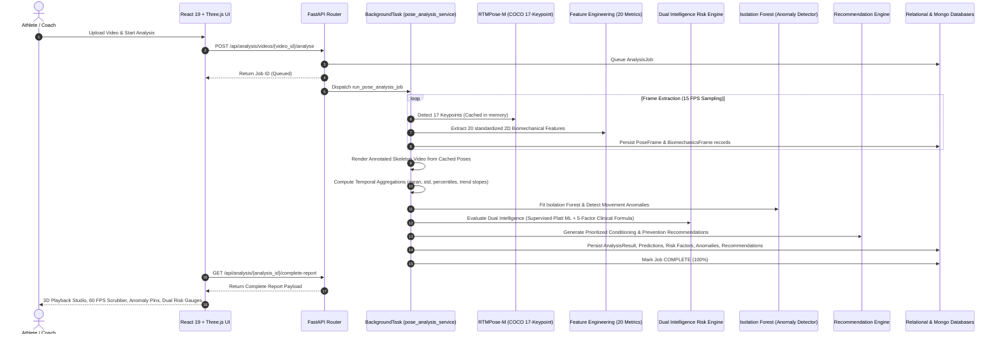

# AthleteGuard - System Architecture & Design Document

**AthleteGuard: AI Sports Biomechanics & Injury Prevention**

> **IMPORTANT MEDICAL & REGULATORY DISCLAIMER**  
> *AthleteGuard provides AI-assisted video biomechanical screening and injury-risk estimation. It is strictly an informational and athletic performance screening tool, NOT a medical device or clinical diagnostic system. No clinical diagnosis or medical prescription is provided.*

---

## 🏛️ System Overview

AthleteGuard is engineered using a modular, high-throughput microservices-ready architecture designed for low-latency computer vision inference, interactive 3D WebGL rendering, and multi-factor clinical risk scoring:

```
+---------------------------------------------------------------------------------------------+
|                                    Client Web Browser                                       |
|  - React 19 + Vite SPA with Tailwind CSS & Lucide Icons                                    |
|  - 3D Kinematic Reconstruction Studio (Three.js / React Three Fiber / OrbitControls)        |
|  - Real-Time Scrubbing Timeline & Anomaly Marker Navigation                                |
+---------------------------------------------------------------------------------------------+
                                              |  HTTPS / REST API
                                              v
+---------------------------------------------------------------------------------------------+
|                                    Nginx Reverse Proxy                                      |
|                  (Static Asset Serving + API Proxy Pass + TLS Termination)                  |
+---------------------------------------------------------------------------------------------+
                                              |  Proxy Pass (Port 8000)
                                              v
+---------------------------------------------------------------------------------------------+
|                                  FastAPI Application Server                                 |
|  - Auth Router (Flexible ID Resolver: Email, Username, ID; Google OAuth; JWT RBAC)          |
|  - Athlete Router (Profile, Physical Assessment, Clinical Injury History Registry)          |
|  - Video Router (Upload, MIME Validation, Metadata Extraction, UUID Storage)                |
|  - Analysis Router (Async Video Pose Extraction, Anomaly Detection, Explainability)         |
|  - Model & Dataset Routers (ML Governance, Model Cards, Dataset Metrics)                    |
+---------------------------------------------------------------------------------------------+
               |                              |                              |
               v                              v                              v
+------------------------------+ +------------------------------+ +---------------------------+
| PostgreSQL / SQLite          | | MongoDB Keypoint Cache       | | Video & Artifact Storage  |
| - Users & Roles              | | - Raw 2D/3D COCO Poses       | | - Source Uploads (UUID)   |
| - Athletes & Assessments     | | - Interpolated Kinematics    | | - Rendered Pose Overlays  |
| - Injury History Registry    | | - Joint Angle Sequences      | | - PDF Clinical Reports    |
| - Analysis Jobs & Results    | | - AI Processing Audit Logs   | | - Excel Analytical Sheets |
+------------------------------+ +------------------------------+ +---------------------------+
```

---

## 🔬 End-to-End ML & Biomechanical Screening Pipeline



---

## 🏃 Interactive 3D Kinematic Reconstruction Studio

The 3D Biomechanical Studio (`AthleteSkeleton3D.jsx` and `AnalysisDashboard.jsx`) delivers real-time spatial movement analysis directly inside the web browser using WebGL:

```
+------------------------------------------------------------------------------------+
|                         3D KINEMATICS PLAYBACK PIPELINE                            |
+------------------------------------------------------------------------------------+
| Raw 2D Keypoints [(x, y, conf)] from RTMPose-M                                     |
|                                     │                                              |
|                                     ▼                                              |
| 1. Dynamic Coordinate Normalization (normalizeKeypoints)                           |
|    • Bounds Bounding Box: [minX, maxX], [minY, maxY]                               |
|    • Scale to standard physiological height (1.62m anatomical reference)            |
|    • Centers pelvic midpoint at origin (0, 0, 0)                                   |
|                                     │                                              |
|                                     ▼                                              |
| 2. Anatomical Volumetric Depth Estimation                                          |
|    • Z-axis synthetic projection based on foreshortening & limb constraint vectors  |
|    • Bilateral symmetry alignment (shoulder and hip coronal plane priors)          |
|                                     │                                              |
|                                     ▼                                              |
| 3. High-Rate 60 FPS Hardware Playback Loop                                         |
|    • requestAnimationFrame continuous animation engine                             |
|    • Microsecond-precision frame interpolation between discrete video frames       |
|    • Dynamic playback speed controls (0.25x, 0.5x, 1.0x, 1.5x)                     |
|                                     │                                              |
|                                     ▼                                              |
| 4. Interactive Scrubber & Anomaly Navigation                                       |
|    • Full-sequence timeline scrubber with drag & click support                    |
|    • Color-coded anomaly pins indicating severity (Low, Medium, High, Critical)    |
|    • Single-frame stepping buttons (◀ -1 Frame / +1 Frame ▶)                       |
|                                     │                                              |
|                                     ▼                                              |
| 5. Multi-Angle Spatial Camera Presets                                              |
|    • 3D Orbit: Free 360° rotational camera with damping controls                   |
|    • Frontal (Coronal): Zeroed Z-axis view for knee valgus & pelvic tilt           |
|    • Lateral (Sagittal): 90° Y-axis profile view for trunk lean & knee flexion     |
+------------------------------------------------------------------------------------+
```

### Key Anatomical Bones & Connectivity
The 3D renderer connects 17 COCO landmarks into 12 physiological kinematic segments:
- **Spine & Torso**: Mid-shoulder to mid-hip spinal column, shoulder girdle, pelvic girdle.
- **Lower Extremities**: Left/Right Femur (Hip $\to$ Knee), Left/Right Tibia/Fibula (Knee $\to$ Ankle).
- **Upper Extremities**: Left/Right Humerus (Shoulder $\to$ Elbow), Left/Right Forearm (Elbow $\to$ Wrist).
- **Ground Force Plate**: Reactive grid positioned at $y = -0.92$, simulating biomechanical force plates.

---

## 🧠 Dual Intelligence Risk Engine

AthleteGuard combines data-driven machine learning with established clinical sports medicine paradigms:

```
                                  +---------------------------------------+
                                  |   Video Keypoint Sequence Features    |
                                  +---------------------------------------+
                                                      |
                         +----------------------------+----------------------------+
                         |                                                         |
                         v                                                         v
          +-------------------------------+                         +-------------------------------+
          |   SUPERVISED MACHINE LEARNING |                         |  5-FACTOR CLINICAL SCREENING  |
          | - Gradient Boosting / XGBoost |                         | - Biomechanical Deviations 35%|
          | - 20 Temporal Feature Vectors |                         | - Prior Injury Registry 20%   |
          | - Platt Probability Calibrator|                         | - Bilateral Asymmetry 20%     |
          |   (CalibratedClassifierCV)    |                         | - ACWR Training Load 15%      |
          +-------------------------------+                         | - Temporal Fatigue Drift 10%  |
                         |                                          +-------------------------------+
                         | P(Injury) ∈ [0.0, 1.0]                                  |
                         |                                                         | Risk Score ∈ [0, 100]
                         +----------------------------+----------------------------+
                                                      |
                                                      v
                                  +---------------------------------------+
                                  |     HYBRID COMPOSITE RISK SYNTHESIS   |
                                  | - Categorization: LOW, MOD, HIGH, CRIT|
                                  | - Explainability & Risk Attribution   |
                                  | - Targeted Corrective Recommendations |
                                  +---------------------------------------+
```

### 1. Supervised Machine Learning Model
- **Algorithm**: Gradient Boosting Classifier / XGBoost.
- **Calibration**: Platt Scaling via `CalibratedClassifierCV(method='sigmoid')` ensuring output probabilities reflect true empirical injury incidence rates.
- **Features**: Aggregated statistical metrics (mean, standard deviation, 95th percentiles, linear regression slope trends) computed across 20 biomechanical kinematic channels.

### 2. Clinical 5-Factor Risk Weighting Formula
The deterministic clinical screening score aggregates 5 foundational sports science pillars:

$$\text{Risk Score} = 0.35 \times B + 0.20 \times H + 0.20 \times A + 0.15 \times L + 0.10 \times F$$

| Factor | Weight | Formulation & Clinical Rationale |
|---|---|---|
| **$B$: Biomechanical Deviations** | **35%** | Percentage of frames exceeding dynamic valgus ($>12^\circ$), trunk tilt ($>10^\circ$), and abnormal hip flexion during landing phases. |
| **$H$: Prior Injury History** | **20%** | Derived from the **Clinical Injury History Registry**: scored by anatomical recurrence, severity (Severe $=3$, Moderate $=2$, Mild $=1$), and recovery status. |
| **$A$: Bilateral Asymmetry** | **20%** | Absolute differences between dominant and non-dominant limbs across knee flexion, hip flexion, and ankle dorsiflexion ($|L - R|$). Discrepancies $>15\%$ elevate score. |
| **$L$: Training Load (ACWR)** | **15%** | Acute:Chronic Workload Ratio ($ACWR = \text{Acute 7d Load} / \text{Chronic 28d Load}$). $ACWR \in [0.8, 1.3]$ is safe; $ACWR > 1.5$ induces exponential risk. |
| **$F$: Fatigue Drift** | **10%** | Kinematic deterioration slope across the duration of the movement sequence. Indicates loss of neuromuscular motor control. |

**Categorical Risk Thresholds**:
- `0 – 34`: **LOW RISK** (Safe athletic movement mechanics)
- `35 – 59`: **MODERATE RISK** (Sub-optimal mechanics; targeted conditioning advised)
- `60 – 79`: **HIGH RISK** (Elevated injury vulnerability; training modification recommended)
- `80 – 100`: **CRITICAL RISK** (Severe biomechanical breakdown; immediate clinical review recommended)

---

## 🏥 Clinical Injury History Registry & Workload Architecture

To capture longitudinal health context, AthleteGuard maintains a dedicated clinical history subsystem:

### Data Model & Endpoints
- **Endpoints**: `GET /api/athletes/injuries` & `POST /api/athletes/injuries`
- **Schema**:
  ```json
  {
    "athlete_id": 1,
    "injury_date": "2025-11-15",
    "injury_type": "ACL Sprain (Grade II)",
    "body_region": "Left Knee",
    "severity": "Moderate",
    "recovery_status": "Recovered",
    "notes": "Cleared for functional movement screening with brace."
  }
  ```
- **Dynamic Weight Recalibration**: When screening an athlete with a previous injury in the target body region, the engine automatically adjusts vulnerability baselines and flags historical recurrence risks.

---

## 📐 20 Reliable 2D Biomechanical Features

All calculations operate in calibrated coordinate planes with frame-by-frame temporal resolution:

1. **Knee Valgus Angle**: Frontal plane medial knee collapse deviation ($^\circ$).
2. **Left Knee Angle**: 3-point interior angle (hip-knee-ankle, $^\circ$).
3. **Right Knee Angle**: 3-point interior angle (hip-knee-ankle, $^\circ$).
4. **Left Hip Angle**: 3-point interior angle (shoulder-hip-knee, $^\circ$).
5. **Right Hip Angle**: 3-point interior angle (shoulder-hip-knee, $^\circ$).
6. **Left Ankle Angle**: Ankle dorsiflexion angle (knee-ankle-foot, $^\circ$).
7. **Right Ankle Angle**: Ankle dorsiflexion angle (knee-ankle-foot, $^\circ$).
8. **Trunk Lean**: Torso vertical inclination angle ($^\circ$).
9. **Hip Stability**: Pelvic tilt angle relative to horizontal plane ($^\circ$).
10. **Bilateral Knee Asymmetry**: Absolute difference between left and right knee flexion ($^\circ$).
11. **Bilateral Hip Asymmetry**: Absolute difference between left and right hip flexion ($^\circ$).
12. **Bilateral Ankle Asymmetry**: Absolute difference between left and right ankle angles ($^\circ$).
13. **Shoulder Asymmetry**: Shoulder line angle relative to horizontal ($^\circ$).
14. **Range of Motion**: Peak dynamic envelope of angular displacement ($^\circ$).
15. **Joint-Angle Velocity**: Angular rate of change frame-to-frame ($^\circ/\text{s}$).
16. **Joint-Angle Acceleration**: Angular acceleration frame-to-frame ($^\circ/\text{s}^2$).
17. **Movement Variability**: Windowed standard deviation of lower-limb kinematics.
18. **Postural Stability**: Center-of-mass sway and trunk oscillation stability index (0–100).
19. **Landing/Deceleration Indicator**: Rapid flexion deceleration impact index.
20. **Confidence & Movement Quality**: Mean detector confidence and composite tracking score (0–100).

---

## 🔐 Universal Authentication & RBAC Architecture

### 1. Flexible Multi-Identifier Login
The authentication system (`backend/routers/auth_router.py`) accepts universal login credentials:
- Validates inputs against `User.email`, `User.username`, and `User.id`.
- Automatically maps short identifiers (e.g., `saketh`, `saketh1`) to stored profiles.
- Supports case-insensitive matching and whitespace sanitization.

### 2. Google OAuth 2.0 Single Sign-On
- Endpoint: `POST /api/auth/google` with token exchange.
- Auto-provisions athlete profiles upon first login with default safe permissions.

### 3. Role-Based Access Control (RBAC)
Enforced via FastAPI dependency injection `require_role(...)`:
- **ATHLETE**: Access own profile, video uploads, self-assessments, and 3D reports.
- **COACH**: Access assigned athlete rosters, comparative team analytics, and training plans.
- **PHYSIOTHERAPIST**: Manage clinical injury registries, rehabilitation exercises, and medical notes.
- **SPORTS_SCIENTIST**: Access raw biomechanical frame data, model cards, and dataset catalogs.
- **ADMIN**: Manage users, system configurations, and security audit logs.

---

## 📑 Clinical Report Generation

- **PDF Reports (`ReportLab`)**: Generates 9-page clinical briefs with high-resolution radar plots, anomaly timelines, personalized drills, and regulatory disclaimers.
- **Excel Analytical Sheets (`OpenPyXL`)**: Multi-sheet workbooks with frame-by-frame joint angles, velocities, anomalies, and model explainability metrics.
