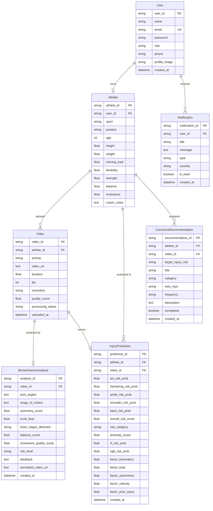

# Sports Injury Risk Detection Platform
## Database Schema & Entity Relationship Specification

---

### Table of Contents
1. [Overview & Supported DBMS](#1-overview--supported-dbms)
2. [Entity Relationship (ER) Diagram](#2-entity-relationship-er-diagram)
3. [Table Data Dictionaries](#3-table-data-dictionaries)
   - [3.1 `users` Table](#31-users-table)
   - [3.2 `athletes` Table](#32-athletes-table)
   - [3.3 `videos` Table](#33-videos-table)
   - [3.4 `biomechanics_analyses` Table](#34-biomechanics_analyses-table)
   - [3.5 `injury_predictions` Table](#35-injury_predictions-table)
   - [3.6 `corrective_recommendations` Table](#36-corrective_recommendations-table)
   - [3.7 `notifications` Table](#37-notifications-table)
4. [Data Integrity & Cascading Rules](#4-data-integrity--cascading-rules)

---

## 1. Overview & Supported DBMS

The data layer is managed via **SQLAlchemy 2.0 ORM** with declarative mappings. It supports:
- **PostgreSQL 15+:** Standard for production deployments via Docker Compose.
- **SQLite 3:** Built-in default for zero-configuration local development.

Primary keys utilize 36-character UUID strings (`uuid4`) to guarantee globally unique identifiers across distributed edge deployments.

---

## 2. Entity Relationship (ER) Diagram

---

## 3. Table Data Dictionaries

### 3.1 `users` Table
Stores authentication accounts, credential hashes, and RBAC roles.

| Column | Type | Constraints | Description |
| :--- | :--- | :--- | :--- |
| `user_id` | `VARCHAR(36)` | PRIMARY KEY | UUID string. |
| `name` | `VARCHAR(255)` | NOT NULL | User's full name. |
| `email` | `VARCHAR(255)` | UNIQUE, NOT NULL, INDEX | Primary login credential. |
| `password` | `TEXT` | NOT NULL | Passlib bcrypt salted hash. |
| `role` | `VARCHAR(50)` | NOT NULL | `Athlete`, `Coach`, `Physiotherapist`, `Sports Scientist`, `Admin`. |
| `phone` | `VARCHAR(50)` | NULLABLE | Contact telephone number. |
| `profile_image`| `TEXT` | NULLABLE | URL/path to profile avatar. |
| `created_at` | `DATETIME` | DEFAULT UTC | Registration timestamp. |

---

### 3.2 `athletes` Table
Contains anthropometric characteristics, physical test scores, and workload.

| Column | Type | Constraints | Description |
| :--- | :--- | :--- | :--- |
| `athlete_id` | `VARCHAR(36)` | PRIMARY KEY | UUID string. |
| `user_id` | `VARCHAR(36)` | FOREIGN KEY (`users.user_id`), UNIQUE | Associated user account. |
| `sport` | `VARCHAR(100)` | NULLABLE | Sport discipline (e.g. Football, Basketball). |
| `position` | `VARCHAR(100)` | NULLABLE | Tactical position (e.g. Forward, Midfielder). |
| `age` | `INTEGER` | NULLABLE | Chronological age. |
| `height` | `FLOAT` | NULLABLE | Height in centimeters. |
| `weight` | `FLOAT` | NULLABLE | Weight in kilograms. |
| `training_load`| `FLOAT` | DEFAULT 0.0 | Acute weekly training volume (hours/week). |
| `flexibility` | `FLOAT` | NULLABLE | Physical flexibility rating (1.0 - 10.0). |
| `strength` | `FLOAT` | NULLABLE | Physical strength rating (1.0 - 10.0). |
| `balance` | `FLOAT` | NULLABLE | Baseline balance rating (1.0 - 10.0). |
| `endurance` | `FLOAT` | NULLABLE | Baseline aerobic capacity rating. |
| `coach_notes` | `TEXT` | NULLABLE | Clinical observations and injury history. |

---

### 3.3 `videos` Table
Tracks uploaded movement footage, technical encoding metadata, and transcode status.

| Column | Type | Constraints | Description |
| :--- | :--- | :--- | :--- |
| `video_id` | `VARCHAR(36)` | PRIMARY KEY | UUID string. |
| `athlete_id` | `VARCHAR(36)` | FOREIGN KEY (`athletes.athlete_id`) | Athlete performing the movement. |
| `activity` | `VARCHAR(100)` | NULLABLE | Movement type: `Squatting`, `Landing`, `Cutting`, etc. |
| `video_url` | `TEXT` | NOT NULL | Relative path to standardized MP4 file. |
| `duration` | `FLOAT` | NULLABLE | Length in seconds. |
| `fps` | `INTEGER` | NULLABLE | Video framerate. |
| `resolution` | `VARCHAR(50)` | NULLABLE | Video pixel dimensions (e.g. `1920x1080`). |
| `quality_score`| `FLOAT` | NULLABLE | Automated frame clarity score. |
| `processing_status` | `VARCHAR(50)`| DEFAULT `Uploaded` | `Uploaded`, `Validated`, `Preprocessed`, `Failed`. |
| `uploaded_at` | `DATETIME` | DEFAULT UTC | Upload timestamp. |

---

### 3.4 `biomechanics_analyses` Table
Aggregated kinematic metrics extracted by MediaPipe BlazePose and spatial vector analysis.

| Column | Type | Constraints | Description |
| :--- | :--- | :--- | :--- |
| `analysis_id` | `VARCHAR(36)` | PRIMARY KEY | UUID string. |
| `video_id` | `VARCHAR(36)` | FOREIGN KEY (`videos.video_id`), UNIQUE | Source video analyzed. |
| `joint_angles`| `TEXT` | NULLABLE | JSON string containing mean/max/min joint angles. |
| `range_of_motion`| `TEXT` | NULLABLE | JSON string containing ROM per joint. |
| `symmetry_score`| `FLOAT` | NULLABLE | Bilateral limb symmetry percentage (0 - 100%). |
| `trunk_lean` | `FLOAT` | NULLABLE | Peak forward spine lean angle in degrees. |
| `knee_valgus_detected`| `VARCHAR(50)`| NULLABLE | Categorization: `Yes`, `No`, or `Borderline`. |
| `balance_score`| `FLOAT` | NULLABLE | Lateral stability score based on hip sway (0 - 10). |
| `movement_quality_score`| `FLOAT`| NULLABLE | Overall movement quality rating (0 - 10). |
| `risk_level` | `VARCHAR(50)` | NULLABLE | Overall kinematic risk: `Low`, `Moderate`, `High`, `Critical`. |
| `feedback` | `TEXT` | NULLABLE | Natural-language clinical assessment summary. |
| `annotated_video_url` | `TEXT` | NULLABLE | Path to re-encoded video with skeleton overlay. |
| `created_at` | `DATETIME` | DEFAULT UTC | Analysis timestamp. |

---

### 3.5 `injury_predictions` Table
Predictive risk probabilities and 5-factor clinical score decomposition.

| Column | Type | Constraints | Description |
| :--- | :--- | :--- | :--- |
| `prediction_id` | `VARCHAR(36)` | PRIMARY KEY | UUID string. |
| `athlete_id` | `VARCHAR(36)` | FOREIGN KEY (`athletes.athlete_id`) | Target athlete. |
| `video_id` | `VARCHAR(36)` | FOREIGN KEY (`videos.video_id`), UNIQUE | Source video. |
| `acl_risk_prob` | `FLOAT` | NOT NULL | Predicted ACL tear risk percentage ($0 - 100\%$). |
| `hamstring_risk_prob`| `FLOAT` | NOT NULL | Predicted hamstring strain risk ($0 - 100\%$). |
| `ankle_risk_prob`| `FLOAT` | NOT NULL | Predicted ankle sprain risk ($0 - 100\%$). |
| `shoulder_risk_prob`| `FLOAT` | NOT NULL | Predicted shoulder impingement risk ($0 - 100\%$). |
| `back_risk_prob` | `FLOAT` | NOT NULL | Predicted lower back strain risk ($0 - 100\%$). |
| `overall_risk_score`| `FLOAT` | NOT NULL | Composite risk score ($0.0 - 100.0\%$). |
| `risk_category` | `VARCHAR(50)` | NOT NULL | `Low`, `Moderate`, `High`, or `Critical`. |
| `anomaly_score` | `FLOAT` | NOT NULL | Anomaly deviation index ($0.0 - 1.0$). |
| `rf_risk_prob` | `FLOAT` | NULLABLE | Random Forest classifier output probability. |
| `xgb_risk_prob` | `FLOAT` | NULLABLE | XGBoost gradient boosting output probability. |
| `factor_kinematics` | `FLOAT`| NULLABLE | Valgus & kinematics score (max 30.0 pts). |
| `factor_load` | `FLOAT` | NULLABLE | Training load & ACWR score (max 25.0 pts). |
| `factor_asymmetry`| `FLOAT` | NULLABLE | Bilateral asymmetry score (max 20.0 pts). |
| `factor_velocity` | `FLOAT` | NULLABLE | Velocity & trunk lean score (max 15.0 pts). |
| `factor_prior_injury`| `FLOAT` | NULLABLE | History & age factor score (max 10.0 pts). |
| `created_at` | `DATETIME` | DEFAULT UTC | Prediction timestamp. |

---

### 3.6 `corrective_recommendations` Table
Prescribed corrective protocols, therapeutic drills, and completion tracking.

| Column | Type | Constraints | Description |
| :--- | :--- | :--- | :--- |
| `recommendation_id`| `VARCHAR(36)` | PRIMARY KEY | UUID string. |
| `athlete_id` | `VARCHAR(36)` | FOREIGN KEY (`athletes.athlete_id`) | Assigned athlete. |
| `video_id` | `VARCHAR(36)` | FOREIGN KEY (`videos.video_id`), NULLABLE | Source assessment clip. |
| `target_injury_risk`| `VARCHAR(100)` | NOT NULL | Target risk vector (e.g. `ACL Injury Risk`). |
| `title` | `VARCHAR(255)` | NOT NULL | Name of prescribed exercise. |
| `category` | `VARCHAR(50)` | DEFAULT `Mobility` | `Mobility`, `Strengthening`, `Recovery`, `Technique`. |
| `sets_reps` | `VARCHAR(100)` | DEFAULT `3 sets x 10 reps` | Dosage specification. |
| `frequency` | `VARCHAR(100)` | DEFAULT `3x per week` | Weekly adherence protocol. |
| `description` | `TEXT` | NOT NULL | Clinical execution instructions. |
| `completed` | `BOOLEAN` | DEFAULT `FALSE` | Athlete completion toggle status. |
| `created_at` | `DATETIME` | DEFAULT UTC | Prescription timestamp. |

---

### 3.7 `notifications` Table
In-app notification messages and critical risk alarms.

| Column | Type | Constraints | Description |
| :--- | :--- | :--- | :--- |
| `notification_id`| `VARCHAR(36)` | PRIMARY KEY | UUID string. |
| `user_id` | `VARCHAR(36)` | FOREIGN KEY (`users.user_id`) | Recipient user account. |
| `title` | `VARCHAR(255)` | NOT NULL | Alert summary headline. |
| `message` | `TEXT` | NOT NULL | Detailed notification body. |
| `type` | `VARCHAR(50)` | DEFAULT `system` | `high_risk`, `training_load`, `recovery`, `system`. |
| `severity` | `VARCHAR(50)` | DEFAULT `info` | Alert urgency: `info`, `warning`, `critical`. |
| `is_read` | `BOOLEAN` | DEFAULT `FALSE` | Read state flag. |
| `created_at` | `DATETIME` | DEFAULT UTC | Timestamp. |

---

## 4. Data Integrity & Cascading Rules

- **User Deletion:** Deleting a `User` cascades to delete their associated `Athlete` profile and `Notification` records (`cascade="all, delete-orphan"`).
- **Athlete Deletion:** Deleting an `Athlete` cascades to remove all associated `Video`, `BiomechanicsAnalysis`, `InjuryPrediction`, and `CorrectiveRecommendation` entities.
- **Video Deletion:** Deleting a `Video` removes its associated `BiomechanicsAnalysis` and `InjuryPrediction` records to prevent orphaned analysis states.
