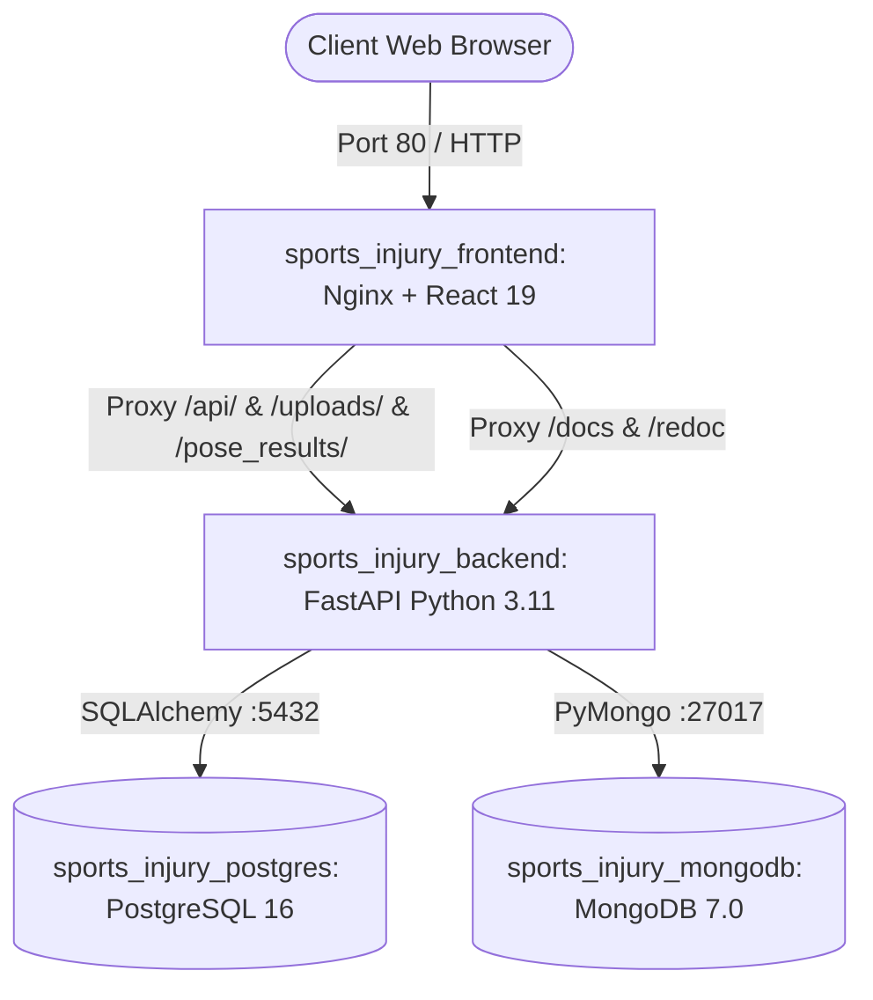

# AthleteGuard: Deployment & Operations Guide

This guide provides end-to-end configuration, containerization, and production deployment instructions for the **AthleteGuard: AI Sports Biomechanics & Injury Prevention Platform**.

---

## 🏛️ Container Architecture Overview

AthleteGuard is containerized into four orchestrated microservices communicating over an isolated bridge network (`athleteguard_net`):



| Service Container | Base Image | Published Ports | Healthcheck Verification |
|---|---|---|---|
| `sports_injury_frontend` | `nginx:alpine` (multi-stage from `node:20-alpine`) | `80:80` | `wget http://127.0.0.1:80/` |
| `sports_injury_backend` | `python:3.11-slim` | `8000:8000` | `curl -f http://localhost:8000/` |
| `sports_injury_postgres`| `postgres:16-alpine` | `5432:5432` | `pg_isready -U postgres` |
| `sports_injury_mongodb` | `mongo:7.0` | `27017:27017` | `mongosh --eval db.adminCommand('ping')` |

---

## 🐳 Docker Deployment (Recommended for Production)

### Prerequisites
- [Docker Desktop](https://www.docker.com/products/docker-desktop/) (version 24.0+ with Docker Compose v2)

---

### Step 1: Environment Configuration
Clone the repository and copy the environment template:

```bash
git clone https://github.com/springboardmentor10529m/sports-injury-risk-detection.git
cd sports-injury-risk-detection
cp .env.example .env
```

#### `.env` Environment Variables Reference

| Variable | Default Value | Description |
|---|---|---|
| `POSTGRES_USER` | `postgres` | PostgreSQL superuser username |
| `POSTGRES_PASSWORD` | `postgres` | PostgreSQL user password |
| `POSTGRES_DB` | `sports_injury_db` | Relational database name |
| `MONGO_DB_NAME` | `sports_injury_mongodb` | Unstructured keypoints database name |
| `JWT_SECRET` | `sports_injury_super_secret_jwt_key_2026_capstone` | Cryptographic secret for signing JWT tokens |
| `GOOGLE_CLIENT_ID` | `""` | Optional: Google OAuth 2.0 Web Client ID |
| `GOOGLE_CLIENT_SECRET` | `""` | Optional: Google OAuth 2.0 Client Secret |

---

### Step 2: Build and Launch Services

Launch all 4 containerized services in detached mode:

```bash
docker compose up --build -d
```

Compose automatically orchestrates service startup order using native healthchecks:
1. PostgreSQL and MongoDB boot and pass their initial health checks.
2. The FastAPI backend starts, runs database table migrations, mounts uploads and static directories, and passes its health probe.
3. The Nginx frontend initializes and begins routing traffic.

---

### Step 3: Verify Running Services

Check health status and port bindings across all containers:

```bash
docker compose ps
```

All four services should display `Up (healthy)`.

#### View Container Logs
```bash
# Stream logs for all services
docker compose logs -f

# View backend logs only
docker compose logs -f backend

# View frontend / Nginx access and error logs
docker compose logs -f frontend
```

---

### Step 4: Service Endpoints

- **Frontend Application**: [http://localhost](http://localhost)
- **Backend REST API**: [http://localhost:8000](http://localhost:8000)
- **Interactive Swagger Docs**: [http://localhost/docs](http://localhost/docs) or [http://localhost:8000/docs](http://localhost:8000/docs)
- **ReDoc API Documentation**: [http://localhost/redoc](http://localhost/redoc)
- **PostgreSQL Database**: `localhost:5432` (`user: postgres`, `database: sports_injury_db`)
- **MongoDB Database**: `localhost:27017` (`database: sports_injury_mongodb`)

---

### Step 5: Persistent Storage Volumes

AthleteGuard mounts persistent volumes to prevent data loss across container teardowns:

| Volume / Bind Mount | Container Path | Purpose |
|---|---|---|
| `postgres_data` (named volume) | `/var/lib/postgresql/data` | PostgreSQL database tables & indexes |
| `mongo_data` (named volume) | `/data/db` | MongoDB pose keypoint documents |
| `./backend/uploads` (bind mount) | `/app/uploads` | User uploaded movement videos & thumbnails |
| `./backend/pose_results` (bind mount) | `/app/pose_results` | Rendered pose skeleton videos & JSON outputs |
| `./backend/data` (bind mount) | `/app/data` | Machine learning datasets & precomputed features |
| `./backend/models_cache` (bind mount) | `/app/models_cache` | RTMPose-M & YOLOX neural network weights |

---

### Step 6: Stopping and Teardown

```bash
# Stop containers while preserving data volumes
docker compose down

# Stop containers and remove volumes (WARNING: wipes all databases)
docker compose down -v
```

---

## 💻 Local Development (Without Docker)

### Backend Setup (FastAPI)
```bash
cd backend
python -m venv venv

# Windows:
venv\Scripts\activate
# Linux/macOS:
# source venv/bin/activate

pip install -r requirements.txt
python -m uvicorn main:app --reload --port 8000
```

### Frontend Setup (React 19 + Vite)
```bash
cd frontend
npm install
npm run dev
```
Preview locally at [http://localhost:5173](http://localhost:5173).

---

## 🧪 Production Build Testing

To validate frontend production bundling locally:
```bash
cd frontend
npm run build
```
Build outputs are compiled into `frontend/dist/` ready for Nginx deployment.
