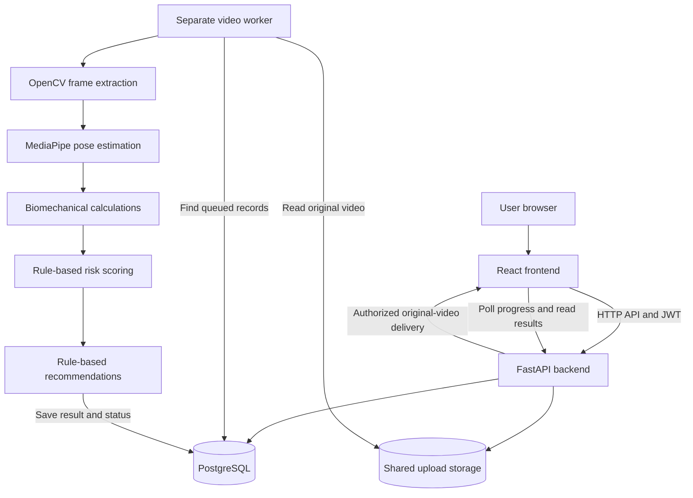

# InjuryGuard AI — Complete Project Documentation

**Code review date:** 21 September 2026

**Branch:** `samitha-muthyala`

**Reviewed application revision:** `253c93e`

**Purpose:** internship submission, mentor explanation, developer handover, and operating guide.

This document describes the implementation in this repository. Features present in code are distinguished from independently validated results. This documentation review did not execute a new end-to-end verification, retrain models, or deploy the application.

## Contents

1. [Project overview](#1-project-overview)
2. [Features and roles](#2-features-and-roles)
3. [Architecture](#3-architecture)
4. [Complete workflow](#4-complete-workflow)
5. [Data and feature extraction](#5-data-and-feature-extraction)
6. [Risk scoring](#6-risk-scoring)
7. [Recommendations and dashboard data](#7-recommendations-and-dashboard-data)
8. [Activity selection](#8-activity-selection)
9. [Machine learning and experiments](#9-machine-learning-and-experiments)
10. [Database and API](#10-database-and-api)
11. [File and function guide](#11-file-and-function-guide)
12. [Local setup](#12-local-setup)
13. [How to use the application](#13-how-to-use-the-application)
14. [Security and operations](#14-security-and-operations)
15. [Testing and evidence](#15-testing-and-evidence)
16. [Improvements completed](#16-improvements-completed)
17. [Limitations and next steps](#17-limitations-and-next-steps)
18. [Mentor explanation and demo](#18-mentor-explanation-and-demo)

## 1. Project overview

InjuryGuard AI is a web application that analyzes an uploaded movement video, estimates body landmarks, calculates movement measurements, and combines selected measurements with athlete-reported history and training information to produce a rule-based risk score and corrective suggestions.

The problem addressed is making movement observations easier to record, visualize, and review without requiring a dedicated motion-capture laboratory. The project brings video playback, estimated biomechanics, profile context, assessment history, and professional review into one interface.

The objectives are to:

- Extract pose information from short movement recordings.
- Make movement measurements and scoring traceable to their inputs.
- Reject inadequate pose data rather than report misleading low risk.
- Preserve assessment history for comparison and review.
- Provide separate athlete, coach, physiotherapist, scientist, and administrator workflows.
- Keep the UI responsive while a separate worker processes video.

**Scope:** single-person movement assessment and decision support. A score of 70/100 is a heuristic score, not a 70% probability of injury. The system has not demonstrated clinical accuracy, injury prevention, or generalization across all sports.

## 2. Features and roles

| Area | Implemented behavior | Important boundary |
|---|---|---|
| Authentication | Registration, password hashing, JWT login, current-user lookup | Public OAuth and automated password recovery are not implemented |
| Athlete profile | Sport, position, body information, injury history, pain flag, training load, optional injury details | Not every stored field contributes to scoring |
| Upload | Activity choice, file upload, configurable resource limits | One person and usable full-body geometry are expected |
| Processing | Frame extraction, pose, biomechanics, risk, recommendations | Runs asynchronously; upload acceptance is not analysis completion |
| Result | Original video with synchronized pose overlay, metrics, risk and recommendations | Browser codec support is required for original-video playback |
| Quality safeguard | `insufficient_data` when pose coverage is inadequate | This is not a low-risk assessment |
| Dashboard | Latest completed assessment and change from the previous one | It is not continuous health monitoring |
| History | Saved completed risk assessments and video records | Different movements/camera views may not be directly comparable |
| Alerts | Athlete high/critical-risk messaging and completion popup | Staff notification infrastructure remains in the backend |
| Coach | Linked-athlete roster, team summary and athlete assessments | Access requires the matching professional-athlete link |
| Physiotherapist | Linked patients, assessments and clinical notes | Notes are entered by staff, not generated recovery outcomes |
| Sports scientist | Linked-athlete records and aggregate analytics | These are application summaries, not clinical validation |
| Administrator | User listing, creation, updates, deletion and statistics | Administrative actions require an administrator role |

## 3. Architecture



| Layer | Technology | Responsibility |
|---|---|---|
| Frontend | React, Vite, React Router | Pages, routing, forms and result presentation |
| UI utilities | Recharts, Lucide icons, CSS | Charts, icons and visual styling |
| API client | Axios and an account-scoped memory cache | Authenticated requests, request deduplication and cached display |
| Backend | Python, FastAPI, Pydantic | API routing, input validation and orchestration |
| Persistence | SQLAlchemy, PostgreSQL | Users, profiles, links, analysis status and JSON results |
| Video | OpenCV | Decoding, frame sampling and resizing |
| Pose | MediaPipe Pose Landmarker | Pretrained estimation of body landmarks |
| Measurements | NumPy and custom Python functions | Geometry, aggregation and movement proxies |
| Experimental ML | pandas, scikit-learn, joblib | Separate tabular experiments and legacy RF utilities |
| Packaging | Docker Compose | Frontend, API, worker and database services |
| Production serving | Caddy and production Compose | Static frontend, API proxy and HTTPS configuration |

The worker is a separate Python process/container, not another frontend or an ML model. It performs expensive video processing so ordinary API requests need not wait for it. PostgreSQL analysis rows form the queue; Redis/Celery are not required by this implementation. Production uses a single sequential worker with a PostgreSQL advisory lock and a subprocess timeout.

## 4. Complete workflow

1. An athlete registers and logs in. The API stores a password hash and returns a signed access token after successful login.
2. The frontend attaches the JWT to subsequent API requests and loads the current user.
3. The athlete enters profile information and selects an activity for a video.
4. The upload endpoint checks ownership context, file/resource constraints, storage capacity and pending-job limits. It stores the video and creates a `VideoAnalysis` record.
5. In worker mode, the worker picks up the queued database record. Local mode instead uses a single-thread executor in the API process.
6. OpenCV samples frames, normally at 10 frames/second, with configured duration/frame limits and resizing.
7. A new MediaPipe estimator is created for this video. Frames receive strictly increasing timestamps. Tracking state is closed after the clip and does not carry into the next upload.
8. The pipeline periodically saves detected image/world landmarks so progress can be displayed.
9. The biomechanics engine filters unusable frames and calculates per-frame geometry and clip summaries.
10. At least 10 valid frames and 50% valid-frame coverage are required. Otherwise the terminal status is `insufficient_data`, with no risk assessment or recommendations.
11. The risk engine combines clip metrics and the athlete's profile values read by the processing job.
12. The recommendation engine evaluates explicit thresholds and stores matching suggestions.
13. The pipeline commits `completed`. Notification delivery then runs separately; notification failure cannot change this completed result to failed.
14. The frontend displays the report, updates cached data and shows the saved assessment in the dashboard/history.

Normal statuses:

```text
uploaded -> extracting_frames -> running_pose -> analyzing_biomechanics
         -> scoring_risk -> generating_recommendations -> completed

Terminal alternatives: insufficient_data or failed
```

`failed` covers processing errors such as unreadable video or unexpected execution failure. `insufficient_data` specifically means the pose-quality requirement was not met. Restart recovery resets interrupted nonterminal jobs for reprocessing; completed results are preserved.

## 5. Data and feature extraction

### 5.1 What data drives the live application?

| Source | Values | Used for |
|---|---|---|
| Uploaded video | Frames and timestamps | Pose estimation and overlay synchronization |
| Pose model | Image and world coordinates, visibility | Geometry and quality filtering |
| Basic injury profile | Previous injury count, days since last injury, current pain flag | Historical-injury risk component |
| Training profile | Weekly training hours, optional acute:chronic ratio | Training-load risk component |
| Optional injury context | Body area, side, type, timeframe, recovery status, limitations, pain location/severity, clinician restrictions | Saved descriptive context; not currently consumed by scoring/recommendations |
| Saved analysis records | Prior scores, categories, dates and recommendations | Dashboard and history |

Age, height, weight, sport and position are stored profile information; the current weighted risk function does not use them. No heart-rate, EMG, force-plate, wearable or daily workload stream is collected by the video pipeline.

### 5.2 Pose representation

MediaPipe's model estimates 33 landmarks. The application maps and stores a selected subset of 17: nose; paired shoulders, elbows, wrists, hips, knees, ankles, heels and foot indices.

- Image landmarks provide the coordinates used to draw the overlay on the video.
- World landmarks provide estimated hip-centered 3D coordinates for geometry.
- A valid scoring frame requires both shoulders, hips, knees and ankles, visibility at least 0.5, finite values, and nondegenerate geometry.
- These visibility checks are separate from MediaPipe's detector/tracker confidence settings.

### 5.3 Extracted biomechanical features

Implementation: `backend/app/services/biomechanics.py`.

| Feature | Calculation and meaning |
|---|---|
| Left/right knee angle | Angle at the knee between hip-knee and ankle-knee vectors |
| Knee-angle asymmetry | Mean absolute left/right angle difference |
| Symmetry score | `clip(100 - mean_difference / 30 * 100)` |
| Knee-deviation proxy (`knee_valgus_avg_pct`) | Perpendicular distance of knee from hip-ankle line divided by leg length, averaged across sides/frames |
| Trunk lean | Angle between shoulder-midpoint/hip-midpoint vector and the vertical axis |
| Hip-line variability | Standard deviation of hip-line angle across usable frames |
| Hip stability score | `clip(100 - hip_line_std / 15 * 100)` |
| Lateral hip-sway proxy | Standard deviation of hip-midpoint x coordinate |
| Balance score | `clip(100 - hip_x_std / 0.15 * 100)` |
| Stride-length proxy | For running/sprinting, change in hip x between estimated left-foot strikes |
| Fatigue proxy | Twice the percentage decline in knee range of motion from the first third to the last third, clipped to 0–100 |
| Movement quality | Mean of available symmetry, hip-stability and balance scores |
| Detection rate | Usable metric frames divided by all sampled frames |

Here `clip` means limiting the result to 0–100. Fatigue remains unavailable if it cannot be calculated; a calculated zero is preserved as zero.

**Measurement limitations:** the knee-deviation function measures an unsigned 3D distance, not isolated frontal-plane valgus. Hip-centered coordinates do not establish global movement through space; the current stride and sway calculations are weak proxies and should not be presented as calibrated distances or validated balance measures. The fatigue calculation detects a change in motion range, not physiological fatigue. These limitations follow from the implementation, even where code comments use stronger terminology.

## 6. Risk scoring

Implementation: `backend/app/services/risk_scoring.py`, primarily `compute_risk()`.

```text
Overall score = 0.35 × biomechanical deviation
              + 0.20 × historical injury
              + 0.20 × movement asymmetry
              + 0.15 × training load
              + 0.10 × fatigue
```

Each component is clipped to 0–100. The final score is rounded to two decimals.

| Component | Rule |
|---|---|
| Biomechanical deviation | Average available scores for knee-deviation `(value-4)/16*100`, trunk lean `(value-8)/22*100`, and hip-line variability `(value-2)/13*100`; each clipped |
| Injury history | Up to 60 points from `15 × injury_count`, up to 40 from recency declining linearly over 365 days, plus 25 for current pain; total clipped |
| Asymmetry | `100 - symmetry_score` |
| Training load | If ACWR exists: within 0.8–1.3, `abs(ACWR-1.05)/0.25*20`; outside, `20 + abs(ACWR-1.05)*60`. Otherwise `weekly_hours/20*100`; clipped |
| Fatigue | Clip fatigue proxy; zero fallback if unavailable |

These are current engineering rules, not clinically established individual risk probabilities. ACWR is supplied by the user; the app does not calculate it from a training diary.

| Overall category | Exact interval |
|---|---|
| LOW | 0 ≤ score ≤ 35 |
| MODERATE | 35 < score ≤ 60 |
| HIGH | 60 < score ≤ 80 |
| CRITICAL | 80 < score ≤ 100 |

There are no gaps between these overall category intervals. For an illustrative set of components `(40, 30, 20, 50, 10)`, the result is `14 + 6 + 4 + 7.5 + 1 = 32.5`, classified LOW. This example is arithmetic, not a measured athlete result.

The service also produces ACL, hamstring, ankle, lower-back and overuse concern flags using individual proxies. Their internal thresholds are separate from the overall categories. These flags do not identify an existing injury.

## 7. Recommendations and dashboard data

Implementation: `backend/app/services/recommendations.py`, `build_recommendations()`.

| Trigger | Generated suggestion group |
|---|---|
| Knee-deviation proxy ≥ 8% | Hip/glute strengthening and ankle mobility |
| Trunk lean ≥ 15 degrees | Core stability work |
| Symmetry < 85 | Unilateral strength work |
| Hip stability < 70 | Pelvic/hip stability drills |
| Fatigue proxy ≥ 40 | Recovery advice |
| Training component ≥ 61 | Training-volume/load advice; wording also depends on supplied ACWR |
| Overall HIGH or CRITICAL | Professional review |

Recommendations contain a title, triggering reason and protocol text. They are organized into mobility, strength, recovery and training lists. Empty lists are possible when no threshold is crossed. The text comes from programmed templates, not a trained recommender or generative model. The table documents software behavior and is not a treatment prescription.

**Dashboard provenance:** `/api/analysis/dashboard-summary` queries only completed analyses for the authenticated athlete and orders them by completion time. It returns the most recent score/metrics/recommendations, the score difference from the previous completed analysis, and a count of completed analyses. Recommendations are from the latest analysis, not newly generated daily advice. Changing the profile does not automatically rescore old assessments.

**Caching:** `frontend/src/api/cache.js` keeps account-scoped values in memory, shares pending requests and normally considers results fresh for 15 seconds. Invalidation preserves displayable values while allowing refresh. Authentication preloads athlete summary/video data. Dashboard requests are independent, so a slow video list need not block summary rendering. A full reload or first visit can still require loading; caching does not eliminate backend requests.

**Evaluation-field caveat:** `analysis.py::_rule_based_evaluation()` returns legacy fields named accuracy, precision, effectiveness and latency. Several are formulas based on a single assessment; timing fields are zero placeholders. They are not measured evaluation results and must not be quoted as project accuracy or performance. The reviewed frontend does not reference `evaluation_metrics`. The recommendation count in this helper also expects a different structure from the actual grouped recommendation lists.

## 8. Activity selection

The UI supports running, sprinting, jumping, squatting, landing and cutting as user-selected labels. This is not automatic recognition of all six activities.

`services/activity_check.py::check_activity()` is an experimental advisory. Only running/sprinting selections are checked for a possible squat-like mismatch. It looks for a contiguous sequence lasting at least two seconds and at least 20 frames, bilateral knee movement with sufficient variation, correlation above 0.85, similar angles, and a sustained bend between straighter positions.

It returns `possible_mismatch` or `unknown`. Other selected activities return `unknown`; unknown is not verification. The heuristic does not block risk calculation, and a missing warning does not prove the activity is correct. The current UI suppresses the generic unknown banner while retaining mismatch advice.

**Example:** selecting squatting and uploading jumping is not reliably detected. The label is saved and the largely generic geometry/risk rules still run. Re-upload with the correct label. Reliable multiclass recognition requires labeled movement sequences and separate evaluation; this remains future work.

## 9. Machine learning and experiments

Three distinct systems must not be confused:

1. **Live pose estimation:** pretrained MediaPipe model, used by the video pipeline.
2. **Live scoring/recommendations:** deterministic Python rules, not a trained injury predictor.
3. **Separate tabular ML work:** legacy RF utilities and an isolated collegiate-workload experiment; neither supplies the video report's risk score.

The legacy service `injury_ml_model.py` contains nine-input synthetic-feature support and an optional loader for day/week CSV datasets. It can train and serialize artifacts. Do not call its training endpoint or run its artifact-writing test casually; it can overwrite an existing model. Presence of CSV-loading code does not establish which dataset produced a saved artifact.

### Collegiate workload experiment

The existing [experiment report](../experiments/workload_20260907/REPORT.md) records a 200-row synthetic collegiate dataset with 14 positive labels (7%). The target is `Injury_Indicator`.

Excluded inputs: `Athlete_ID`, `ACL_Risk_Score`, `Load_Balance_Score`, `Performance_Score`, `Team_Contribution_Score`, and the target itself.

Primary inputs: age, gender, height, weight, position, training intensity, training hours/week, recovery days/week, matches/week, rest between events and fatigue score. The workload-only candidate uses the six training/schedule/fatigue inputs.

Evaluation used stratified five-fold cross-validation, training-fold preprocessing, a fixed 0.5 threshold, a dummy baseline, balanced logistic regression and balanced random forest. It reports precision, recall, F1, average precision (PR-AUC), ROC-AUC, confusion matrices and fold/split variability.

| Candidate | Pooled OOF precision | Recall | F1 | AP | ROC-AUC | Matrix [[TN,FP],[FN,TP]] |
|---|---:|---:|---:|---:|---:|---|
| Logistic, 11 inputs | 0.270 | 0.714 | 0.392 | 0.403 | 0.868 | [[159,27],[4,10]] |
| Random forest, 11 inputs | 0.375 | 0.429 | 0.400 | 0.455 | 0.847 | [[176,10],[8,6]] |
| Workload logistic | 0.233 | 0.714 | 0.351 | 0.471 | 0.858 | [[153,33],[4,10]] |

These are copied from the recorded experiment, not recomputed in this documentation task. Small positive counts, synthetic labels, and wide fold variability limit interpretation. The related 5,430-row multimodal audit reconstructed every label from five feature thresholds; that demonstrates label dependence, not future injury prediction. Dataset provenance, exact diagnostics, fold results and source links are documented in the experiment report. No experimental fitted model was saved or connected to video analysis.

## 10. Database and API

### Main entities

| Entity/table | Stored information |
|---|---|
| `users` | Email, password hash, name, role, active status |
| `athlete_profiles` | Athlete details, injury/training inputs and optional injury-context JSON |
| Staff profile tables | Coach, physiotherapist and scientist details |
| `athlete_links` | Professional-to-athlete access relationship and link type |
| `video_analyses` | Ownership, activity, original file path, status/times and JSON results |
| `clinical_notes` | Physiotherapist, athlete, rehabilitation phase and free-text note |
| `notifications` | Recipient, event type, message, link and read state |

A user has an associated role profile; an athlete can have many analyses. Professional links connect staff accounts to athlete profiles. Video bytes live in upload storage, while landmarks, biomechanics, risk and recommendations live in database JSON columns. JSON results permit inspection but there is no complete versioned model/rule/profile snapshot for exact future reproduction.

### Principal endpoints

| Endpoint | Purpose |
|---|---|
| `POST /api/auth/register` | Athlete registration |
| `POST /api/auth/register/{staff-role}` | Role-specific registration routes |
| `POST /api/auth/login-json` | JSON login and access token |
| `POST /api/auth/login` | Form-based login |
| `GET /api/auth/me` | Current authenticated account |
| `GET/PATCH /api/athlete/profile` | Read/update own profile |
| `GET /api/videos/limits` | Upload limits for the UI |
| `POST /api/videos/upload` | Submit a video and activity |
| `GET /api/videos` | Own video records |
| `GET /api/videos/{id}` | Own analysis status/result |
| `GET /api/videos/{id}/pose-frames` | Pose data |
| `GET /api/videos/{id}/original` | Authorized original-video playback |
| `GET /api/analysis/dashboard-summary` | Latest completed assessment summary |
| `GET /api/analysis/risk-history` | Completed assessment timeline |
| `/api/coach/...` | Team links, summary and linked-athlete records |
| `/api/physio/...` | Patient links, assessments and notes |
| `/api/scientist/...` | Linked athletes and analytics |
| `/api/admin/...` | Administrative users/statistics operations |
| `/api/notifications/...` | Event listing and read-state changes |
| `GET /api/health` | API liveness |
| `GET /api/ready` | Database/schema/model-file readiness |

Development Swagger UI at `/docs` provides request/response schemas. It is disabled in production configuration. Readiness does not prove worker liveness or a successful analysis.

**Separate legacy endpoints:** `POST /api/analysis/ml/train` and `/ml/predict` exist. In the reviewed code neither has an authentication dependency, and the general middleware does not protect them. Restrict or disable these before public exposure; training can consume resources and overwrite artifacts. This review did not invoke them.

## 11. File and function guide

Paths below are relative to the repository root.

| File or group | Main responsibility |
|---|---|
| `frontend/src/main.jsx` | Mount React, router and auth provider |
| `frontend/src/App.jsx` | Route definitions and `ProtectedRoute` role/login checks |
| `frontend/src/context/AuthContext.jsx` | Login, logout, current user and dashboard preloading |
| `frontend/src/api/client.js` | Axios, JWT headers, API functions and cache invalidation |
| `frontend/src/api/cache.js` | `createCache()`: account isolation, freshness and shared pending reads |
| `frontend/src/pages/Login.jsx`, `Register.jsx`, `SelectRole.jsx`, `StaffRegister.jsx` | Authentication and onboarding screens |
| `frontend/src/pages/Home.jsx` | Redirect to the appropriate role home |
| `frontend/src/pages/Dashboard.jsx` | Latest athlete summary, recommendations and recent records |
| `frontend/src/pages/Analyze.jsx` | File/activity selection, upload and recording guidance |
| `frontend/src/pages/Result.jsx` | Progress polling, terminal-state handling and assessment display |
| `frontend/src/pages/History.jsx` | Assessment history |
| `frontend/src/pages/Profile.jsx` | Basic and optional injury-context fields |
| `frontend/src/pages/Coach*.jsx` | Coach dashboard, team and athlete detail |
| `frontend/src/pages/Physio*.jsx` | Patient workflow and physiotherapist dashboard |
| `frontend/src/pages/Scientist*.jsx` | Scientist dashboard, roster and detail |
| `frontend/src/pages/Admin*.jsx` | Admin statistics and user management |
| `frontend/src/components/Layout.jsx` | Role navigation and common page layout |
| `VideoPoseOverlay.jsx` | Authorized video retrieval, playback and time-aligned canvas skeleton |
| `Pose3DViewer.jsx` | Separate 3D viewer component remains in source; removed from athlete Result presentation |
| `RiskGauge.jsx`, `RiskPill.jsx`, `StatCard.jsx` | Score/category/stat presentation |
| `NotificationBell.jsx` | Staff notification UI |
| `StaffAthleteDetail.jsx`, `AddAthleteForm.jsx` | Shared professional athlete views/link forms |
| `SkeletonMotif.jsx`, `frontend/src/theme.css` | Visual motif and theme styling |
| `backend/app/main.py` | FastAPI creation, middleware, routers and health/readiness |
| `backend/app/core/config.py` | Environment settings and production validation |
| `backend/app/core/database.py` | SQLAlchemy connection/session setup |
| `backend/app/core/schema.py` | Additive schema initialization/compatibility changes |
| `backend/app/core/security.py` | Password hashing, JWT access tokens and invitation verification |
| `backend/app/core/request_limits.py` | Single-process production authentication throttle |
| `backend/app/models.py` | Database entities and enums |
| `backend/app/schemas.py` | Pydantic API validation and response models |
| `backend/app/routers/deps.py` | Authenticated-user and role dependencies |
| `backend/app/routers/*.py` | HTTP endpoints for the domains listed above |
| `backend/app/video_processing/frame_extractor.py` | `extract_frames()`: video validation and sampled frame stream |
| `backend/app/services/pose_estimation.py` | `PoseEstimator`, landmark mapping, timestamps and serialization |
| `backend/app/services/biomechanics.py` | `compute_frame_metrics()`, `aggregate_biomechanics()` |
| `backend/app/services/risk_scoring.py` | Component functions, `risk_category()`, `compute_risk()` |
| `backend/app/services/recommendations.py` | `build_recommendations()` threshold rules |
| `backend/app/services/activity_check.py` | `check_activity()` experimental mismatch advisory |
| `backend/app/services/pipeline.py` | `run_pipeline()`: stages, persistence, quality gate and errors |
| `backend/app/worker.py` | Worker loop, lock, subprocess execution and timeout |
| `backend/app/services/jobs.py` | Interrupted-job recovery, abort handling and optional upload deletion |
| `backend/app/services/notifications.py` | Event-based notification creation |
| `backend/app/services/roster.py` | Shared professional roster/access functionality |
| `backend/app/services/injury_ml_model.py` | Separate RF training/prediction utilities |
| `backend/app/invite.py` | CLI invitation generation |
| `backend/scripts/download_models.sh` | Download required pose-model bundle |
| `backend/scripts/create_admin.py` | Interactive administrator creation |
| `scripts/backup.py` | Database/upload backup orchestration |
| `docker-compose.yml` | Local development services and volumes |
| `compose.production.yml`, production Dockerfiles/Caddy config | Separate production deployment configuration |
| `.github/workflows/production-checks.yml` | Configured CI checks; presence does not prove latest CI passed |
| `experiments/workload_20260907/` | Isolated experiment script, metrics and report |
| `reports/lighthouse-2026-09-20/` | Incomplete Lighthouse audit and diagnostic artifacts |

## 12. Local setup

### Recommended: existing Docker workflow

Requirements: Git, Docker Desktop with Compose, sufficient memory/disk, and internet access for the initial image/dependency/model downloads. Use the intended `samitha-muthyala` checkout; do not switch or modify `main` as part of setup.

1. Open a terminal in the repository root.
2. Check `git branch --show-current` and `git status --short`.
3. For a new installation, create a private root `.env` with `POSTGRES_PASSWORD` and a strong `JWT_SECRET_KEY`. Preserve existing secrets for an existing database; changing the database variable alone does not change an initialized PostgreSQL password. Do not commit this file. There is no root `.env.example` in the reviewed checkout.
4. Validate and start:

```powershell
docker compose config --quiet
docker compose up -d --build
docker compose ps
docker compose logs --tail 100 backend worker
```

| Local service | Address |
|---|---|
| Frontend | http://localhost:5173 |
| Backend | http://localhost:8001 |
| Development API docs | http://localhost:8001/docs |
| Readiness | http://localhost:8001/api/ready |
| PostgreSQL | Host port 5432; normally accessed through the app |

Docker maps backend host port **8001** to container port **8000**. The frontend's development API base is `http://127.0.0.1:8001`. `localhost` addresses refer to the machine running the browser, not a remote server.

```powershell
docker compose stop
docker compose start
```

These commands preserve named volumes. Do not use `docker compose down -v` as a normal restart: it removes volume data. PostgreSQL uses `pg_data`; originals use `uploads_data`.

### Frontend outside Docker

```powershell
cd frontend
npm ci
npm run dev
```

For a production frontend build use `npm run build`. `npm run preview -- --host 127.0.0.1 --port 4173` previews static output; it does not provide the backend. `VITE_API_BASE_URL` is a build-time frontend setting. A separate API origin must also be allowed by backend CORS. Do not assume preview login works without these settings.

### Backend outside Docker

Use a compatible Python 3.12 environment, install `backend/requirements.txt`, and download the pose model using the supplied script in a shell that supports it. Run commands from `backend` so relative model/upload paths resolve correctly:

```text
python -m venv venv
# Activate the environment for your shell, then:
python -m pip install -r requirements.txt
python -m uvicorn app.main:app --host 127.0.0.1 --port 8001
```

Without database configuration the development fallback is SQLite. `PROCESSING_MODE=local` uses in-process processing; worker mode requires the database/worker configuration and a separately running `python -m app.worker`. For this project's PostgreSQL worker workflow, Docker is the more reproducible starting point. Do not rely on the machine-specific ignored `.venv` tools used during previous checks as a portable environment.

### Important settings

| Variable | Default or purpose |
|---|---|
| `ENVIRONMENT` | Development vs production safeguards |
| `PROCESSING_MODE` | Local executor or dedicated worker |
| `DATABASE_HOST/USER/PASSWORD/NAME`, `DATABASE_URL` | Database connection |
| `JWT_SECRET_KEY` | Access-token/invitation signing secret |
| `CORS_ORIGINS` | Explicit browser origins allowed to call API |
| `REGISTRATION_EMAILS` | Invited-email allowlist in production |
| `MAX_UPLOAD_MB` | Default 50; configurable up to 300 |
| `MAX_VIDEO_SECONDS` | Default 30 |
| `MAX_SAMPLED_FRAMES` | Default 300 |
| `POSE_SAMPLE_FPS` | Default 10 |
| `MAX_PENDING_PER_ATHLETE`, `MAX_PENDING_VIDEOS` | Default 2 and 10 |
| `MAX_UPLOAD_STORAGE_MB` | Default 2048 |
| `JOB_TIMEOUT_SECONDS` | Default 600 |
| `DELETE_PROCESSED_UPLOADS` | Default false, retaining video for playback |
| `POSE_MODEL_PATH`, `UPLOAD_DIR` | Model and video storage paths |

Defaults are not proof of current runtime values; local environment overrides can differ. The upload screen reads server limits. Production Compose explicitly sets 50 MB and 30 seconds.

## 13. How to use the application

1. Register as an athlete, or use the invitation supplied for an invited production installation.
2. Log in and complete the profile. Enter actual injury/training information; leave optional unknown information unspecified rather than inventing it.
3. Open **Analyze Movement**, choose the activity actually recorded, and select a supported video file.
4. Prefer a short, well-lit recording with one person, the full body including feet visible, a stable camera, and several complete movement cycles. Keep within the displayed limits.
5. Click **Analyze Video** once. Follow the stage display while the worker processes it.
6. On completion, play/pause/seek the video to inspect the skeleton overlay. Review metrics, component scores, category and recommendation reasons.
7. If the result is insufficient data, record a better clip. Do not interpret it as reassurance about injury risk.
8. Open Dashboard for the most recent completed assessment and Risk History for previous results.
9. Upload a second clip to compare under similar conditions. A different activity or camera angle can change the proxy scores without showing a real change in health.
10. Professional users can link athletes by email and review the records allowed by that link; physiotherapists can add notes.

Profile edits apply to later processing. Historical reports retain their saved scores and suggestions. Optional injury-context text is currently stored for context rather than used to personalize exercise selection.

## 14. Security and operations

Implemented controls include bcrypt password hashes, expiring JWTs, role dependencies, athlete ownership checks, staff links, guarded original-video paths, explicit CORS configuration, production invitation checks, basic authentication throttling, upload/queue/storage limits and safe client-facing pipeline errors. Tokens are held in browser local storage, so preventing script injection remains important.

Production configuration requires PostgreSQL, dedicated-worker mode, a nondefault signing key of at least 32 characters and HTTPS CORS origins. It is designed for a small invited installation, not high availability. Staff linking by email assumes trusted staff; athlete consent/approval is not a completed workflow.

Deployment instructions are in [PRODUCTION.md](PRODUCTION.md). The existing production architecture hosts static frontend and API behind Caddy on one server, with API/worker sharing upload storage. Merely seeing containers in Docker Desktop confirms local containers, not public deployment. No public deployment was verified for this document.

Vercel would host only the frontend; this repository's long-running worker, Python video processing, database and shared file storage require separate hosting. Splitting services requires a deliberate shared-storage and API/CORS design. The teammate's deployment URLs/configuration do not establish deployment of this branch.

Use `/api/health` for liveness and `/api/ready` for database/schema/model-file readiness. Also inspect worker logs and test an actual clip. Back up both PostgreSQL and retained uploads; use the backup/restore procedure in PRODUCTION.md and restore into an isolated environment first. Do not store credentials, backups, uploads or personal records in Git.

## 15. Testing and evidence

| Test file | Area covered |
|---|---|
| `backend/tests/test_biomechanics.py` | Geometry, quality gates and aggregate features |
| `backend/tests/test_pose_estimation.py` | Pose handling and timestamp behavior |
| `backend/tests/test_pipeline.py` | Pipeline outcomes, insufficient data and notification isolation |
| `backend/tests/test_risk_scoring.py` | Weighted scoring and category boundaries |
| `backend/tests/test_activity_check.py` | Limited mismatch heuristic |
| `backend/tests/test_production.py` | Production settings/resource/job behavior |
| `backend/tests/test_security_and_api.py` | API/auth/access and profile validation/persistence |
| `frontend/src/api/cache.test.js` | Cache isolation, invalidation and request behavior |
| `backend/tests/test_ml_model.py` | Separate ML path; may retrain/overwrite artifact — excluded from routine checks |

With test dependencies installed in an isolated environment, run from `backend`:

```text
python -m pytest tests/test_biomechanics.py tests/test_pose_estimation.py tests/test_pipeline.py tests/test_risk_scoring.py tests/test_activity_check.py tests/test_production.py tests/test_security_and_api.py
```

From `frontend`:

```text
node --test src/api/cache.test.js
npm run build
npm run lint
```

These are instructions, not a claim that the full suite was rerun on 21 September. Historical execution evidence is in [PRODUCTION_VERIFICATION.md](PRODUCTION_VERIFICATION.md), whose date and scope must be retained when quoting it.

The 20 September frontend production build passed and reported a 749.16 kB minified JavaScript bundle (222.31 kB gzip). Lighthouse failed repeatedly with `NO_FCP`, so no valid Lighthouse scores were obtained. See the [Lighthouse audit record](../reports/lighthouse-2026-09-20/README.md). Do not convert missing scores into zero, invent high scores, or treat these attempts as a passed audit.

Suggested acceptance checks: registration/login, profile persistence, valid upload, second consecutive upload, no-person clip, corrupt clip, history refresh, cross-account denial, original-video playback, worker restart, and restored backup. Record actual outcomes and environment when running them.

## 16. Improvements completed

The present implementation reflects the following work:

- Continuous overall category ranges and rejection of invalid score inputs.
- Minimum usable pose coverage and explicit insufficient-data outcomes.
- Per-video estimator lifecycle and monotonic timestamps for consecutive uploads.
- Preservation of valid zero fatigue values.
- Notification failure separated from committed analysis completion.
- Persistent queued processing, worker timeout and interrupted-job recovery.
- Dashboard preloading, independent refreshes and account-scoped caching.
- Recommendation wording tied to the latest analysis rather than an implied daily reassessment.
- Original-video pose overlay and a bounded player size; separate 3D playback removed from the athlete result page.
- Athlete risk alerts and transient completion feedback instead of the general notification bell.
- Recording guidance alongside upload controls.
- Optional structured injury-profile context and validation.
- A separate leakage-aware workload-model experiment, kept out of video scoring.
- Small-installation production packaging and backup/verification documentation.

## 17. Limitations and next steps

| Priority | Work needed | Reason |
|---|---|---|
| P0 before public exposure | Disable or authorize legacy ML training/prediction endpoints; isolate artifact writes | Unauthenticated training is a resource and model-integrity risk |
| P0 for truthful reporting | Remove/rename legacy pseudo-evaluation fields or replace with measured metrics | They are not model accuracy or timing evidence |
| P1 measurement validity | Review knee-deviation, hip-centered sway/stride and fatigue terminology/calculations | Current proxies can be misleading if presented as clinical measurements |
| P1 assessment context | Design clinician-reviewed use of optional injury details and reconcile pain fields | Stored context currently does not alter recommendations |
| P1 reproducibility | Save rule/model versions and the input-profile snapshot per assessment | Historical outputs are not fully reproducible after profile/rule changes |
| P1 demo/release evidence | Finish visible-browser Lighthouse, end-to-end checks and actual-host verification | Current audit/deployment evidence is incomplete |
| P2 activity recognition | Build labeled sequence data and validate classifier or clearly limited rules | Current advisory covers only a narrow mismatch case |
| P2 frontend performance | Measure route lazy loading and responsive dashboard layouts | Current initial bundle is large; performance gain is not yet measured |
| P2 wider use | Consent-based staff linking, account recovery, retention policy and versioned migrations | Current onboarding/operations target trusted invited users |
| Research | Collect independent prospective outcomes and evaluate calibration/generalization | Synthetic-label results cannot validate real injury prediction |

The most defensible current description is a working movement-analysis and transparent risk-screening prototype with operational safeguards, rather than a clinically validated system for every sport.

## 18. Mentor explanation and demo

### Short explanation

“InjuryGuard AI accepts a movement video and uses a pretrained MediaPipe model to estimate body landmarks. We calculate movement features from those landmarks and combine selected features with the athlete's reported injury history and training information. A transparent weighted rule engine produces the score, and threshold rules generate recommendations with reasons. Results are stored so the athlete and authorized staff can review them. We reject clips with insufficient pose data. Our separate workload ML experiment is not used to score these videos.”

### Five-minute live demo

| Time | Show | Explain |
|---|---|---|
| 0:00–0:40 | Athlete profile | Which inputs affect scoring and which are context only |
| 0:40–1:20 | Upload and activity selection | Recording requirements and user-selected activity |
| 1:20–2:00 | Processing stages | Worker, pose extraction and quality gate |
| 2:00–3:15 | Completed result and overlay | Landmark visualization, biomechanics and five scoring components |
| 3:15–4:15 | Recommendation reasons and history | Threshold-based advice, latest analysis and saved comparisons |
| 4:15–5:00 | Previously prepared insufficient-data example | Safeguards, limitations and future validation |

Run the application beforehand and keep a completed sample available in case video processing exceeds the live-demo time. Label saved examples as saved examples.

### Common questions

**Is this ML?** Pose estimation uses pretrained ML. The live injury-risk score and recommendations are rule-based. The separate workload experiment is exploratory.

**What data is on the dashboard?** The logged-in athlete's latest completed analysis, its stored recommendations, and comparison with the previous completed analysis.

**Does 80 mean an 80% chance of injury?** No. It is a heuristic 0–100 score with configured categories.

**Can it identify every activity?** No. Activity is user-selected, with one limited mismatch advisory.

**Does it use the new injury details?** They are saved in the profile. Only the older injury count, recency and pain flag currently enter the risk formula.

**What accuracy did you achieve?** There is no validated real-video injury-prediction accuracy to report. Quote the separate experiment only with its synthetic-data and evaluation limitations. Automated tests check software behavior, not clinical accuracy.

**Is it deployed?** Docker supports local execution, and production configuration exists. Claim public deployment only after verifying the actual hosted URL and complete workflow.

### Related records

- [Production setup and operations](PRODUCTION.md)
- [Historical production verification](PRODUCTION_VERIFICATION.md)
- [Separate workload experiment](../experiments/workload_20260907/REPORT.md)
- [Lighthouse attempt and next steps](../reports/lighthouse-2026-09-20/README.md)
- [Frontend README](../frontend/README.md)

The experiment and Lighthouse folders were untracked at review time. Include the intended non-sensitive supporting reports explicitly when preparing a submission; a Git clone may not contain uncommitted local artifacts.
