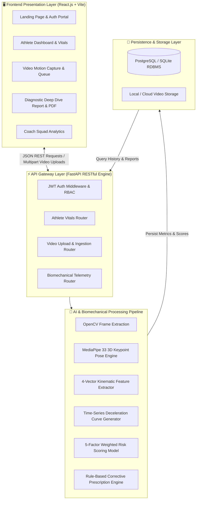

# 📚 KineticAI — Complete Technical Documentation Suite

Welcome to the official technical documentation repository for **KineticAI: AI-Powered Sports Injury Risk Detection from Video**.

This documentation suite provides a complete, module-by-module breakdown of the system architecture, mathematical models, computer vision pipelines, biomechanical telemetry, and deployment workflows.

---

## 📑 Documentation Index

| Module Document | Module Name | Primary Focus |
| :--- | :--- | :--- |
| **[01. User Authentication & RBAC](./01_USER_AUTHENTICATION_AND_RBAC.md)** | Module 1 | JWT authentication, bcrypt hashing, role separation (Athlete, Coach). |
| **[02. Athlete Profile Management](./02_ATHLETE_PROFILE_MANAGEMENT.md)** | Module 2 | Vitals, anthropometrics, injury history, and load tracking. |
| **[03. Video Upload & Processing Engine](./03_VIDEO_UPLOAD_AND_PROCESSING.md)** | Module 3 | Multi-video queue, video validation, frame extraction & batch ingestion. |
| **[04. Pose Estimation Engine](./04_POSE_ESTIMATION_ENGINE.md)** | Module 4 | MediaPipe 3D landmark localization, spatial mapping, confidence filtering. |
| **[05. Biomechanical Analysis Engine](./05_BIOMECHANICAL_ANALYSIS_ENGINE.md)** | Module 5 | 4 core kinematic features: Valgus, Flexion, Trunk Tilt, Asymmetry. |
| **[06. Injury Risk Prediction Engine](./06_INJURY_RISK_PREDICTION_ENGINE.md)** | Module 6 | Multi-vector mapping: ACL, Hamstring, Ankle, and Lumbar shear risks. |
| **[07. Movement Anomaly Detection Engine](./07_MOVEMENT_ANOMALY_DETECTION.md)** | Module 7 | Threshold deviation triggers, medial collapse flags, technique scoring. |
| **[08. Risk Scoring & Weighted Model](./08_RISK_SCORING_WEIGHTED_MODEL.md)** | Module 8 | 5-factor mathematical composite equation, weight normalization, risk tiers. |
| **[09. Corrective Recommendations Engine](./09_CORRECTIVE_RECOMMENDATIONS.md)** | Module 9 | Clinical exercise prescriptions, neuromuscular rehabilitation drills. |
| **[10. Dashboards & Analytics](./10_DASHBOARDS_AND_ANALYTICS.md)** | Module 10 | Athlete portal, Coach squad roster, interactive time-series curves. |
| **[11. Alerts, Archive & PDF Export](./11_NOTIFICATIONS_ALERTS_REPORTS_EXPORT.md)** | Module 11 & 12 | Visual danger banners, screening history archive, print/PDF engine. |
| **[12. Integration, Testing & Deployment](./12_INTEGRATION_TESTING_DEPLOYMENT.md)** | Module 13 | Docker multi-container architecture, FastAPI + React integration, testing. |

---

## 🏗️ Master System Architecture Diagram

---

## 🔬 Core Technology Stack

- **Computer Vision & Pose Estimation:** Google MediaPipe (BlazePose 33 3D Landmarks), OpenCV
- **Backend API:** Python 3.11, FastAPI, Pydantic v2, SQLAlchemy ORM, Uvicorn
- **Frontend SPA:** React 18, Vite, Lucide Icons, Recharts (Time-Series Analytics)
- **Security & Authentication:** OAuth2 Password Bearer, JWT (JSON Web Tokens), passlib (Bcrypt)
- **Containerization & Deployment:** Docker, Docker Compose, Nginx Reverse Proxy
