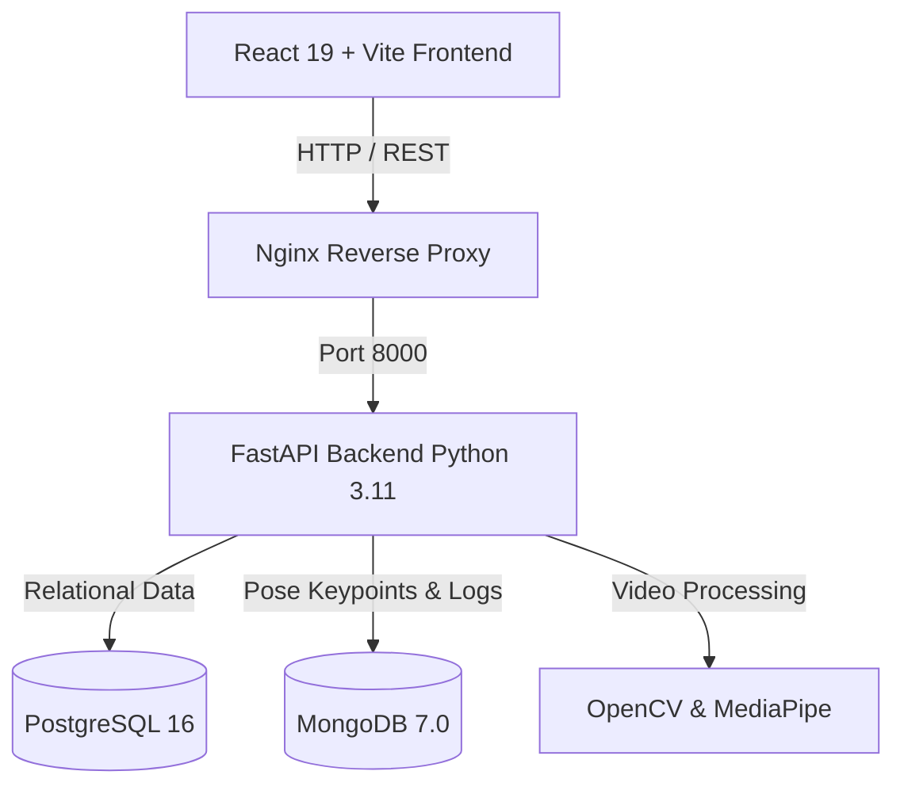

# Sports Injury Risk Detection - Documentation Portal

Welcome to the documentation for **Sports Injury Risk Detection System**, a full-stack AI platform for video-based biomechanical movement analysis, pose estimation, and injury risk prediction.

---

## 📚 Quick Navigation

| Document | Description |
|---|---|
| 🏃 [**Pose & Biomechanics Pipeline**](file:///c:/Users/saketh/Msme_Backend/docs/POSE_PIPELINE.md) | Technical guide for RTMPose-M, COCO 17 keypoints, smoothing & joint angles |
| 🗄️ [**Database Schema Specification**](file:///c:/Users/saketh/Msme_Backend/docs/DATABASE_SCHEMA.md) | Complete reference for PostgreSQL tables & MongoDB collections |
| 🏗️ [**System Architecture**](file:///c:/Users/saketh/Msme_Backend/docs/ARCHITECTURE.md) | High-level system design, AI processing pipeline, & auth model |
| 🔌 [**API Documentation**](file:///c:/Users/saketh/Msme_Backend/docs/API_DOCUMENTATION.md) | Comprehensive REST API endpoints, schemas, and request/response payloads |
| 🐳 [**Deployment & Operations Guide**](file:///c:/Users/saketh/Msme_Backend/docs/DEPLOYMENT_GUIDE.md) | Docker Compose setup, environment variables, and production deployment |

---

## 🎯 System Overview

The **Sports Injury Risk Detection** platform enables coaches, sports scientists, medical staff, and athletes to:
1. **Upload Movement Videos**: Capture high-FPS footage of jumping, landing, cutting drills, squats, and sprints.
2. **Pose Estimation Overlay**: Extract 2D/3D frame-wise skeletal keypoints (`pose_data` MongoDB collection).
3. **Biomechanical Movement Analysis**: Calculate dynamic joint angles including **Knee Valgus**, **Hip Stability Index**, **Lateral Trunk Lean**, **Stride Length**, and **Bilateral Symmetry**.
4. **Predict Injury Risk**: Compute probability scores for **ACL Tear/Sprain**, **Hamstring Strain**, **Ankle Inversion**, **Shoulder Instability**, **Lower Back Stress**, and **Overuse Fatigue**.
5. **Generate AI Prescriptions**: Output personalized corrective exercises, mobility protocols, strengthening routines, recovery plans, and training load modifications.

---

## 🛠️ Technology Stack

- **Frontend**: React 19, Vite, Tailwind CSS, Chart.js, Lucide Icons
- **Backend API**: FastAPI (Python 3.11), Uvicorn, SQLAlchemy, PyMongo, Pydantic, PassLib/Bcrypt, PyJWT
- **Computer Vision & AI**: OpenCV, MediaPipe Pose Estimation, NumPy
- **Databases**: PostgreSQL 16 (Relational Core), MongoDB 7.0 (Unstructured Keypoints & Logs)
- **DevOps**: Docker, Docker Compose, Nginx Reverse Proxy
