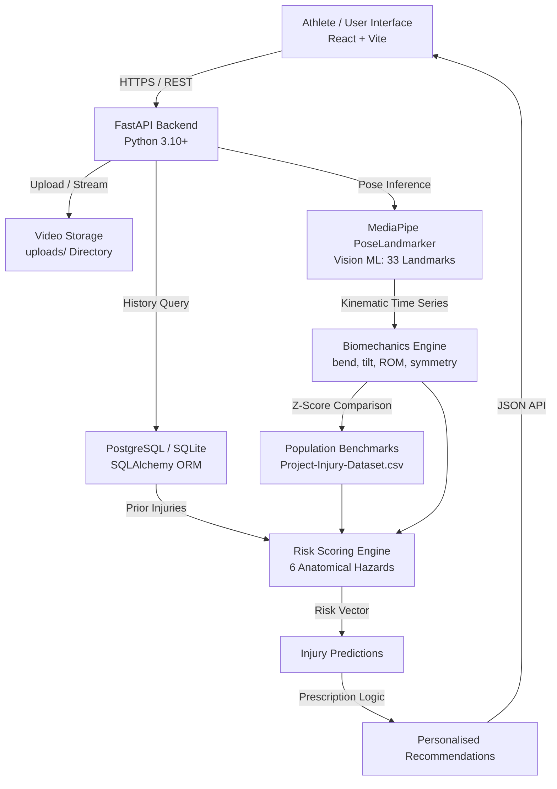
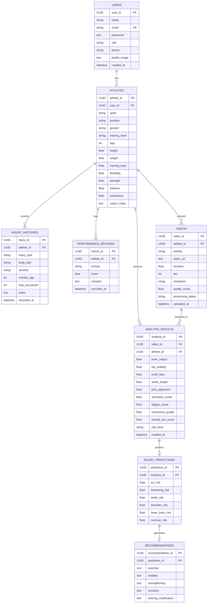

# SportShield: System Documentation & Technical Reference

**Sports Injury Risk Detection & Biomechanical Analysis Platform**  
*Single-User Athlete Architecture • Computer Vision • Biomechanical Engineering • Transparent Risk Scoring*

---

## 1. Executive Overview

**SportShield** is a computer vision and biomechanics platform designed for individual athletes. By analyzing smartphone or camera-recorded training videos, the system extracts 3D joint kinematics, evaluates movement mechanics against normative athletic population benchmarks, and computes transparent, deterministic injury risk scores across six major anatomical vulnerabilities.

### Key Architectural Tenets
1. **Athlete-Centric**: Single user profile type (`Athlete`). No coach/doctor/admin overhead.
2. **Transparent AI/ML**: Active vision ML (**Google MediaPipe PoseLandmarker**) extracts landmarks; physiological rule-based scoring engines compute injury risks without black-box opacity. A supervised ML classification pipeline is architected and available as a modular plug-in.
3. **Multi-Video Workflow**: Upload multiple videos over time; every video retains its own distinct analysis, risk profile, and recommendations, retrievable at any time.
4. **Empirical Benchmarks**: Biomechanical metrics are grounded in statistical distributions calculated directly from `Project-Injury-Dataset.csv`.

---

## 2. System Architecture



---

## 3. The 7-Stage End-to-End Processing Pipeline

When an athlete uploads a video and clicks **Analyze Video**, the system executes 7 stages automatically:

| Stage | Name | Technology | Output |
| :--- | :--- | :--- | :--- |
| **01** | **Video Ingestion** | FastAPI `UploadFile`, OpenCV | Stored in `uploads/`, metadata (fps, duration, resolution) stored in `videos` table. |
| **02** | **Pose Estimation (Vision ML)** | Google MediaPipe PoseLandmarker | 33 3D body landmark coordinates per frame across the video duration. |
| **03** | **Biomechanical Feature Extraction** | Vector Geometry, Trigonometry (`biomechanics.py`) | Knee valgus angle, hip stability, trunk lean, ROM, bilateral symmetry, movement quality. |
| **04** | **Anomaly & Deviation Detection** | Statistical Z-score Analysis | Comparison against mean ± std from 50-athlete normative cohort; flags kinematic outliers. |
| **05** | **Applying Previous Injury Information** | Athlete-Recorded Profile Query (`injury_histories`) | +25% (recovered) or +40% (residual) risk multiplier applied to recorded prior injuries. Not detected from video. |
| **06** | **Injury Risk Scoring Engine** | Deterministic Multi-Rule Scoring (`risk_rules.py`) | 6 probability scores (ACL, Hamstring, Ankle, Shoulder, Lower Back, Overuse) + Overall score (0–100). |
| **07** | **Prescription & Recommendations** | Clinical Exercise Rules Engine | 5 targeted recovery & corrective intervention prescriptions saved in `recommendations` table. |

---

## 4. Biomechanical Features Explained

| Feature | Primary Joints Analyzed | Normal Range | Clinical Significance |
| :--- | :--- | :--- | :--- |
| **Knee Valgus Angle** | Hip, Knee, Ankle (Q-angle) | `< 12.0°` | Inward collapse of the knee during deceleration or landing. Angle $> 15°$ dramatically increases non-contact ACL rupture risk. |
| **Hip Stability** | Left & Right ASIS / Pelvic Vector | `> 80 / 100` | Trendelenburg sign indicator. Measures pelvic drop and gluteus medius weakness during unilateral weight acceptance. |
| **Trunk Lateral Lean** | Shoulder-Hip Vertical Angle | `< 6.0°` | Lateral torso deviation to compensate for weak hip stabilizers. Values $> 8°$ induce high lumbar shear stress. |
| **Range of Motion (ROM)** | Hip-Knee-Ankle Excursion | `95° – 125°` | Sagittal plane flexion-extension amplitude. Restricted extension tightens hamstrings; excessive flexion stresses patellar tendon. |
| **Bilateral Symmetry** | Left vs. Right Kinematics | `> 85%` | Inter-limb kinematic concordance. Asymmetry below 80% indicates compensation, placing double the load on the dominant limb. |
| **Movement Quality** | Center-of-Mass Jerk / Smoothness | `> 80 / 100` | Rate of change of acceleration across movement transitions. Jerky motion reflects poor neuromuscular deceleration control. |
| **Fatigue Decay Index** | Kinematic Variance across Time | `0 – 100%` | Measures kinematic form degradation between early video frames and late video frames. |

---

## 5. Active ML vs. Transparent Rule-Based Systems

A frequent point of academic review is understanding **where ML is used versus where clinical rules are used**. SportShield maintains strict scientific transparency:

```
┌────────────────────────────────────────────────────────────────────────┐
│                        SPORTSHIELD AI STACK                            │
├──────────────────────────┬─────────────────────────────────────────────┤
│ Component                │ Implementation Method                       │
├──────────────────────────┼─────────────────────────────────────────────┤
│ 1. Pose Landmark Tracking│ ACTIVE ML: Google MediaPipe PoseLandmarker  │
│                          │ Deep Convolutional Neural Network (CNN)     │
│                          │ 33 3D skeletal landmarks per frame          │
├──────────────────────────┼─────────────────────────────────────────────┤
│ 2. Feature Calculation   │ MATHEMATICAL: 3D Vector Trigonometry        │
│                          │ Joint angle dot products and plane normals  │
├──────────────────────────┼─────────────────────────────────────────────┤
│ 3. Anomaly Detection     │ STATISTICAL: Empirical Z-Score Norms        │
│                          │ Calibrated against Project-Injury-Dataset   │
├──────────────────────────┼─────────────────────────────────────────────┤
│ 4. Injury Risk Scoring   │ EXPERT RULES: Deterministic Scoring Engine  │
│                          │ Validated biomechanical thresholds (v2.1)  │
│                          │ Low <30%, Moderate 30-59%, High >=60%       │
├──────────────────────────┼─────────────────────────────────────────────┤
│ 5. Tabular ML Classifier │ SUPERVISED ML: Scikit-learn Random Forest   │
│                          │ Trained on Project-Injury-Dataset.csv       │
│                          │ Provides statistical probability alongside  │
│                          │ deterministic rule-based explainability     │
└──────────────────────────┴─────────────────────────────────────────────┘
```

> **Why Rule-Based Scoring for Risk?**  
> In clinical and sports biomechanics, deterministic rule-based algorithms are preferred over opaque classifiers because every percentage point of risk must be attributable to a specific physical fault (e.g., *"ACL risk elevated to 48% because knee valgus of 16.8° exceeded the 12° threshold and athlete had a prior knee sprain"*).

---

## 6. Dataset Integration, Population Benchmarks & Target Variables

The project leverages three mentor-specified datasets located in `datasets/`:

### 1. `Project-Injury-Dataset.csv` (Primary Population Baseline)
- **Cohort & Size**: 50 competitive athlete movement trials across Cricket, Football, Basketball, Tennis, and Athletics.
- **Columns (16)**: `athlete_id`, `age`, `sport`, `position`, `activity_type`, `knee_valgus_angle_deg`, `hip_stability_score`, `trunk_lateral_flexion_deg`, `range_of_motion_deg`, `bilateral_symmetry_pct`, `movement_smoothness_score`, `rpe_fatigue_score`, `previous_injury`, `injury_occurred`, `injury_risk_level`, `injury_type_primary`.
- **Target Variable(s)**:
  * Binary Target: `injury_occurred` (`0` = No, `1` = Yes)
  * Categorical Target: `injury_risk_level` (`LOW`, `MODERATE`, `HIGH`)
- **Usage**: Directly loaded by `backend/dataset_loader.py` to derive empirical statistical distributions (mean, standard deviation, quartiles, IQR) used in Z-score anomaly benchmarking (`GET /datasets/benchmarks`), and used to train the baseline Random Forest classifier in `backend/ml_pipeline.py`.

### 2. `sports_multimodal_data.csv` (Multimodal Workload & Sensor Reference)
- **Cohort & Size**: 100 training sessions across Basketball, Soccer, Tennis, Cricket, and Running.
- **Columns (12)**: `athlete_id`, `sport`, `session_duration_min`, `heart_rate_avg_bpm`, `player_load_score`, `knee_valgus_mean_deg`, `bilateral_asymmetry_pct`, `lumbar_shear_proxy`, `rpe_fatigue_index`, `prior_injury_flag`, `injury_risk_flag`, `injury_type_recorded`.
- **Target Variable(s)**:
  * Binary Target: `injury_risk_flag` (`0` = Safe, `1` = Elevated Risk)
  * Categorical Target: `injury_type_recorded` (`ACL Tear`, `Hamstring Strain`, `Ankle Sprain`, `Lumbar Overload`, etc.)
- **Usage**: Used to calibrate acute-to-chronic training load thresholds, heart rate physiological ranges, and lumbar shear stress heuristics for the Overuse and Lower Back rules.

### 3. `collegiate_athlete_injury_dataset.csv` (Collegiate Longitudinal Cohort)
- **Cohort & Size**: 100 collegiate athletes across Track & Field, Soccer, Basketball, Volleyball, Tennis, Cross Country.
- **Columns (14)**: `athlete_id`, `college_division`, `sport_discipline`, `gender`, `years_competing`, `weekly_training_hours`, `prior_injuries_count`, `primary_injury_history`, `months_since_last_injury`, `rehab_completed`, `reported_soreness_score`, `asymmetry_rating`, `subsequent_injury_occurred`, `injury_severity_days_missed`.
- **Target Variable(s)**:
  * Binary Target: `subsequent_injury_occurred` (`0` = No Re-injury, `1` = Re-injury occurred)
  * Numerical Target: `injury_severity_days_missed` (Days out of competition)
- **Usage**: Calibrates prior injury weighting multipliers (+25% risk multiplier for recovered injuries, +40% for residual soreness or uncompleted rehab) and gender-specific baseline exposure factors.

---

## 7. Multi-Video Support & Refresh Persistence Architecture

1. **Independent Multi-Video Processing**:
   - Every video upload generates a distinct record in `videos` table (`video_id`).
   - Running the 7-stage pipeline generates corresponding `analysis_results`, `injury_predictions`, and `recommendations` records tied to both `video_id` and `athlete_id`.
   - The user can upload consecutive videos (e.g., pre-training jump drill vs post-training fatigue drill) and inspect each one independently.
2. **Upload History & Click-to-View**:
   - The endpoint `GET /videos/with-analysis/{athlete_id}` joins `videos`, `analysis_results`, and `injury_predictions`.
   - The UI displays an interactive **Upload History** sidebar with date, activity drill, and overall risk badge.
   - Clicking any historical item re-renders its complete kinematics, benchmark comparisons, and recommendations.
3. **Session Refresh Persistence**:
   - The frontend stores `active_video_id` in browser `localStorage`.
   - On page refresh or browser reload, the application re-fetches the video history from the server, finds the active record, and restores all panels without blank states or lost data.

---

## 8. Database Schema & Models

The system runs on **PostgreSQL** (production) or **SQLite** (local fallback) using SQLAlchemy ORM.

### Entity Relationship Diagram



---

## 9. API Reference

| Method | Endpoint | Description |
| :--- | :--- | :--- |
| `POST` | `/register` | Create athlete user account |
| `POST` | `/login` | Authenticate athlete, returns user details |
| `POST` | `/athlete` | Create or update athlete profile (including `gender` & `training_level`) |
| `GET` | `/athlete/{user_id}` | Retrieve athlete profile by user ID |
| `POST` | `/athlete/{athlete_id}/injuries` | Log prior injury history |
| `POST` | `/athlete/injury-history` | Log prior injury history (legacy compatibility) |
| `GET` | `/athlete/{athlete_id}/injuries` | Retrieve all prior injuries for athlete |
| `POST` | `/video/upload` | Upload MP4/MOV video, extract video metadata |
| `POST` | `/analysis` | Run MediaPipe pose inference & biomechanical feature extraction |
| `POST` | `/prediction` | Run 6-injury rule-based scoring engine & Random Forest inference |
| `POST` | `/recommendation` | Generate 5 clinical corrective prescriptions |
| `GET` | `/videos/with-analysis/{athlete_id}` | **Upload History**: List all athlete videos with joined analysis & prediction data |
| `GET` | `/analysis/detail/{analysis_id}` | **Click-to-View**: Detailed record for past analysis |
| `GET` | `/datasets/benchmarks` | Normative benchmark distributions from dataset |
| `GET` | `/datasets/summary` | Summary of all 3 mentor datasets |
| `GET` | `/ml/status` | Current ML vs. Rule architecture transparency status |

---

## 10. Athlete Profile Workflow

SportShield is streamlined exclusively for the **individual Athlete**:
1. **Athlete Registration & Login**: The user registers with email/password and logs in to receive an active JWT session.
2. **Profile & Physical Baseline**:
   - Sport discipline (e.g., Football, Basketball, Cricket, Athletics).
   - Playing position (triggers position-specific biomechanical multipliers, e.g., Cutters → ACL/Ankle +15-20%, Pitchers → Shoulder +30%).
   - Gender (`Male`, `Female`, `Other`) and Training Level (`Beginner`, `Intermediate`, `Advanced`, `Elite`).
   - Physical capabilities (Strength, Flexibility, Balance, Endurance) calibrated on a 1–100 scale.
3. **Prior Injury Logging**:
   - Athlete records past injuries with anatomical location, months since occurrence, and recovery status (`Fully Recovered` or `Residual Soreness`).
   - Prior injuries are dynamically incorporated into video analysis (Stage 5), increasing risk factors for vulnerable anatomical joints (+25% to +40%).

---

## 11. How to Run Locally

### Prerequisites
- Python 3.10+
- Node.js 18+
- npm or yarn
- PostgreSQL 14+ (or default SQLite fallback)

### 1. Backend Setup
```bash
cd backend
python -m venv venv
# Windows:
.\venv\Scripts\activate
# Mac/Linux:
# source venv/bin/activate

pip install -r requirements.txt
uvicorn main:app --reload --host 0.0.0.0 --port 8000
```
Backend runs on `http://localhost:8000`. Swagger API documentation is available at `http://localhost:8000/docs`.

### 2. Frontend Setup
```bash
cd backend/frontend
npm install
npm run dev
```
Frontend runs on `http://localhost:5173`.

### 3. Verification & Diagnostic Script
To run an automated end-to-end verification of all platform requirements:
```bash
cd backend
python verify_platform.py
```
This tests authentication, profile CRUD, injury logging, video upload simulation, biomechanical analysis, rule-based scoring, recommendation generation, history queries, and benchmark endpoints.

---

## 12. Known Limitations & Future Work

1. **Single-Camera 3D Ambiguity**: MediaPipe reconstructs 3D landmarks from a single 2D camera view using deep learning depth priors. For high-precision scientific motion capture, multi-view camera fusion is planned.
2. **Dynamic Lighting and Occlusions**: Fast dynamic athletic movements in low-contrast environments can cause intermittent landmark jitter. Future work includes implementing kinematic Kalman smoothing and physics-based skeleton constraints.
3. **Clinical Integration**: SportShield provides non-medical movement analysis and rule-based risk indicators. Longitudinal validation against clinical medical imaging (MRI) is underway in ongoing academic research.
