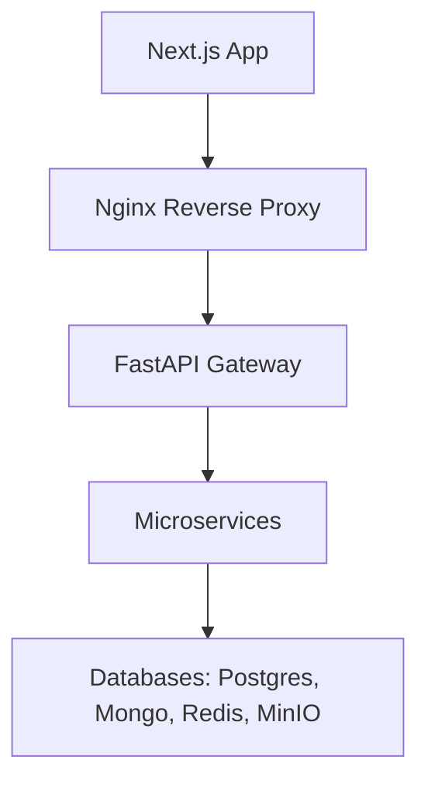
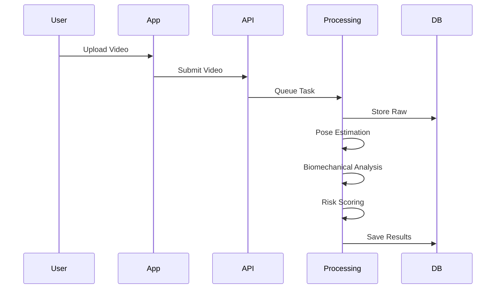

# Architecture

## 1. System Overview

## 2. Microservice Architecture

* **User/Athlete Management**: Handles identities, roles, and profiles.
* **Video Management**: Metadata tracking, storage coordination with MinIO.
* **Video Processing**: Preprocessing, standardization of video formats.
* **Pose Estimation**: Keypoint extraction using MediaPipe/YOLOv8.
* **Biomechanical Analysis**: Calculates joint angles, velocities, ROM.
* **Movement Quality**: Assesses movement symmetry and mechanics.
* **Injury Risk Prediction**: Employs ML models to determine risk probabilities.
* **Anomaly Detection**: Identifies deviations from baseline movement patterns using autoencoders.
* **Risk Scoring**: Computes the final composite score.
* **Recommendation Engine**: Generates targeted interventions based on risk factors.
* **Analytics & Insights**: Aggregates data for trend analysis.
* **Notification Service**: Delivers alerts and reports.

## 3. Data Flow

## 4. Database Architecture

* **PostgreSQL**: Relational data (users, teams, permissions).
* **TimescaleDB**: Time-series telemetry (training load, biomechanical metrics over time).
* **MongoDB**: Unstructured data (complex analysis results, metadata).
* **Redis**: Caching, Celery task queues.
* **MinIO**: Object storage for video files.
* **FAISS**: Vector search (future expansion).

## 5. AI/ML Pipeline

* **Pose Estimation**: MediaPipe / YOLOv8 (Deep Learning)
* **Action Recognition**: CNN/LSTM
* **Biomechanical Analysis**: Regression models
* **Injury Risk**: ML/DL Ensemble (XGBoost, Random Forest, PyTorch models)
* **Anomaly Detection**: Autoencoders
* **Fatigue**: Time-series forecasting
* **Risk Scoring**: Weighted ensemble

## 6. Authentication & Authorization

JWT Bearer Token flow. RBAC Matrix:
| Role | Video Upload | View Team Data | View Own Data | System Settings |
|---|---|---|---|---|
| Admin | Y | Y | Y | Y |
| Scientist | Y | Y | Y | N |
| Physio | Y | Y | Y | N |
| Coach | N | Y | Y | N |
| Athlete | Y | N | Y | N |

## 7. Composite Risk Score

* Biomechanical Deviations: 35%
* Historical Injury Factors: 20%
* Movement Asymmetry: 20%
* Training Load Indicators: 15%
* Fatigue Indicators: 10%
*(Note: Thresholds PROPOSAL_PENDING_STAKEHOLDER)*

## 8. Cross-Cutting Concerns

* Monitoring (Prometheus/Grafana)
* Audit logging
* Backups

## 9. Section 8 Decisions

* Real-time vs batch: batch (upload-and-process)
* Wearable: stub interface only
* Numeric thresholds: pending stakeholder
* Regulatory: no EHR without compliance review
* Billing/mobile: out of scope
