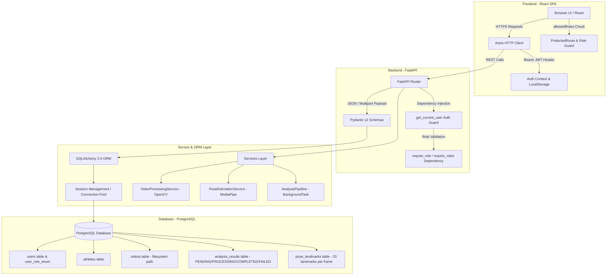
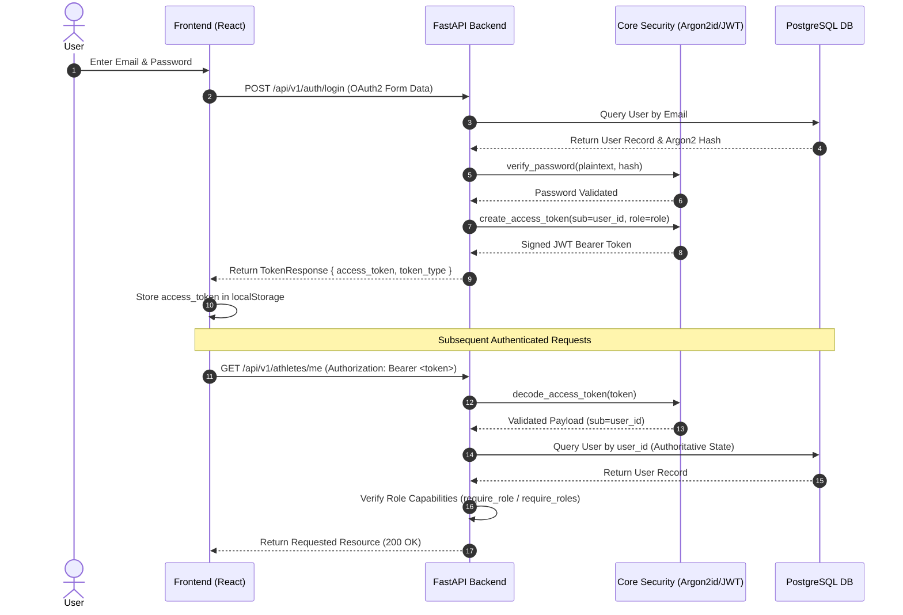
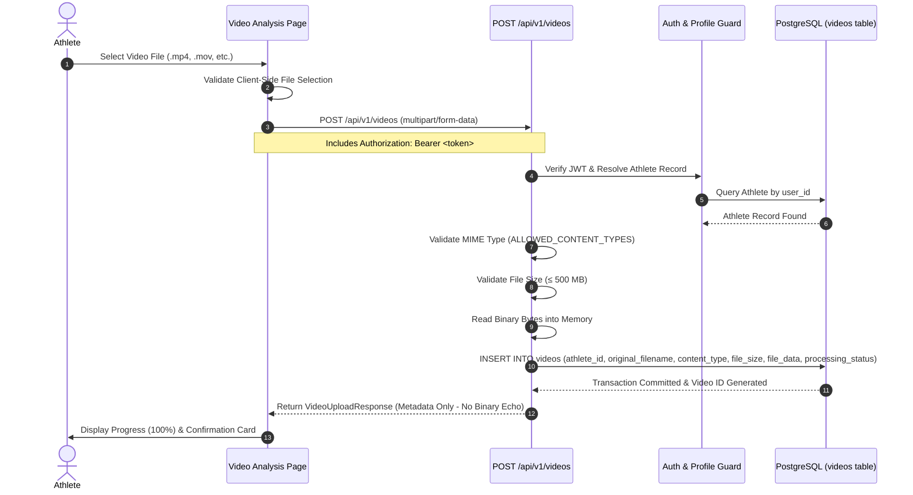
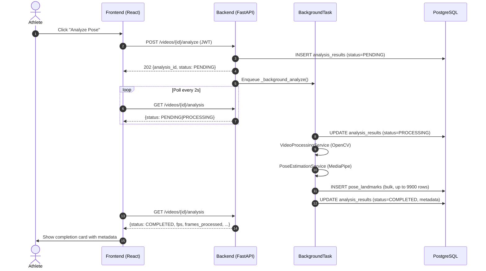

# System Architecture & Technical Specification

This document details the architectural design, component flow, security model, and data management pipelines of the **Sports Injury Risk Detection System**.

---

## 🏗️ High-Level System Architecture

The application follows a decoupled client-server architecture with a Single Page Application (SPA) frontend, a RESTful FastAPI backend, and a PostgreSQL relational database.



---

## 🔐 1. Authentication & Security Flow (JWT & RBAC)

The system implements stateless JWT authentication combined with database-authoritative Role-Based Access Control (RBAC).



### Key Security Mechanics:
1. **Password Hashing**: Passwords are saved strictly using the **Argon2id** algorithm (`argon2-cffi`).
2. **User Enumeration Defense**: The login handler executes constant-time hash verifications even when an email address is not found in the database.
3. **Database Authoritative Roles**: Roles (`Athlete`, `Coach`, `Physiotherapist`, `Sports Scientist`, `Administrator`) are re-verified against PostgreSQL on every request via `get_current_user` rather than trusting payload claims blindly.
4. **Forbidden Administrator Registration**: Self-registration for the `Administrator` role is explicitly rejected at the validation layer.

---

## 🛡️ 2. Dual-Layer RBAC Architecture

Security is enforced at two distinct layers:

### A. Backend Authorization (FastAPI Enforcement — True Security)
Every API endpoint validates permissions server-side:
* **Primary Auth Guard**: `get_current_user` extracts JWT `sub` (UUID) and fetches the authoritative `User` from PostgreSQL.
* **Role Dependency Factories**:
  * `require_role(allowed_role)`: Returns HTTP 403 Forbidden if `user.role != allowed_role`.
  * `require_roles(*allowed_roles)`: Returns HTTP 403 Forbidden if `user.role` is not in `allowed_roles`.
* **Resource-Level Authorization**:
  * `/athletes/me`, `POST /videos`: Resolves `athlete_id` strictly from `user.user_id` of the authenticated JWT.
  * `GET /athletes/{id}`: Athlete can only request their own profile; staff roles (`Coach`, `Physio`, `Scientist`, `Admin`) can view any profile.
  * `DELETE /athletes/{id}`: Restricted to `RoleEnum.ADMINISTRATOR`.

### B. Frontend Route & UI Adaptation (React — UX & Navigation)
* **Route Protection (`ProtectedRoute.jsx`)**: Checks `isAuthenticated` and optional `allowedRoles`. If an authenticated user attempts direct URL navigation to an unauthorized route (e.g. Athlete visiting `/athletes`), a clean `Access Restricted` UI is displayed with a navigation button back to `/dashboard`.
* **Role-Aware Sidebar (`Sidebar.jsx`)**: Filters sidebar links dynamically based on `user.role` (e.g. Roster page shown for Staff roles, Video Analysis shown for Athletes). Displays a role badge at the bottom.
* **Customized Dashboard (`Dashboard.jsx`)**: Adapts greeting, statistics, and quick-action buttons based on whether the user is an Athlete or Staff.

---

## 📹 3. Video Upload & Storage Flow

The platform handles video binary uploads directly through FastAPI and stores raw binary data in PostgreSQL using the `BYTEA` data type alongside metadata.



### Data Pipeline Details:
* **Server-Side Identity Derivation**: `user_id` and `athlete_id` are derived strictly from the authenticated JWT token — clients cannot pass or override target profile IDs.
* **Payload Validation**: MIME types are checked against an explicit whitelist (`video/mp4`, `video/quicktime`, `video/x-msvideo`, `video/webm`, `video/x-matroska`), and payloads above 500 MB return `HTTP 413 Payload Too Large`.
* **Zero-Echo Response**: The HTTP response contains file metadata (`video_id`, `original_filename`, `content_type`, `file_size`, `uploaded_at`), omitting binary contents to preserve bandwidth.

---

## 💻 Tech Stack Overview

| Layer | Technologies Used |
|---|---|
| **Frontend UI** | React 18, Vite, Lucide React Icons, Vanilla CSS Design System |
| **State & HTTP** | React Context API (`AuthContext`), Axios + Interceptors, React Router v6 |
| **Backend Framework** | Python 3.11+, FastAPI, Pydantic v2, Pydantic Settings |
| **Database & ORM** | PostgreSQL 16, SQLAlchemy 2.0 (ORM & Mapped Types), Alembic Migrations |
| **Security & Auth** | Argon2id (`argon2-cffi`), PyJWT (`python-jose`), FastAPI OAuth2 Bearer |
| **File Processing** | `python-multipart` for streaming multipart binary parsing |
| **Video Processing** | OpenCV (`opencv-python-headless`) — frame validation, FPS/metadata, frame sampling |
| **Pose Estimation** | MediaPipe BlazePose — 33 landmarks (x, y, z, visibility) per frame |
| **Async Processing** | FastAPI `BackgroundTasks` — no external queue/broker required |
| **Containerisation** | Docker Compose (postgres, backend, frontend) with named volumes |

---

## 🎯 Video Analysis Pipeline

The analysis pipeline runs as a `BackgroundTask` after `POST /videos/{id}/analyze` returns 202:



### Status Lifecycle

```
PENDING → PROCESSING → COMPLETED
                     ↘ FAILED (error_message saved)
```

### Landmark Storage Schema

For each sampled frame, 33 `pose_landmarks` rows are written:

| Column | Type | Description |
|---|---|---|
| `analysis_id` | UUID FK | Links to `analysis_results` |
| `frame_number` | int | 0-indexed frame in original video |
| `timestamp_ms` | float | ms from video start |
| `landmark_index` | int | 0–32 (MediaPipe topology) |
| `landmark_name` | str | e.g. `LEFT_KNEE`, `RIGHT_HIP` |
| `x`, `y`, `z` | float | Normalised spatial coordinates |
| `visibility` | float | Detection confidence [0,1] |

A composite index on `(analysis_id, frame_number)` enables efficient feature engineering queries for angles, velocities, and symmetry in the next phase.
