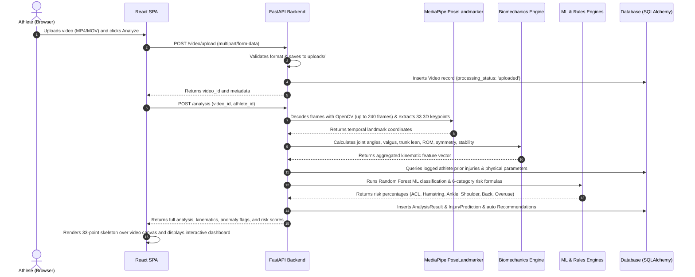
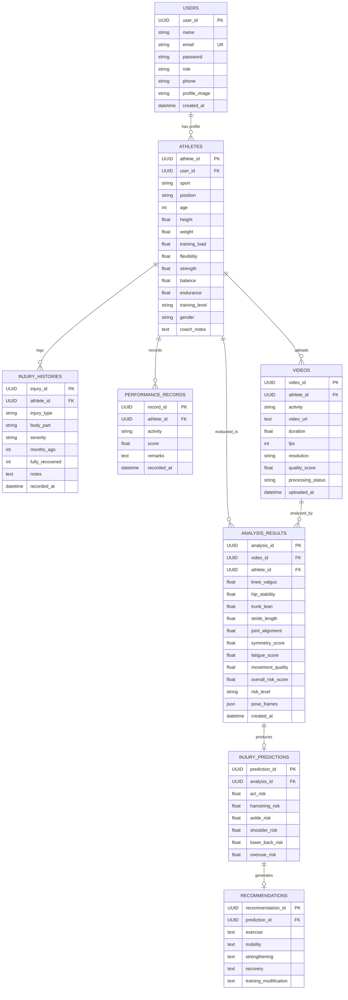

# System Architecture: SportShield Platform

This document provides a comprehensive architectural breakdown of the **SportShield** Sports Injury Risk Detection and Biomechanical Analysis system.

---

## 1. High-Level Architecture Overview

SportShield is built as a decoupled, client-server system designed for individual athletes:
- **Frontend Layer**: Single-page application (SPA) created with **React 18** and **Vite**, featuring HTML5 Canvas for real-time skeletal pose playback and interactive metric dashboards.
- **Backend API Layer**: High-performance asynchronous REST API powered by **FastAPI** (Python 3.10+).
- **Computer Vision & Biomechanics Engine**: Integrated pipeline utilizing **OpenCV** for video ingestion and **Google MediaPipe PoseLandmarker** for 33 3D skeletal landmark extraction, followed by vector trigonometry kinematic calculation.
- **Intelligence & Risk Layer**: Hybrid architecture combining a supervised **Scikit-learn Random Forest Classifier** trained on empirical datasets alongside a deterministic **6-Category Clinical Biomechanics Rule Engine**.
- **Persistence Layer**: Relational database managed via **SQLAlchemy ORM** supporting **PostgreSQL** in production with automatic fallback to **SQLite** for local development.

```mermaid
flowchart TD
    subgraph Client["Frontend Client (React + Vite)"]
        UI_AUTH[Athlete Authentication & Profile]
        UI_VID[Video Ingestion & Playback Canvas]
        UI_SKELETON[33-Keypoint Skeletal Visualizer]
        UI_DASH[Kinematic & Anomaly Dashboard]
        UI_RISK[6-Category Risk & Risk Tiers]
        UI_REC[Exercise & Prehab Prescriptions]
        UI_HIST[Multi-Video History Selector]
    end

    subgraph Server["Backend Server (FastAPI)"]
        API_GATEWAY[FastAPI Router & CORS Middleware]
        CV_ENGINE[OpenCV Video Frame Decoder]
        POSE_TRACKER[MediaPipe PoseLandmarker Engine]
        BIO_ENGINE[Biomechanical Feature Extractor]
        ANOMALY_ENGINE[Empirical Z-Score Benchmark Engine]
        ML_MODEL[Random Forest Classifier (100 Trees)]
        RULES_ENGINE[6-Category Deterministic Risk Engine]
        REC_ENGINE[Targeted Prescription Engine]
    end

    subgraph Storage["Storage & Datasets"]
        RAW_VIDEOS[uploads/ Video Directory]
        POSTGRES_DB[(PostgreSQL / SQLite Database)]
        DS_PRIMARY[("Project-Injury-Dataset.csv\n(50 Athlete Cohort)")]
        DS_WORKLOAD[("sports_multimodal_data.csv\n(100 Records)")]
        DS_COLLEGE[("collegiate_athlete_injury_dataset.csv\n(100 Records)")]
    end

    UI_AUTH -->|REST API| API_GATEWAY
    UI_VID -->|Multipart Form Upload| API_GATEWAY
    API_GATEWAY --> RAW_VIDEOS
    API_GATEWAY --> CV_ENGINE
    CV_ENGINE --> POSE_TRACKER
    POSE_TRACKER --> BIO_ENGINE
    BIO_ENGINE --> ANOMALY_ENGINE
    ANOMALY_ENGINE --> DS_PRIMARY
    BIO_ENGINE --> ML_MODEL
    BIO_ENGINE --> RULES_ENGINE
    POSTGRES_DB -->|Athlete History| RULES_ENGINE
    RULES_ENGINE --> REC_ENGINE
    REC_ENGINE --> API_GATEWAY
    API_GATEWAY --> POSTGRES_DB
    API_GATEWAY --> UI_DASH
    API_GATEWAY --> UI_RISK
    API_GATEWAY --> UI_REC
    UI_HIST -->|Fetch Past Analyses| API_GATEWAY
```

---

## 2. End-to-End Processing Workflow

When an athlete uploads a video, the system executes a 7-stage pipeline:



---

## 3. Database Entity Relationship (ER) Model

The database maintains referential integrity using standard foreign key constraints.



---

## 4. Component Directory & Module Mapping

```
sports-injury-risk-detection/
├── backend/
│   ├── main.py                  # FastAPI application, route handlers, CORS configuration
│   ├── pose_engine.py           # OpenCV frame reader & MediaPipe PoseLandmarker task runner
│   ├── biomechanics.py          # 3D vector geometry, valgus projection, activity inference
│   ├── ml_pipeline.py           # Scikit-learn Random Forest model training, scaling, inference
│   ├── risk_rules.py            # 6-category deterministic risk engine & position weighting
│   ├── feature_engineering.py   # Anomaly Z-score comparison against population benchmarks
│   ├── recommendation_engine.py # Targeted exercise and prehab prescription generation
│   ├── dataset_loader.py        # CSV ingestion & descriptive statistical benchmark generator
│   ├── database.py              # SQLAlchemy engine, session factory, Postgres/SQLite fallback
│   ├── models.py                # SQLAlchemy ORM table declarations
│   ├── schemas.py               # Pydantic validation schemas
│   ├── init_db.py               # Database table initialization script
│   ├── verify_platform.py       # Comprehensive diagnostic and verification test suite
│   ├── models/                  # Serialized model directory (injury_rf_model.pkl, scaler.pkl)
│   └── uploads/                 # Uploaded video file storage directory
├── backend/frontend/            # Active React 18 + Vite frontend application
│   ├── src/
│   │   ├── App.jsx              # Application shell, authentication state, profile modal
│   │   ├── Dashboard.jsx        # Athlete summary cards, risk distribution, history drawer
│   │   ├── VideoAnalysis.jsx    # Video player, HTML5 Canvas 33-point pose skeleton renderer
│   │   ├── Recommendations.jsx  # 5-part exercise and prehab corrective prescriptions
│   │   ├── Performance.jsx      # Performance record tracking and history
│   │   ├── config/api.js        # API base URL configuration
│   │   └── utils/validation.js  # Client-side input validation and error parsing
│   ├── package.json             # NPM package manifest
│   └── vite.config.js           # Vite development server configuration
├── datasets/                    # Empirical benchmark and calibration datasets
│   ├── Project-Injury-Dataset.csv
│   ├── sports_multimodal_data.csv
│   └── collegiate_athlete_injury_dataset.csv
└── docs/                        # Dedicated technical and architectural documentation
    ├── architecture.md
    ├── technical-details.md
    ├── setup.md
    └── SYSTEM_DOCUMENTATION.md
```
