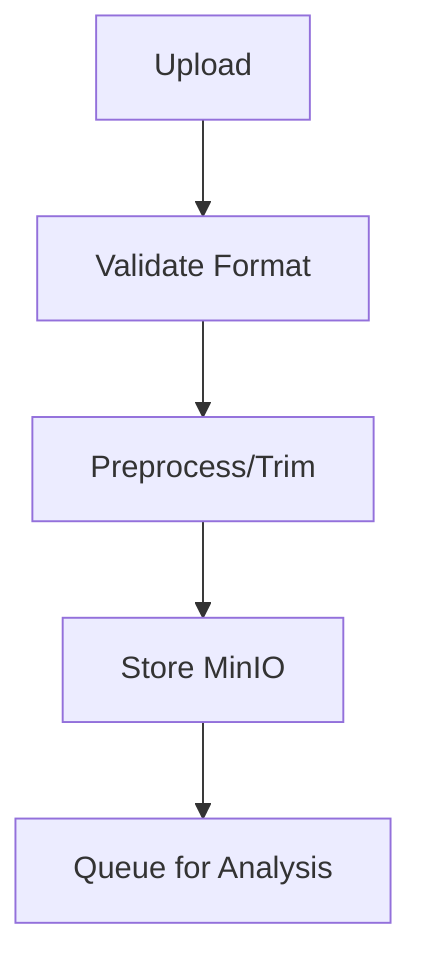
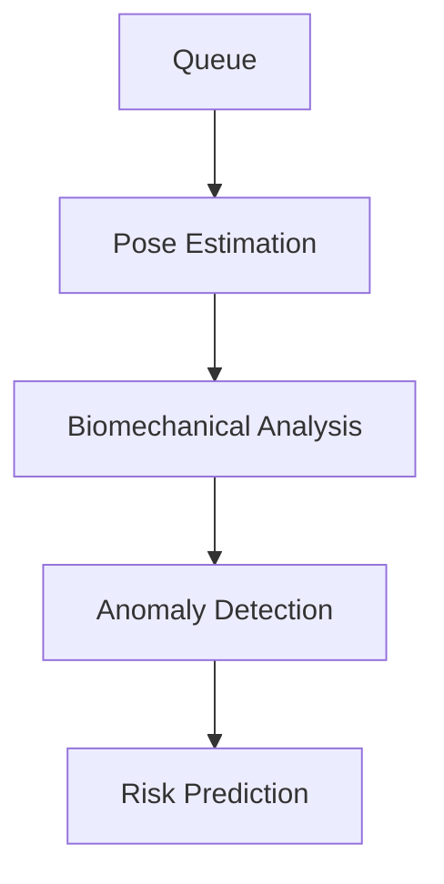
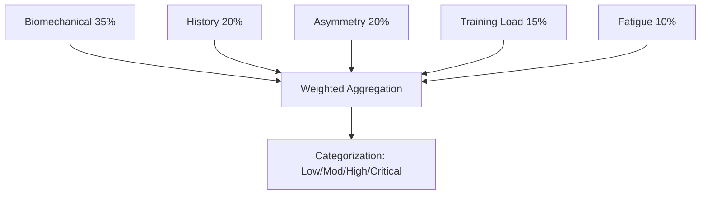

# Data Flow Diagrams

## Video Processing Pipeline

```mermaid
graph TD
    Upload[Upload] --> Validate[Validate Format]
    Validate --> Preprocess[Preprocess/Trim]
    Preprocess --> Store[Store MinIO]
    Store --> Queue[Queue for Analysis]
```

## Analysis Pipeline

```mermaid
graph TD
    Queue[Queue] --> Pose[Pose Estimation]
    Pose --> Biomech[Biomechanical Analysis]
    Biomech --> Anomaly[Anomaly Detection]
    Anomaly --> Risk[Risk Prediction]
```

## Risk Scoring Flow

```mermaid
graph TD
    Biomech[Biomechanical 35%] --> Agg[Weighted Aggregation]
    History[History 20%] --> Agg
    Asym[Asymmetry 20%] --> Agg
    Load[Training Load 15%] --> Agg
    Fatigue[Fatigue 10%] --> Agg
    Agg --> Cat[Categorization: Low/Mod/High/Critical]
```
