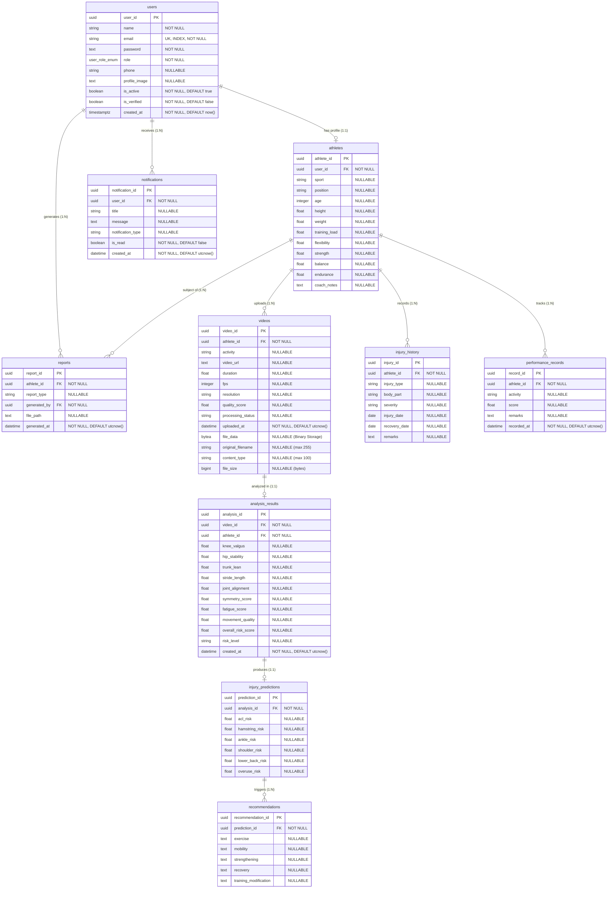

# Database Architecture & Entity Schema

The **Sports Injury Risk Detection System** uses a PostgreSQL relational database. Database schema and migrations are managed using **SQLAlchemy 2.0 ORM** and **Alembic**.

---

## 🗺️ Entity Relationship Diagram (ERD)

---

## 🗄️ Detailed Table Specifications

### 1. `users` Table
Stores authentication identity and role assignments for all system users.
* `user_id` (`UUID`, Primary Key, default `uuid4()`): Unique user ID.
* `name` (`VARCHAR`, Not Null): User's full display name.
* `email` (`VARCHAR`, Unique, Indexed, Not Null): Lowercased login email address.
* `password` (`TEXT`, Not Null): Argon2id hashed password string.
* `role` (`user_role_enum`, Not Null): Native PostgreSQL Enum (`Athlete`, `Coach`, `Physiotherapist`, `Sports Scientist`, `Administrator`).
* `phone` (`VARCHAR`, Nullable): Contact phone number.
* `profile_image` (`TEXT`, Nullable): Avatar image URL string.
* `is_active` (`BOOLEAN`, Not Null, default `true`): Account active status.
* `is_verified` (`BOOLEAN`, Not Null, default `false`): Verification status.
* `created_at` (`TIMESTAMPTZ`, Not Null, server default `now()`): Registration timestamp.

---

### 2. `athletes` Table
Stores physical characteristics and performance baselines for accounts with the `Athlete` role.
* `athlete_id` (`UUID`, Primary Key, default `uuid4()`): Unique athlete profile ID.
* `user_id` (`UUID`, Foreign Key → `users.user_id`, Not Null): Owner user account ID.
* `sport` (`VARCHAR`, Nullable): Primary sport (e.g., Football, Basketball).
* `position` (`VARCHAR`, Nullable): Playing position (e.g., Midfielder, Point Guard).
* `age` (`INTEGER`, Nullable): Age in years.
* `height` (`FLOAT`, Nullable): Height in centimeters.
* `weight` (`FLOAT`, Nullable): Weight in kilograms.
* `training_load` (`FLOAT`, Nullable): Baseline training load rating.
* `flexibility`, `strength`, `balance`, `endurance` (`FLOAT`, Nullable): Physical performance baselines.
* `coach_notes` (`TEXT`, Nullable): Notes added by coaching staff.

---

### 3. `videos` Table
Stores movement video metadata and **raw binary contents** uploaded by athletes.
* `video_id` (`UUID`, Primary Key, default `uuid4()`): Unique video record ID.
* `athlete_id` (`UUID`, Foreign Key → `athletes.athlete_id`, Not Null): Linked athlete ID.
* `activity` (`VARCHAR`, Nullable): Movement activity type (e.g., Squat, Jump, Sprint).
* `video_url` (`TEXT`, Nullable): Optional file path or URL string.
* `duration` (`FLOAT`, Nullable): Duration in seconds.
* `fps` (`INTEGER`, Nullable): Video frame rate.
* `resolution` (`VARCHAR`, Nullable): Video resolution (e.g., 1920x1080).
* `quality_score` (`FLOAT`, Nullable): Video quality assessment score.
* `processing_status` (`VARCHAR`, Nullable): Status (e.g., `uploaded`, `processing`, `completed`).
* `uploaded_at` (`DATETIME`, Not Null, default `utcnow()`): Upload timestamp.
* **`file_data`** (`BYTEA` / `LargeBinary`, Nullable): **Raw video binary file stored directly in PostgreSQL**.
* `original_filename` (`VARCHAR(255)`, Nullable): Original filename from client.
* `content_type` (`VARCHAR(100)`, Nullable): MIME format (e.g., `video/mp4`).
* `file_size` (`BIGINT`, Nullable): Binary file size in bytes.

---

### 4. `analysis_results` Table *(Schema Ready - Population Planned)*
Stores kinematic joint angle metrics and risk ratings calculated from video analysis.
* `analysis_id` (`UUID`, Primary Key, default `uuid4()`)
* `video_id` (`UUID`, Foreign Key → `videos.video_id`, Not Null)
* `athlete_id` (`UUID`, Foreign Key → `athletes.athlete_id`, Not Null)
* `knee_valgus`, `hip_stability`, `trunk_lean`, `stride_length`, `joint_alignment`, `symmetry_score`, `fatigue_score`, `movement_quality`, `overall_risk_score` (`FLOAT`, Nullable)
* `risk_level` (`VARCHAR`, Nullable): Rating (`Low`, `Moderate`, `High`).
* `created_at` (`DATETIME`, Not Null, default `utcnow()`)

---

### 5. `injury_predictions` Table *(Schema Ready - Population Planned)*
Stores ML-generated joint and muscle injury risk probabilities.
* `prediction_id` (`UUID`, Primary Key, default `uuid4()`)
* `analysis_id` (`UUID`, Foreign Key → `analysis_results.analysis_id`, Not Null)
* `acl_risk`, `hamstring_risk`, `ankle_risk`, `shoulder_risk`, `lower_back_risk`, `overuse_risk` (`FLOAT`, Nullable)

---

### 6. `recommendations` Table *(Schema Ready - Population Planned)*
Stores corrective exercise and recovery strategies triggered by injury predictions.
* `recommendation_id` (`UUID`, Primary Key, default `uuid4()`)
* `prediction_id` (`UUID`, Foreign Key → `injury_predictions.prediction_id`, Not Null)
* `exercise`, `mobility`, `strengthening`, `recovery`, `training_modification` (`TEXT`, Nullable)

---

### 7. `injury_history` Table
Tracks medical history and previous injuries for an athlete.
* `injury_id` (`UUID`, Primary Key, default `uuid4()`)
* `athlete_id` (`UUID`, Foreign Key → `athletes.athlete_id`, Not Null)
* `injury_type`, `body_part`, `severity` (`VARCHAR`, Nullable)
* `injury_date`, `recovery_date` (`DATE`, Nullable)
* `remarks` (`TEXT`, Nullable)

---

### 8. `performance_records` Table
Tracks ongoing physical test performance evaluations.
* `record_id` (`UUID`, Primary Key, default `uuid4()`)
* `athlete_id` (`UUID`, Foreign Key → `athletes.athlete_id`, Not Null)
* `activity` (`VARCHAR`, Nullable)
* `score` (`FLOAT`, Nullable)
* `remarks` (`TEXT`, Nullable)
* `recorded_at` (`DATETIME`, Not Null, default `utcnow()`)

---

### 9. `notifications` Table
Stores system alerts and notifications for users.
* `notification_id` (`UUID`, Primary Key, default `uuid4()`)
* `user_id` (`UUID`, Foreign Key → `users.user_id`, Not Null)
* `title` (`VARCHAR`, Nullable)
* `message` (`TEXT`, Nullable)
* `notification_type` (`VARCHAR`, Nullable)
* `is_read` (`BOOLEAN`, Not Null, default `false`)
* `created_at` (`DATETIME`, Not Null, default `utcnow()`)

---

### 10. `reports` Table
Stores export metadata for downloadable analysis and team reports.
* `report_id` (`UUID`, Primary Key, default `uuid4()`)
* `athlete_id` (`UUID`, Foreign Key → `athletes.athlete_id`, Not Null)
* `report_type` (`VARCHAR`, Nullable)
* `generated_by` (`UUID`, Foreign Key → `users.user_id`, Not Null)
* `file_path` (`TEXT`, Nullable)
* `generated_at` (`DATETIME`, Not Null, default `utcnow()`)

---

## 📜 Alembic Migration Revision Chain

| Revision ID | Description | Key Schema Operations |
|---|---|---|
| `5d34925c67e8` | Initial schema setup | Created base tables with standard UUID primary keys. |
| `db5f18369348` | Native PG Enum | Converted `user.role` column to native PostgreSQL Enum type `user_role_enum`. |
| `20ddf52c0e83` | Schema alignment | Aligned relational structure for `athletes`, `videos`, `analysis_results`, `injury_predictions`, `recommendations`, `injury_history`, `performance_records`, `notifications`, `reports`. |
| `507b90721148` | Binary video storage | Added `file_data` (`BYTEA`), `original_filename` (`VARCHAR`), `content_type` (`VARCHAR`), and `file_size` (`BIGINT`) to `videos`. |
