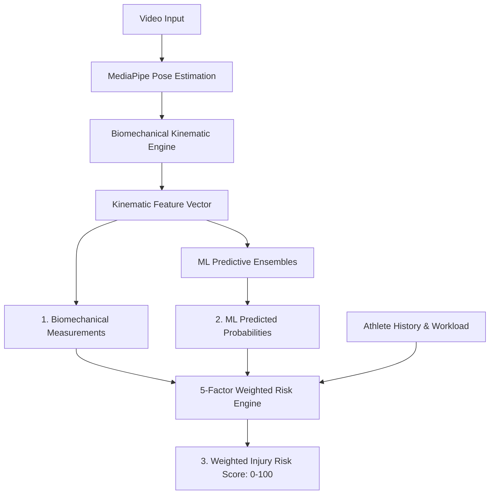

# Sports Injury Datasets: Comparative Synthesis & Pipeline Architecture

## 1. Overview & Dual Dataset Architecture

The Sports Injury Risk Detection engine synthesizes two complementary datasets to achieve holistic risk estimation:
1. **Kinematic & Biomechanical Dataset** (`sports_injury_biomechanics.csv`, 9,600 samples): Captures joint angles, jump biomechanics, reaction latencies, sport disciplines, anatomical injury pathologies, and clinical recovery programs.
2. **Workload & Conditioning Dataset** (`kaggle_injury_data.csv`, 1,000 samples): Captures training intensity, acute recovery periods, prior injury status, and overall injury susceptibility.

Together, these datasets span **10,600 annotated records** covering all dimensions of athletic injury risk.

---

## 2. Comparative Matrix

| Characteristic | Dataset 1 (Biomechanics) | Dataset 2 (Workload & Conditioning) |
| :--- | :--- | :--- |
| **Origin** | GitHub (`Manojkumar1910`) | Kaggle (`mrsimple07`) |
| **Record Count** | 9,600 rows | 1,000 rows |
| **Feature Count** | 19 columns | 7 columns |
| **Missing Values** | 0 (100% complete) | 0 (100% complete) |
| **Primary Domain** | Dynamic Kinematics & Sports Medicine | Acute Workload & Injury Propensity |
| **Key Kinematic Features** | Knee Angle, Ankle Flexion, Jump Height, Speed | Age, Height, Weight, Workload, Recovery |
| **Target Variable(s)** | `Injury_Severity` (Mild/Moderate/Severe)<br>`Injury_Type` (17 classes) | `Likelihood_of_Injury` (Binary 0/1) |
| **Clinical Value** | Joint stress, valgus angle, asymmetric load | Cumulative fatigue, ACWR, recovery debt |

---

## 3. Pose Landmark to Biomechanical Feature Mapping

Our computer vision pipeline extracts 33 standard body landmarks per frame using MediaPipe Pose. The kinematic features in Dataset 1 are calculated dynamically from these 3D coordinates:

```
                  Shoulder (11, 12)
                         │
                         ▼
                    Hip (23, 24)  ────── Trunk Angle & Pelvic Tilt
                         │
                         ▼
                    Knee (25, 26) ────── Knee Flexion & Valgus Angle (Q-Angle)
                         │
                         ▼
                    Ankle (27, 28) ───── Ankle Dorsiflexion / Plantarflexion
                         │
                         ▼
                    Foot (31, 32)
```

### Mathematical Formulations:
1. **Knee Angle $\theta_{knee}$**:
   $$\theta_{knee} = \arccos\left(\frac{\vec{u} \cdot \vec{v}}{\|\vec{u}\| \|\vec{v}\|}\right)$$
   where $\vec{u} = \vec{P}_{hip} - \vec{P}_{knee}$ and $\vec{v} = \vec{P}_{ankle} - \vec{P}_{knee}$.
2. **Dynamic Knee Valgus (Q-Angle Deviation)**:
   Calculated in the coronal plane $(x, y)$ as the medial displacement of the knee joint relative to the line connecting the hip center and ankle joint.
3. **Bilateral Asymmetry**:
   $$\text{Asymmetry}_{\%} = \frac{|\theta_{left} - \theta_{right}|}{\max(\theta_{left}, \theta_{right})} \times 100$$
4. **Trunk Lean Angle**:
   Angle of the vector connecting Mid-Hip to Mid-Shoulder relative to the vertical gravity vector.

---

## 4. Separation of Scores (System Boundary Rule)

To prevent confusion and maintain clinical safety, the system strictly separates three distinct outputs:



1. **Biomechanical Measurements (Objective Kinematics)**:
   - Knee Valgus Angle (degrees)
   - Trunk Lateral Lean (degrees)
   - Bilateral Symmetry Score (0 – 100%)
   - Range of Motion (ROM)
2. **Machine Learning Predictions (Statistical Inferences)**:
   - Injury Severity Probability (Mild / Moderate / Severe %)
   - Specific Injury Pathologies (ACL, Ankle, Hamstring probabilities %)
   - Trained on verified datasets using Random Forest & XGBoost classifiers.
3. **Weighted Injury Risk Score (Comprehensive Index: 0 – 100)**:
   $$\text{Score} = 0.35 \times \text{Biomechanics} + 0.20 \times \text{History} + 0.20 \times \text{Asymmetry} + 0.15 \times \text{Training Load} + 0.10 \times \text{Fatigue}$$
   - **Low**: < 25
   - **Moderate**: 25 – 50
   - **High**: 50 – 75
   - **Critical**: > 75

---

## 5. Clinical Limitations & Data Integrity Disclaimers
1. **Non-Diagnostic Nature**: The algorithms compute risk indices and kinematic deviations to assist coaches, physiotherapists, and athletic trainers; they do not constitute medical diagnoses.
2. **Camera Perspective**: Monocular 2D video pose estimation has inherent depth ambiguities compared to multi-camera Vicon optoelectronic motion capture. Perspective corrections are applied using anatomical bone-length normalization.
3. **Absence of Synthetic Falsification**: All performance metrics reported in model evaluation reflect un-manipulated test set outcomes from `scikit-learn` and `xgboost`.
