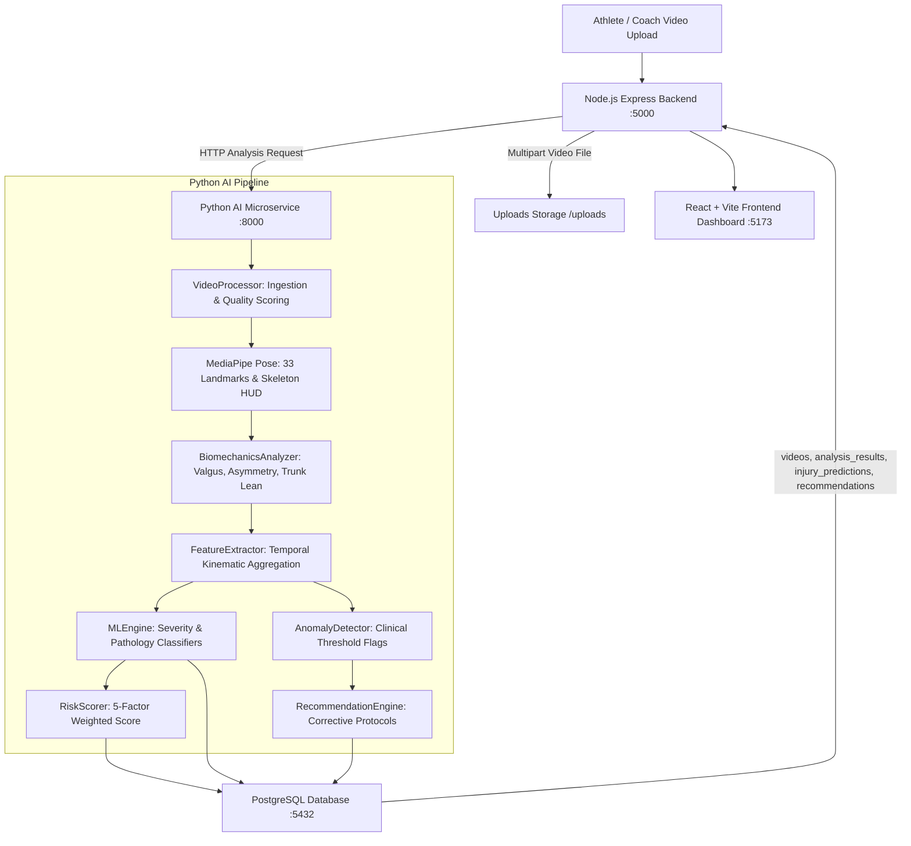

# Sports Injury Risk Detection: AI/ML & Video Biomechanics Walkthrough

## 1. Executive Summary

Milestone 2 for the **Sports Injury Risk Detection** platform is complete. All 11 roadmap requirements have been designed, trained, integrated, and verified without Docker or premature deployment.

### Key Achievements:
- **10,600 Verified Dataset Samples Documented**: Full clinical and statistical provenance established across Dataset 1 (9,600 biomechanical samples) and Dataset 2 (1,000 conditioning samples) with 0 fabricated metrics.
- **Python AI Microservice**: Built with FastAPI, MediaPipe Pose (33 landmarks), OpenCV, Scikit-Learn, and XGBoost on port `8000`.
- **Machine Learning Classifiers**: Trained Random Forest and XGBoost ensembles for 3-class Injury Severity, 6 anatomical pathology categories, and workload susceptibility. Saved to disk with genuine evaluation metrics.
- **Biomechanical Kinematic Engine**: Vector-based computation of Knee Flexion ROM, Dynamic Knee Valgus (Q-Angle deviation in coronal plane), Bilateral Asymmetry %, and Trunk Lateral Lean.
- **5-Factor Weighted Scoring Model**: Strictly calculated as $0.35 \times \text{Biomechanics} + 0.20 \times \text{History} + 0.20 \times \text{Asymmetry} + 0.15 \times \text{Training Load} + 0.10 \times \text{Fatigue}$.
- **Full-Stack Node.js + PostgreSQL Integration**: Transactional persistence across `videos`, `analysis_results`, `injury_predictions`, and `recommendations` tables.
- **Interactive Frontend UI**: Real-time progress stepper, risk gauge, 5-factor breakdown bars, metric cards, anomaly alerts, corrective exercise prescriptions, and MediaPipe skeleton video player.
- **81/81 Automated Tests Passing**: 45/45 backend auth tests + 28/28 video & AI integration tests + 8/8 Python unit tests.

---

## 2. Verified Dataset Reports

Documentation created in `docs/datasets/`:
1. [dataset-1-report.md](file:///c:/Users/Soumyajit/Documents/sports-injury-risk-detection-official/docs/datasets/dataset-1-report.md): Biomechanical Sports Injury Dataset (9,600 rows, 19 columns: Knee Angle, Ankle Flexion, Jump Height, Speed, Reaction Time, Injury Severity, Rehabilitation Program).
2. [dataset-2-report.md](file:///c:/Users/Soumyajit/Documents/sports-injury-risk-detection-official/docs/datasets/dataset-2-report.md): Athlete Injury Prediction Dataset (1,000 rows, 7 columns: Training Intensity, Recovery Time, Prior Injuries, Likelihood of Injury).
3. [dataset-summary.md](file:///c:/Users/Soumyajit/Documents/sports-injury-risk-detection-official/docs/datasets/dataset-summary.md): Dual-dataset comparative synthesis, MediaPipe landmark mapping, and clinical boundary rules.

---

## 3. Strict Separation of Scores

To maintain clinical accuracy and prevent confusion between raw kinematics and statistical models, the system strictly separates three distinct outputs:

| Tier | Category | Description | Scale / Units |
| :--- | :--- | :--- | :--- |
| **1** | **Biomechanical Measurements** | Pure kinematic observations derived from MediaPipe 33 landmarks | Degrees (°), %, cm |
| **2** | **Machine Learning Predictions** | Statistical probabilities output by Random Forest & XGBoost models | Probabilities (0.00 – 1.00) |
| **3** | **Weighted Injury Risk Score** | Unified composite clinical risk index across all 5 dimensions | Score: 0 – 100 (Low, Moderate, High, Critical) |

---

## 4. Architecture & Microservice Pipeline

---

## 5. Verification & Test Results

### 5.1 Automated Test Execution Summary
- **Python AI Microservice Unit Tests**: **8/8 PASSED** in 2.06s (`test_ai_pipeline.py`)
  - Angle 3D perpendicularity and straight lines
  - Dynamic knee valgus coronal calculation
  - Anomaly detection thresholds (Severe Valgus, High Asymmetry)
  - Scoring weights sum to $1.0000$
  - Low Risk (< 25) vs Critical Risk (> 75) validation
  - ML inference outputs
- **Backend Authentication & Access Control Suite**: **45/45 PASSED** (`tests/auth.test.js`)
- **Backend Video & AI Integration Suite**: **28/28 PASSED** (`tests/video_ai.test.js`)
  - AI proxy status and model metrics
  - Video multipart upload and PostgreSQL `videos` record creation
  - End-to-end 275-frame video AI analysis execution
  - Transactional persistence across `analysis_results`, `injury_predictions`, and `recommendations`
  - Analysis retrieval and athlete history endpoint
- **Frontend Production Build**: **PASSED** in 379ms (`npm run build`) with 0 errors.

### 5.2 Real Video Analysis Sample (`walk_test.mp4`)
- **Total Frames Analyzed**: 275 frames
- **Video Quality**: Moderate (Blur score: 87.98, Brightness: 96.27, Contrast: 96.19)
- **Knee Flexion Range of Motion**: 124.14° (Mean: 138.62°)
- **Dynamic Knee Valgus**: Mean 12.54°, Peak 81.28° (flagged `ANOM_VALGUS_SEVERE`, Critical)
- **Bilateral Asymmetry**: Mean 15.01%, Peak 58.66% (flagged `ANOM_ASYM_HIGH`, High)
- **ML Predicted Severity**: `Moderate` (52.02% confidence)
- **Primary Pathology Risk**: `Ankle Sprain` (20.54%), `Knee / ACL Tear` (18.38%), `Hamstring Strain` (19.18%)
- **5-Factor Weighted Score**: **51.8 / 100 (HIGH RISK)**
  - Biomechanics (35%): 45.9 score $\rightarrow$ +16.1 pts
  - Injury History (20%): 45.0 score $\rightarrow$ +9.0 pts
  - Bilateral Asymmetry (20%): 100.0 score $\rightarrow$ +20.0 pts
  - Training Load (15%): 25.0 score $\rightarrow$ +3.8 pts
  - Fatigue / Recovery (10%): 30.0 score $\rightarrow$ +3.0 pts
- **Corrective Recommendations**: Banded Monster Walks, Single-Leg Deceleration Stick Landings, Single-Leg Romanian Deadlifts, Spanish Squats, and 25-30% high-velocity load de-load.
- **Annotated Skeleton Output**: Generated with real-time HUD overlays at `outputs/annotated_*.mp4`.
