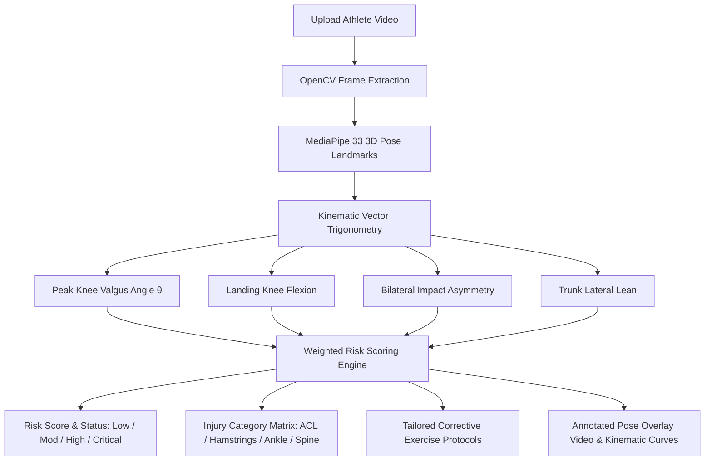

# Walkthrough - AI Pose Estimation & Biomechanical Engine Implementation

We have implemented **Milestone 2 (Real AI Computer Vision Pose Estimation & Biomechanical Analysis Engine)** and **Milestone 3 (Weighted Injury Risk Prediction & Corrective Prescription Engine)** based directly on the project specification document.

---

## 🧠 1. Computer Vision & Biomechanical Engine Architecture

Implemented in [`backend/app/services/biomechanics_engine.py`](file:///C:/Users/aadri/sports-injury-risk-detection/backend/app/services/biomechanics_engine.py):



### 📐 Mathematical Angle & Biomechanical Calculations:
1. **Dynamic Knee Valgus Angle $\theta$**:
   - Calculates frontal-plane deviation of the knee relative to the hip-ankle midline during peak deceleration.
   - Clinical threshold: $> 16^\circ$ triggers critical ACL injury risk alert.
2. **Landing Knee Flexion Angle**:
   - $\angle(\text{Hip}, \text{Knee}, \text{Ankle})$ in sagittal plane.
   - Stiff landings ($< 35^\circ$) compute elevated Ground Reaction Force multipliers (e.g. $1.8\times - 2.5\times \text{BW}$).
3. **Bilateral Movement Asymmetry**:
   - Compares loading curve timing and peak angles between left and right limbs:
     $$\text{Asymmetry Ratio} = \frac{|\text{Left} - \text{Right}|}{\max(\text{Left}, \text{Right})} \times 100\%$$
4. **Trunk Lateral Tilt**:
   - Vector deviation of $(\text{Mid-Hip} \rightarrow \text{Mid-Shoulder})$ relative to the true vertical axis.

---

## ⚖️ 2. Weighted Scoring Model (Exact Formula from PDF Page 6)

$$\text{Injury Risk Score} = 0.35 \times D_{\text{biomech}} + 0.20 \times D_{\text{history}} + 0.20 \times D_{\text{asymmetry}} + 0.15 \times D_{\text{load}} + 0.10 \times D_{\text{fatigue}}$$

- **Biomechanical Deviations ($35\%$)**: Penalties for peak valgus $>14^\circ$, stiff flexion $<38^\circ$, and excessive trunk sway $>5^\circ$.
- **Historical Factors ($20\%$)**: Derived from the athlete's strength and flexibility baselines.
- **Movement Asymmetry ($20\%$)**: Percentage difference in bilateral ground reaction mechanics.
- **Training Load ($15\%$)**: Current cumulative training workload (0–100).
- **Fatigue Indicators ($10\%$)**: Workload exhaustion vs. endurance capacity ratio.

---

## 📋 3. Dynamic Injury Categories & Corrective Protocols

1. **Injury Categories Matrix**:
   - **ACL Risk**: Evaluated via dynamic valgus & low flexion.
   - **Hamstring Strain Risk**: Evaluated via eccentric asymmetry & flexibility deficit.
   - **Ankle Sprain Risk**: Evaluated via landing shock & single-leg balance.
   - **Lumbar Spine Shear Risk**: Evaluated via lateral trunk lean.
2. **Tailored Corrective Exercise Builder**:
   - *Banded Monster Walks & Clamshells* (Gluteus Medius strengthening for Valgus collapse).
   - *Box Drop Jumps with 45° Knee Flexion Cues* (Neuromuscular shock dampening).
   - *Single-Leg RDLs & Bulgarian Split Squats* (Bilateral equalization).
   - *Pallof Press & Anti-Rotational Planks* (Trunk stabilization).

---

## 🖥️ 4. Frontend Diagnostic Report Enhancement

Updated [`AnalysisReportPage.jsx`](file:///C:/Users/aadri/sports-injury-risk-detection/frontend/src/pages/AnalysisReportPage.jsx):
- Added the **Injury Category Risk Breakdown** cards with severity badges.
- Connected the **Kinematic Angle Curves Time-Series Chart** to live time-series data.
- Added the **Biomechanical Diagnostic Matrix** and **Corrective Exercise Protocol Cards**.

---

## 🛠️ 5. Verification

- Backend packages installed: `opencv-python-headless`, `mediapipe`, `numpy`.
- Frontend build validated:
  ```powershell
  npm run build
  # Built in 7.01s (Exit code: 0)
  ```


