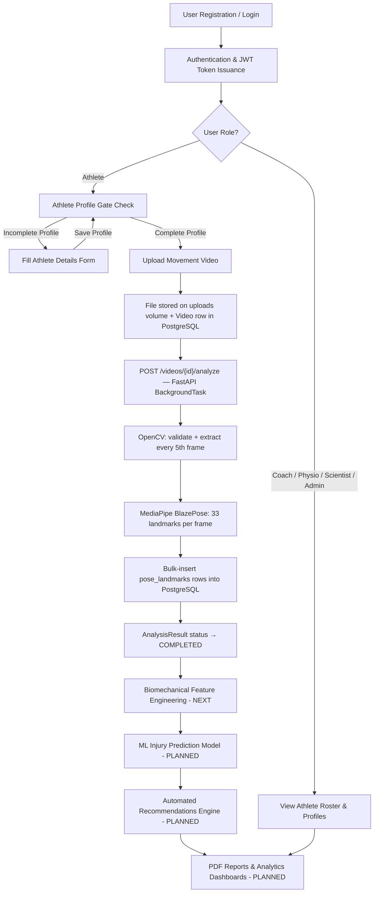
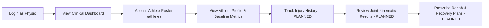
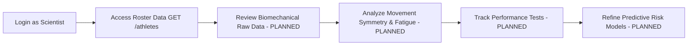

# System Workflows & Role-Based Journeys

This document details the complete end-to-end user workflows and role-specific journeys in the **Sports Injury Risk Detection System**.

---

## 🔄 High-Level System Workflow Overview



---

## 👥 Role-Specific Workflows

Below are the operational workflows for each of the five system roles defined in the RBAC matrix (`Athlete`, `Coach`, `Physiotherapist`, `Sports Scientist`, `Administrator`).

---

### 1. Athlete Workflow

The Athlete workflow focuses on physical baseline management and submitting movement videos for automated risk analysis.

```mermaid
flowchart LR
    A[Register / Login] --> B[View Dashboard & Profile]
    B --> C{Profile Complete?}
    C -- No --> D[Fill Sport, Position, Age, H, W]
    D --> E[PUT /athletes/me]
    E --> C
    C -- Yes --> F[Access Video Analysis /analysis]
    F --> G[Select Video File max 500MB]
    G --> H[POST /videos — Upload to filesystem]
    H --> I[Analyze Button appears in UI]
    I --> J[POST /videos/{id}/analyze]
    J --> K["BackgroundTask: OpenCV + MediaPipe"]
    K --> L["pose_landmarks rows stored in DB"]
    L --> M[Frontend polls status — PENDING→PROCESSING→COMPLETED]
    M --> N[View Metadata: FPS, Duration, Frames Analysed]
    N --> O[Injury Risk Scoring - NEXT PHASE]
    O --> P[View Recommendations & Drills - PLANNED]
```

#### Step-by-Step Breakdown:
1. **Registration & Authentication** (`IMPLEMENTED`)
   * Self-register via `/register` selecting the `Athlete` role, or log in via `/login`.
   * Receive a signed JWT token stored in client `localStorage`.
2. **Profile Completion & Verification** (`IMPLEMENTED`)
   * Navigate to `/profile`. The system fetches profile state via `GET /api/v1/athletes/me`.
   * If any of the five required parameters (**Sport**, **Position**, **Age**, **Height**, **Weight**) are missing, status is marked `⚠ Incomplete`.
   * Submit physical details via `PUT /api/v1/athletes/me`. `athlete_id` and `user_id` are derived server-side.
   * Status updates to `✓ Complete`.
3. **Profile-Gated Video Upload** (`IMPLEMENTED`)
   * Navigate to `/analysis`. If the profile is incomplete, a warning banner redirects the user to `/profile`.
   * If complete, the athlete's physical details header is rendered, unlocking the upload interface.
   * Select a video file (MP4, MOV, AVI, WebM — max 500 MB) and click **Upload Video**.
   * The file is uploaded via `POST /api/v1/videos` (`multipart/form-data`) with progress bar tracking (0–100%).
   * The file is stored on the Docker `uploads_data` volume and a metadata row is written to PostgreSQL.
4. **Pose Estimation Analysis** (`IMPLEMENTED`)
   * After successful upload, click **Analyze Pose**.
   * `POST /api/v1/videos/{video_id}/analyze` creates an `AnalysisResult` row (status=`PENDING`) and enqueues a FastAPI `BackgroundTask`.
   * The frontend polls `GET /api/v1/videos/{video_id}/analysis` every 2 seconds, showing a live status badge (`PENDING → PROCESSING → COMPLETED`).
   * The background worker uses **OpenCV** to extract every 5th frame (configurable via `FRAME_SAMPLE_RATE`, max 300 frames via `MAX_PROCESSED_FRAMES`).
   * **MediaPipe BlazePose** extracts all 33 body landmarks (x, y, z, visibility) per frame.
   * Raw landmark data is bulk-inserted into the `pose_landmarks` table.
   * On completion, the UI shows video metadata: FPS, duration, resolution, frames analysed, and total landmark count.
5. **Injury Risk Scoring** (`NEXT PHASE`)
   * Feature engineering (knee/hip/ankle angles, symmetry, velocity) from `pose_landmarks`.
   * ML model inference → `AnalysisResult.overall_risk_score`.
6. **Targeted Recommendations & Corrective Drills** (`PLANNED`)
   * Automated exercise routines generated from the risk prediction model.

---

### 2. Coach Workflow

The Coach workflow centers on team roster monitoring, movement evaluation tracking, and training load adjustment.

```mermaid
flowchart LR
    A[Login as Coach] --> B[View Staff Dashboard]
    B --> C[View Athlete Roster /athletes]
    C --> D[Filter & Search Athletes]
    D --> E[View Athlete Profiles GET /athletes/{id}]
    E --> F[Review Biomechanical Results - PLANNED]
    F --> G[Adjust Training Load & Notes - PLANNED]
```

#### Step-by-Step Breakdown:
1. **Authentication** (`IMPLEMENTED`)
   * Log in via `/login` with a `Coach` user account.
   * System grants access to staff endpoints (`require_roles(Coach, Physiotherapist, Sports Scientist, Administrator)`).
2. **Athlete Roster Management** (`IMPLEMENTED`)
   * Navigate to `/athletes` (`GET /api/v1/athletes`).
   * Search and filter athletes across the team roster by name, email, or sport.
   * View individual athlete details via `GET /api/v1/athletes/{athlete_id}`.
3. **Manual Profile Provisioning** (`IMPLEMENTED`)
   * Provision athlete profiles on behalf of squad members via `POST /api/v1/athletes` or update baseline values via `PATCH /api/v1/athletes/{id}`.
4. **Team Risk Monitoring & Analytics** (`PLANNED`)
   * Access high-level team injury risk trends on `/dashboard`.
   * Identify athletes with elevated risk flags (e.g., High ACL or Hamstring strain probability).
5. **Training Load Modification & Coach Notes** (`PLANNED`)
   * Record custom coach notes and adjust daily/weekly training load parameters in `athletes.training_load` to prevent overuse injuries.
6. **Explicit Squad Assignment Mapping** (`PLANNED`)
   * Direct Coach 1:N or M:N assigned squad mapping is marked as planned until dedicated team junction tables are added to the schema.

---

### 3. Physiotherapist Workflow

The Physiotherapist workflow is tailored toward clinical biomechanical review, injury history tracking, and rehabilitation plan oversight.



#### Step-by-Step Breakdown:
1. **Authentication** (`IMPLEMENTED`)
   * Log in via `/login` as a `Physiotherapist`. Access controlled by RBAC dependencies.
2. **Athlete Clinical Review** (`IMPLEMENTED`)
   * Access athlete records via `/athletes` (`GET /api/v1/athletes` & `GET /api/v1/athletes/{id}`).
   * Inspect physical parameters (Height, Weight, Flexibility, Strength, Balance, Endurance baselines).
3. **Injury History & Medical Tracking** (`PLANNED`)
   * Review past injury records from the `injury_history` table (body part, severity, injury date, recovery date, clinical remarks).
4. **Biomechanical Kinematic Audit** (`PLANNED`)
   * Audit detailed frame-by-frame joint angle breakdowns (e.g., knee flexion angle at landing, trunk tilt, hip drop).
5. **Rehabilitation & Mobility Prescription** (`PLANNED`)
   * Review system-generated recommendations and prescribe customized physical therapy routines, mobility protocols, and recovery plans stored in `recommendations`.
6. **Explicit Patient Assignment Mapping** (`PLANNED`)
   * Direct Physiotherapist-to-patient assignment scoping is marked as planned until explicit assignment junction tables are introduced.

---

### 4. Sports Scientist Workflow

The Sports Scientist workflow focuses on aggregate movement analytics, performance testing metrics, and machine learning model validation.



#### Step-by-Step Breakdown:
1. **Authentication** (`IMPLEMENTED`)
   * Log in via `/login` with `Sports Scientist` credentials. Authorized for `ATHLETE_VIEW_ROLES`.
2. **Roster Data Inspection** (`IMPLEMENTED`)
   * Browse registered athlete records via `/athletes` (`GET /api/v1/athletes`).
3. **Biomechanical Data Analysis** (`PLANNED`)
   * Analyze spatial-temporal biomechanical parameters stored in `analysis_results` (knee valgus, hip stability, trunk lean, stride length, symmetry score, fatigue score).
4. **Performance Record Evaluation** (`PLANNED`)
   * Track historical physical test scores from `performance_records` (jump height, sprint speed, agility times) against movement quality scores.
5. **Risk Model Validation** (`PLANNED`)
   * Evaluate predictive accuracy of `injury_predictions` models against real-world athlete outcome data to refine algorithms.

---

### 5. Administrator Workflow

The Administrator workflow covers platform security enforcement, account management, and system infrastructure monitoring.

```mermaid
flowchart LR
    A[Login as Admin] --> B[System Infrastructure Health /health]
    B --> C[Manage Users & Roles - PLANNED UI / IMPLEMENTED API]
    C --> D[Delete / Archive Profiles DELETE /athletes/{id}]
    D --> E[Generate System Reports - PLANNED]
```

#### Step-by-Step Breakdown:
1. **Authentication & Security Boundary** (`IMPLEMENTED`)
   * Authenticate with provisioned `Administrator` credentials. (Note: Self-registration as Administrator is blocked at `/auth/register`).
2. **Infrastructure Health Monitoring** (`IMPLEMENTED`)
   * Monitor application status and PostgreSQL database connection liveliness via `/health` and `/`.
3. **Athlete Profile Deletion & Management** (`IMPLEMENTED`)
   * Execute administrative deletion of athlete records via `DELETE /api/v1/athletes/{athlete_id}` (`require_roles(Administrator)`).
   * Provision or override any athlete profile via `POST /api/v1/athletes` or `PATCH /api/v1/athletes/{id}`.
4. **User & Role Administration UI** (`PLANNED`)
   * Admin dashboard for activating/deactivating user accounts (`user.is_active`) and verifying roles.
5. **System-Wide Reporting & PDF Audits** (`PLANNED`)
   * Generate comprehensive compliance, usage, and analytical summary reports stored in `reports`.

---

## 📊 Summary Feature Matrix Across Roles

| Feature / Action | Athlete | Coach | Physiotherapist | Sports Scientist | Administrator | Status |
|---|:---:|:---:|:---:|:---:|:---:|---|
| Self-Registration | ✅ | ✅ | ✅ | ✅ | ❌ (Blocked) | `IMPLEMENTED` |
| View Own Profile | ✅ | ✅ | ✅ | ✅ | ✅ | `IMPLEMENTED` |
| Upsert Own Athlete Profile (`/me`) | ✅ | ❌ | ❌ | ❌ | ❌ | `IMPLEMENTED` |
| View All Athletes Roster | ❌ | ✅ | ✅ | ✅ | ✅ | `IMPLEMENTED` |
| Manage Any Athlete Profile | ❌ | ✅ | ✅ | ❌ | ✅ | `IMPLEMENTED` |
| Delete Athlete Profile | ❌ | ❌ | ❌ | ❌ | ✅ | `IMPLEMENTED` |
| Upload Video Binary (`POST /videos` BYTEA) | ✅ | ❌ | ❌ | ❌ | ❌ | `IMPLEMENTED` |
| Profile-Gated Video Upload UI | ✅ | ❌ | ❌ | ❌ | ❌ | `IMPLEMENTED` |
| Pose Keypoint Overlay View | 🔮 | 🔮 | 🔮 | 🔮 | 🔮 | `PLANNED` |
| Review Kinematic Risk Scores | 🔮 | 🔮 | 🔮 | 🔮 | 🔮 | `PLANNED` |
| Prescribe Rehab & Recovery Plans | ❌ | ❌ | 🔮 | ❌ | ❌ | `PLANNED` |
| Advanced Biomechanical Analytics | ❌ | ❌ | ❌ | 🔮 | 🔮 | `PLANNED` |
| PDF Report Generation | 🔮 | 🔮 | 🔮 | 🔮 | 🔮 | `PLANNED` |
